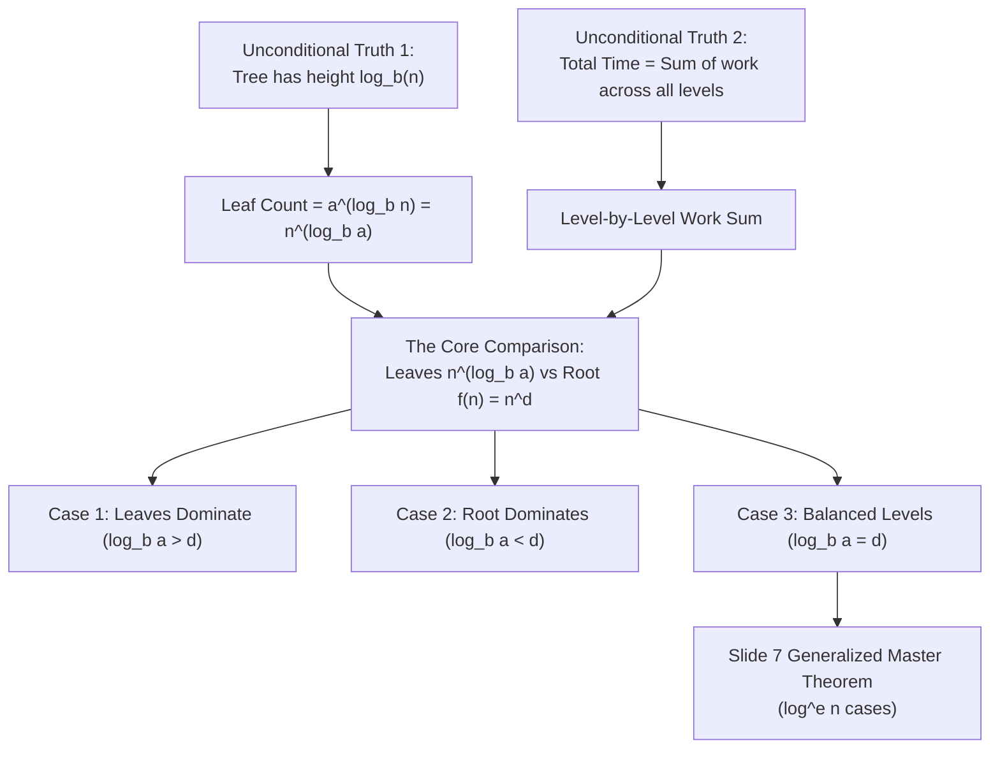

> [!quote] YOU

explain the master theorem in /home/warley/ufc/4s/algorithms_analysis_project/slides/05.pdf in page 7

> [!question] Quiz
> In a divide-and-conquer recurrence $T(n) = a T(n/b) + f(n)$, what does the term $n^{\log_b a}$ geometrically represent in the recursion tree?
>
> 1. The number of subproblems solved at the first recursive step
> 2. The total height (number of levels) of the recursion tree
> 3. The work done to divide and combine subproblems at the root
> 4. The total work done strictly at the leaf level (base cases)

> [!question] Quiz — I don't know
> Your answer: I don't know
> Correct answer: 4
>
> A recursion tree of depth $\log_b n$ branching by factor $a$ at each step has $a^{\log_b n} = n^{\log_b a}$ leaves, which represents the total base-case work at the bottom of the tree.

> [!question] Quiz
> Which recurrence equation models the standard Merge Sort algorithm on an array of size $n$?
>
> 1. $T(n) = T(n-1) + \Theta(n)$
> 2. $T(n) = T(n/2) + \Theta(1)$
> 3. $T(n) = 2T(n/2) + \Theta(n)$
> 4. $T(n) = 2T(n/2) + \Theta(1)$

> [!success] Quiz — correct ✓
> Your answer: 3. $T(n) = 2T(n/2) + \Theta(n)$
> Correct answer: 3
>
> In Merge Sort, the list of size $n$ is split into 2 halves ($a=2, b=2$), and merging two sorted halves of total size $n$ takes linear time $\Theta(n)$, so $f(n) = \Theta(n)$.

> [!question] Question
> What is your primary focus for understanding the Master Theorem on page 7?
>
> Slide 7 presents a generalized Master Theorem table comparing $\log_b a$ with $d$ (and exponent $e$) for $f(n) = \Theta(n^d \log^e n)$.
>
> 1. Both: intuition + practical application (Recommended)
> 2. Practical recipe for solving exercises
> 3. Deep mathematical derivation

> [!example] Answer
> 1. Both: intuition + practical application (Recommended)

> [!abstract] PI

### Plan

We will build the Master Theorem from the ground up so that the table on slide 7 is not a set of arbitrary rules to memorize, but a natural consequence of how work flows through a recursion tree.

Here is the roadmap:

1. **The Recursion Tree Anatomy (Foundations):**
   - Break down a divide-and-conquer recurrence $T(n) = a T(n/b) + f(n)$ into tree levels.
   - Count the tree height ($\log_b n$) and the total number of base-case leaves ($a^{\log_b n} = n^{\log_b a}$).
2. **The "Horse Race" Intuition (The 3 Core Regimes):**
   - Compare work done at the root vs work done across the leaves.
   - See why comparing $\log_b a$ against the exponent $d$ of $f(n) = \Theta(n^d)$ immediately decides who wins:
     - **Bottom-heavy** ($\log_b a > d$): Leaves dominate $\implies \Theta(n^{\log_b a})$.
     - **Top-heavy** ($\log_b a < d$): Root dominates $\implies \Theta(f(n))$.
     - **Balanced** ($\log_b a = d$): Work is equal across levels $\implies \Theta(f(n) \log n)$.
3. **The Slide 7 Extension ($f(n) = \Theta(n^d \log^e n)$):**
   - Understand the nuance of the logarithm exponent $e$ when levels are balanced ($\log_b a = d$), including $e = 0$, $e > -1$, $e = -1$, and $e < -1$.
4. **Hands-on Application:**
   - Walk through the examples from the slide step by step to build speed and confidence.

---

### Dependency Map

---

Does this roadmap look good to start?
