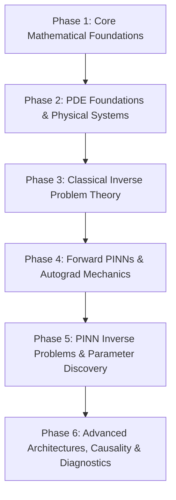
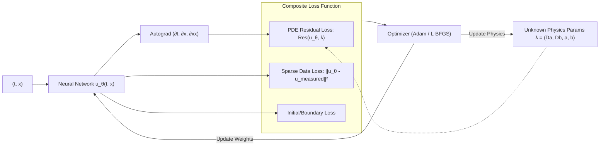

> [!quote] YOU

get the context of ./output/inbox-ai/causality_is_all_you_need.md chat
and give me a roadmap to study the pinn inverse problem, maths etc
dont use the teach quiz skill


> [!abstract] PI

Based on the context of your previous conversation—working on reaction-diffusion systems (like the Schnakenberg model) using PyTorch, encountering training failure modes like causality violations, and building up from limited pure math background—here is a structured, step-by-step roadmap to master **PINN Inverse Problems**, from mathematical foundations to implementation.

---

# Roadmap: Mastering PINN Inverse Problems



---

## Phase 1: Core Mathematical Foundations

You don't need a pure math degree, but inverse problems require comfort with multivariable calculus, linear algebra, and gradient-based optimization.

### 1. Multivariable Calculus & Vector Calculus
* **Key Topics**:
  * Partial derivatives, chain rule (the backbone of backpropagation and automatic differentiation).
  * Gradient ($\nabla u$), Divergence ($\nabla \cdot \mathbf{F}$), and Laplacian ($\nabla^2 u = \Delta u$).
  * Taylor expansions (understanding truncation errors in numerical methods vs. continuous neural representations).
* **Recommended Resource**: *Khan Academy Multivariable Calculus* or *3Blue1Brown: Essence of Calculus*.

### 2. Linear Algebra & Matrix Calculus
* **Key Topics**:
  * Eigenvalues and eigenvectors (crucial for stability analysis, Jacobian conditioning, and Fourier analysis).
  * Singular Value Decomposition (SVD) and condition numbers ($\kappa(A)$).
  * Gradients of scalar functions with respect to vectors and matrices.
* **Recommended Resource**: Gilbert Strang's *Linear Algebra and Learning from Data*.

### 3. Optimization & Loss Landscapes
* **Key Topics**:
  * Convex vs. non-convex optimization.
  * First-order optimizers (SGD, Adam, AdamW) and second-order optimizers (L-BFGS).
  * Multi-objective loss balancing and Pareto fronts (why PDE residual loss and data loss compete).
* **Recommended Resource**: *Numerical Optimization* (Nocedal & Wright, Chapters 2, 3, 7).

---

## Phase 2: PDE Foundations & Dynamic Systems

Understanding the differential equations you are trying to solve or invert.

### 1. PDE Fundamentals
* **Types of PDEs**:
  * **Elliptic** (steady-state, Poisson $\nabla^2 u = f$).
  * **Parabolic** (time-dependent diffusion $\partial_t u = D \nabla^2 u$).
  * **Hyperbolic** (wave propagation, advection $\partial_t u + c \partial_x u = 0$).
* **Boundary & Initial Conditions**:
  * Dirichlet (fixed value), Neumann (zero-flux / derivative), Robin (mixed), and Periodic conditions.

### 2. Reaction-Diffusion Systems & Pattern Formation
* **Schnakenberg / Gray-Scott / FitzHugh-Nagumo models**:
  $$\begin{cases}
  \frac{\partial u}{\partial t} = D_u \nabla^2 u + a - u + u^2 v \\
  \frac{\partial v}{\partial t} = D_v \nabla^2 v + b - u^2 v
  \end{cases}$$
* **Turing Instability & Bifurcation**: Understanding why small parameter changes in $D_u, D_v, a, b$ cause wildly different spatial patterns (spots, stripes, labyrinths).
* **Recommended Resource**: Strogatz's *Nonlinear Dynamics and Chaos* (Chapters on 2D systems and limit cycles) and Murray's *Mathematical Biology I & II*.

---

## Phase 3: Classical Inverse Problem Theory

An **inverse problem** is: given observations of the solution $u(x, t)$ (often sparse and noisy), determine the unknown parameters $\theta = [D_u, D_v, a, b]$ or unknown functions $f(x, t)$.

### 1. Ill-Posedness (Hadamard's Criteria)
A problem is well-posed if:
1. A solution exists.
2. The solution is unique.
3. The solution depends continuously on the data (stability).
* *Why inverse problems fail*: Small noise in data measurements $\delta u$ often leads to catastrophic errors in parameter estimates without regularization.

### 2. Parameter Identifiability
* **Structural Identifiability**: Can the parameters be uniquely determined even with infinite noise-free data?
* **Practical Identifiability**: Can they be determined given the actual spatial-temporal distribution of your measurement sensors?

### 3. Classical Regularization
* **Tikhonov Regularization ($L_2$)** and **Lasso ($L_1$ / sparsity)**.
* **Bayesian Inversion**: Estimating posterior probability distributions over parameters rather than single point estimates.
* **Recommended Resource**: *Discrete Inverse Problems: Insight and Algorithms* by Per Christian Hansen.

---

## Phase 4: Forward PINNs & Autograd Mechanics

Before solving inverse problems, master the forward PINN pipeline.

### 1. Computational Mechanics of PINNs
* **Automatic Differentiation (AD)**:
  * How Reverse-Mode Autograd (`torch.autograd.grad`) evaluates exact derivatives $\frac{\partial u}{\partial x}$, $\frac{\partial^2 u}{\partial x^2}$, $\frac{\partial u}{\partial t}$ without numerical mesh discretization.
  * `create_graph=True` and computational graph retention during backpropagation.
* **Collocation Method**:
  * Sampling strategies: Latin Hypercube Sampling (LHS), Sobol sequences, uniform grids, and residual-adaptive sampling (RAD).

### 2. Why Standard Forward PINNs Fail
* **Spectral Bias**: Neural networks learn low-frequency components much faster than high frequencies.
* **Gradient Pathologies**: Imbalanced gradient magnitudes between boundary loss, initial condition loss, and PDE residual loss.
* **Temporal Causality Violations**: The network attempts to minimize future residuals before resolving earlier time dynamics (the core issue solved by Wang et al., 2022).

---

## Phase 5: PINN Inverse Problems & Parameter Estimation

In an inverse PINN, unknown physical constants or spatial fields are treated as **learnable parameters** optimized simultaneously with the network weights.



### 1. Parameter Estimation Formulation (Constant Parameters)
* Define unknown parameters as `nn.Parameter` or `torch.tensor(..., requires_grad=True)`:
  ```python
  self.Da = nn.Parameter(torch.tensor([0.5])) # initial guess
  self.Db = nn.Parameter(torch.tensor([5.0]))
  ```
* Combined objective function:
  $$\mathcal{L}_{\text{total}} = \lambda_{\text{data}} \mathcal{L}_{\text{data}} + \lambda_{\text{pde}} \mathcal{L}_{\text{residual}}(\theta_{\text{net}}, \mathbf{\lambda}_{\text{physics}}) + \lambda_{\text{bc}} \mathcal{L}_{\text{bc}}$$

### 2. Function Estimation (Spatially/Temporally Varying Parameters)
* When parameters vary across space or time (e.g., $D(x)$ or $R(u, v)$):
  * Use a dual-network setup: one subnet for $u(t, x)$ and a second subnet for $D(x)$.
  * Physics constraint links the two outputs via PDE residuals.

### 3. Sparse PDE Discovery (PINN + Sparse Regression / PDE-FIND)
* Discovering the governing equation structure itself from data using candidate library terms ($u, u^2, u_x, u_{xx}, \dots$) and $L_1$ / STRidge regularized loss.

---

## Phase 6: Advanced Techniques, Causality & Robustness

### 1. Causality in Inverse Problems
* If the forward solver fails without causality, inverse parameter estimation will drift into unphysical local minima.
* Apply exponential causal weighting:
  $$w_i = \exp\left(-\epsilon \sum_{k=1}^{i-1} \mathcal{L}_{\text{PDE}}(t_k)\right)$$
* Apply gradient stopping (`w.detach()`) so the optimizer cannot inflate early errors to suppress later weights.

### 2. Loss Balancing Strategies
* **GradNorm / Learning Rate Annealing**: Balances gradients between data fitting and PDE residual minimization (Wang et al., 2021).
* **Self-Adaptive Weights / SoftAdapt**: Dynamic weighting assigned to each loss component.

### 3. Second-Order Optimization (L-BFGS Fine-Tuning)
* Start with Adam for global parameter exploration.
* Switch to L-BFGS for high-precision convergence in both network weights and physical parameters.

---

## Practical Study & Implementation Plan

| Milestone | Objective | Key Deliverable |
| :--- | :--- | :--- |
| **Week 1** | Autograd & 1D Forward Problem | Solve 1D Heat / Burgers' equation in PyTorch using `torch.autograd.grad`. |
| **Week 2** | 1D Inverse Parameter Estimation | Estimate unknown diffusion coefficient $D$ in $\partial_t u = D \partial_{xx} u$ given 10% noisy sensor measurements. |
| **Week 3** | Stiff 2D Systems & Modified MLP | Implement the Modified MLP (Wang et al.) with coordinate encoders for Schnakenberg forward simulation. |
| **Week 4** | Causal Loss Integration | Add discrete time-bucketing and causal weight annealing $\epsilon(k)$ to stabilize the reaction-diffusion dynamics. |
| **Week 5** | Schnakenberg Inverse Problem | Infer unknown kinetics $(a, b)$ and diffusion ratio $(D_a, D_b)$ from sparse, noisy temporal snapshots of pattern formation. |

---

## Key Papers to Read (In Suggested Order)

1. **Raissi, Perdikaris, Karniadakis (2019)**: *"Physics-informed neural networks: A deep learning framework for solving forward and inverse problems involving nonlinear partial differential equations"* (The foundational PINN paper).
2. **Wang, Teng, Perdikaris (2021)**: *"Understanding and mitigating gradient pathologies in physics-informed neural networks"* (Introduces Modified MLP and learning rate annealing).
3. **Wang, Sankaran, Perdikaris (2022)**: *"Respecting causality is all you need for training physics-informed neural networks"* (The causality weighting paper you referenced).
4. **Chen, Lu, Karniadakis, Dal Negro (2020)**: *"Physics-informed neural networks for inverse problems in nano-optics and metamaterials"*.


> [!quote] YOU

I already know the basis understand of dynamical systems and forward pinns, the inverse problem is harder than forward problem?


> [!abstract] PI

The answer depends on whether you look at it from **classical computational physics** or from the **PINN framework**.

Counter-intuitively, in the context of PINNs, **simple inverse problems are often easier to train than purely forward problems**, but they come with unique mathematical pitfalls.

Here is the exact comparison of why and when inverse problems are easier vs. harder.

---

### 1. In Classical Numerical Methods (FEM / FDM / FVM)
* **Forward Problem:** **Easy / Well-Posed.**
  You have initial and boundary conditions. You discretize the domain with a grid and march forward in time using standard solvers (Runge-Kutta, Crank-Nicolson). The solution exists, is unique, and is stable.
* **Inverse Problem:** **Extremely Hard / Ill-Posed.**
  You must use adjoint-state methods, iterative optimization, or Bayesian MCMC. You repeatedly solve the full forward problem dozens or hundreds of times inside an outer optimization loop, requiring complex regularization (e.g., Tikhonov) to prevent numerical explosion from noise.

---

### 2. In PINNs: Why Inverse Problems Can Be *Easier* to Train

In a purely **forward PINN**, the network receives data **only at the boundaries and $t=0$**. 
* The entire interior domain $[0, T] \times \Omega$ is guided solely by the PDE residual loss $\mathcal{L}_{\text{PDE}}$.
* For stiff or pattern-forming systems (like Schnakenberg), the optimizer frequently gets stuck in **trivial local minima** (e.g., predicting zero or a constant mean state everywhere) because no intermediate measurements force it onto the true physical trajectory.

In an **inverse PINN (with internal measurements)**:
* You provide sparse observational data $u_{\text{meas}}(x_i, t_i)$ scattered inside the spatio-temporal domain.
* **Data Acts as an Anchor:** The network is not guessing the entire physical state from scratch; the data loss $\mathcal{L}_{\text{data}}$ directly pins the neural network $u_\theta(x, t)$ close to the real solution.
* **Trivial Solution Avoided:** The network cannot collapse into a flat/zero state because that would produce a huge data loss.
* The optimizer only needs to adjust the unknown physical parameters (e.g., diffusion $D_a, D_b$ or reaction rates $a, b$) so that the autograd derivatives of the fitted curve satisfy the PDE residual.

---

### 3. When PINN Inverse Problems Become *Harder*

While basic parameter estimation can converge faster, inverse problems introduce specific structural difficulties:

| Challenge | Why It Makes Inverse Problems Harder |
| :--- | :--- |
| **1. Structural Non-Identifiability** | Multiple distinct parameter sets $(D_a, D_b, a, b)$ can produce virtually identical spatial profiles $u(x, t)$. The optimizer cannot determine the true physical constants without sufficient temporal/spatial variation in the data. |
| **2. Noise Amplification via Autograd** | In inverse PINNs, you fit data points, and autograd differentiates that fitted neural network twice in space ($\partial_{xx} u$) and once in time ($\partial_t u$). If the network overfits high-frequency measurement noise, the second derivatives become erratic, corrupting parameter estimation. |
| **3. Coupled Non-Convex Optimization** | The loss landscape is optimized over both network weights $\theta \in \mathbb{R}^{10^5}$ and physical parameters $\lambda \in \mathbb{R}^k$. The gradient scales with respect to $\theta$ and with respect to $\lambda$ are often orders of magnitude apart, causing one to stagnate while the other overshoots. |
| **4. Spatially Varying Parameters $D(x)$** | If the unknown is a continuous field rather than a single scalar constant, the parameter space is infinite-dimensional, making convergence much harder. |

---

### Summary for Reaction-Diffusion (Schnakenberg)

1. **If you have clean, well-distributed data points across space and time:**
   The inverse problem is **easier to optimize** than the forward problem because the data prevents the Schnakenberg pattern from collapsing into the false trivial states that standard forward PINNs suffer from.
2. **If your data is sparse, noisy, or only observes $u$ (and not $v$):**
   The problem becomes **harder**, because the system must simultaneously reconstruct the unobserved inhibitor state $v(x, t)$ while inferring the reaction parameters $(a, b, D_a, D_b)$.


> [!quote] YOU

give me a inverse problem code


> [!abstract] PI

Here is a complete, self-contained **PyTorch implementation of an Inverse PINN problem** applied to the 1D Schnakenberg reaction-diffusion system.

### What this script does:
1. **Generates Synthetic Ground Truth Data:** Uses a standard numerical solver (Finite Difference Method / Euler-Maruyama/RK) with true physics parameters:
   $$D_a = 1.0, \quad D_b = 10.0, \quad a = 0.1, \quad b = 0.9$$
2. **Samples Sparse, Noisy Observations:** Samples sparse internal data points $u_{\text{meas}}$ and $v_{\text{meas}}$ with Gaussian noise.
3. **Defines Unknown Physics Parameters as PyTorch Variables:**
   Initializes unknown parameters with deliberate wrong guesses:
   $$\hat{D}_a = 0.2, \quad \hat{D}_b = 5.0, \quad \hat{a} = 0.5, \quad \hat{b} = 0.3$$
4. **Joint Optimization:** Uses the Modified MLP architecture to simultaneously fit the sparse noisy data and drive the PDE residuals to zero, discovering the true physical parameters.

---

### `inverse_schnakenberg_pinn.py`

```python
import numpy as np
import torch
import torch.nn as nn
import matplotlib.pyplot as plt

# -----------------------------------------------------------------------------
# 0. Setup and Reproducibility
# -----------------------------------------------------------------------------
device = torch.device('cuda' if torch.cuda.is_available() else 'cpu')
print(f"Using device: {device}")

torch.manual_seed(42)
np.random.seed(42)

# True physical parameters
TRUE_Da = 1.0
TRUE_Db = 10.0
TRUE_a = 0.1
TRUE_b = 0.9

L = 20.0       # Spatial domain [0, L]
T_MAX = 5.0    # Time horizon [0, T_MAX]

# -----------------------------------------------------------------------------
# 1. Generate Synthetic Ground Truth Data via Finite Differences
# -----------------------------------------------------------------------------
def generate_ground_truth_data(Nx=200, Nt=1000):
    """Generates synthetic Schnakenberg data with 1D periodic boundary conditions."""
    x = np.linspace(0, L, Nx, endpoint=False)
    t = np.linspace(0, T_MAX, Nt)
    dx = x[1] - x[0]
    dt = t[1] - t[0]

    # Initial condition: homogeneous steady state + small random perturbation
    u_ss = TRUE_a + TRUE_b
    v_ss = TRUE_b / ((TRUE_a + TRUE_b) ** 2)
    
    u = u_ss + 0.1 * np.cos(2 * np.pi * x / L)
    v = v_ss + 0.1 * np.sin(2 * np.pi * x / L)

    u_history = np.zeros((Nt, Nx))
    v_history = np.zeros((Nt, Nx))
    u_history[0, :] = u
    v_history[0, :] = v

    # Finite difference time stepping
    for n in range(1, Nt):
        u_xx = (np.roll(u, -1) - 2 * u + np.roll(u, 1)) / (dx ** 2)
        v_xx = (np.roll(v, -1) - 2 * v + np.roll(v, 1)) / (dx ** 2)
        
        f_u = TRUE_a - u + (u ** 2) * v
        f_v = TRUE_b - (u ** 2) * v
        
        u = u + dt * (TRUE_Da * u_xx + f_u)
        v = v + dt * (TRUE_Db * v_xx + f_v)
        
        u_history[n, :] = u
        v_history[n, :] = v

    T_grid, X_grid = np.meshgrid(t, x, indexing='ij')
    return T_grid.flatten(), X_grid.flatten(), u_history.flatten(), v_history.flatten()

# Generate reference solution
t_all, x_all, u_all, v_all = generate_ground_truth_data()

# Sample sparse observations (e.g., 2000 random points) with 2% Gaussian noise
N_OBS = 2000
idx_obs = np.random.choice(len(t_all), N_OBS, replace=False)

noise_level = 0.02
t_obs = torch.tensor(t_all[idx_obs], dtype=torch.float32, device=device).unsqueeze(1)
x_obs = torch.tensor(x_all[idx_obs], dtype=torch.float32, device=device).unsqueeze(1)
u_obs = torch.tensor(u_all[idx_obs] * (1.0 + noise_level * np.random.randn(N_OBS)), dtype=torch.float32, device=device).unsqueeze(1)
v_obs = torch.tensor(v_all[idx_obs] * (1.0 + noise_level * np.random.randn(N_OBS)), dtype=torch.float32, device=device).unsqueeze(1)

# Sample PDE Collocation points across domain
N_PDE = 10000
t_pde = torch.tensor(np.random.uniform(0, T_MAX, (N_PDE, 1)), dtype=torch.float32, device=device, requires_grad=True)
x_pde = torch.tensor(np.random.uniform(0, L, (N_PDE, 1)), dtype=torch.float32, device=device, requires_grad=True)

# -----------------------------------------------------------------------------
# 2. Neural Network Architecture (Modified MLP with coordinate normalization)
# -----------------------------------------------------------------------------
class InversePINN(nn.Module):
    def __init__(self, hidden_dim=128, num_layers=4):
        super().__init__()
        
        # Coordinate Encoders
        self.encoder_u = nn.Sequential(nn.Linear(2, hidden_dim), nn.Tanh())
        self.encoder_v = nn.Sequential(nn.Linear(2, hidden_dim), nn.Tanh())
        
        # Hidden layers
        self.layers = nn.ModuleList([nn.Linear(hidden_dim, hidden_dim) for _ in range(num_layers)])
        self.act = nn.Tanh()
        self.out_layer = nn.Linear(hidden_dim, 2)  # Outputs (u, v)

        # ---------------------------------------------------------
        # Unknown Physics Parameters (Learnable PyTorch Parameters)
        # ---------------------------------------------------------
        # We enforce positivity by parameterizing as log(param) or using softplus
        self.log_Da = nn.Parameter(torch.tensor(np.log(0.2), dtype=torch.float32))
        self.log_Db = nn.Parameter(torch.tensor(np.log(5.0), dtype=torch.float32))
        self.log_a  = nn.Parameter(torch.tensor(np.log(0.5), dtype=torch.float32))
        self.log_b  = nn.Parameter(torch.tensor(np.log(0.3), dtype=torch.float32))

    @property
    def Da(self): return torch.exp(self.log_Da)
    @property
    def Db(self): return torch.exp(self.log_Db)
    @property
    def a(self):  return torch.exp(self.log_a)
    @property
    def b(self):  return torch.exp(self.log_b)

    def forward(self, t, x):
        # Normalize inputs to [-1, 1] for training stability
        t_norm = 2.0 * (t / T_MAX) - 1.0
        x_norm = 2.0 * (x / L) - 1.0
        inputs = torch.cat([t_norm, x_norm], dim=-1)
        
        U = self.encoder_u(inputs)
        V = self.encoder_v(inputs)
        
        H = U
        for layer in self.layers:
            Z = self.act(layer(H))
            H = (1.0 - Z) * U + Z * V  # Modified MLP Skip connection
            
        return self.out_layer(H)

# -----------------------------------------------------------------------------
# 3. Residual & Loss Computation
# -----------------------------------------------------------------------------
model = InversePINN().to(device)

def compute_pde_residuals(model, t, x):
    """Calculates PDE residuals using automatic differentiation."""
    pred = model(t, x)
    u = pred[:, 0:1]
    v = pred[:, 1:2]

    # First-order derivatives
    u_t = torch.autograd.grad(u, t, grad_outputs=torch.ones_like(u), create_graph=True)[0]
    u_x = torch.autograd.grad(u, x, grad_outputs=torch.ones_like(u), create_graph=True)[0]
    v_t = torch.autograd.grad(v, t, grad_outputs=torch.ones_like(v), create_graph=True)[0]
    v_x = torch.autograd.grad(v, x, grad_outputs=torch.ones_like(v), create_graph=True)[0]

    # Second-order derivatives
    u_xx = torch.autograd.grad(u_x, x, grad_outputs=torch.ones_like(u_x), create_graph=True)[0]
    v_xx = torch.autograd.grad(v_x, x, grad_outputs=torch.ones_like(v_x), create_graph=True)[0]

    # Schnakenberg PDE equations
    # du/dt = Da*d2u/dx2 + a - u + u^2*v
    # dv/dt = Db*d2v/dx2 + b - u^2*v
    f_u = u_t - (model.Da * u_xx + model.a - u + (u ** 2) * v)
    f_v = v_t - (model.Db * v_xx + model.b - (u ** 2) * v)

    return f_u, f_v

# -----------------------------------------------------------------------------
# 4. Training Loop (Adam + Parameter Logging)
# -----------------------------------------------------------------------------
# We use separate learning rates: standard for network weights, higher for physical parameters
optimizer = torch.optim.Adam([
    {'params': [p for name, p in model.named_parameters() if not name.startswith('log_')], 'lr': 1e-3},
    {'params': [model.log_Da, model.log_Db, model.log_a, model.log_b], 'lr': 5e-3}
])

history = {'epoch': [], 'Da': [], 'Db': [], 'a': [], 'b': [], 'loss': []}

epochs = 10000
print("--- Starting Inverse PINN Training ---")
print(f"Target Parameters: Da={TRUE_Da:.2f}, Db={TRUE_Db:.2f}, a={TRUE_a:.2f}, b={TRUE_b:.2f}\n")

for epoch in range(1, epochs + 1):
    optimizer.zero_grad()

    # 1. Data Loss (Fitting sparse observed data)
    pred_obs = model(t_obs, x_obs)
    loss_data_u = torch.mean((pred_obs[:, 0:1] - u_obs) ** 2)
    loss_data_v = torch.mean((pred_obs[:, 1:2] - v_obs) ** 2)
    loss_data = loss_data_u + loss_data_v

    # 2. PDE Residual Loss (Satisfying physics)
    f_u, f_v = compute_pde_residuals(model, t_pde, x_pde)
    loss_pde = torch.mean(f_u ** 2) + torch.mean(f_v ** 2)

    # Total loss
    loss = loss_data + 0.1 * loss_pde
    loss.backward()
    optimizer.step()

    # Logging
    if epoch % 500 == 0 or epoch == 1:
        Da_val, Db_val = model.Da.item(), model.Db.item()
        a_val, b_val = model.a.item(), model.b.item()
        
        history['epoch'].append(epoch)
        history['Da'].append(Da_val)
        history['Db'].append(Db_val)
        history['a'].append(a_val)
        history['b'].append(b_val)
        history['loss'].append(loss.item())

        print(f"Epoch {epoch:5d}/{epochs} | Total Loss: {loss.item():.6f} | Data Loss: {loss_data.item():.6f} | PDE Loss: {loss_pde.item():.6f}")
        print(f"  Estimates -> Da: {Da_val:.4f} (True: {TRUE_Da}), Db: {Db_val:.4f} (True: {TRUE_Db}), a: {a_val:.4f} (True: {TRUE_a}), b: {b_val:.4f} (True: {TRUE_b})")

# -----------------------------------------------------------------------------
# 5. Summary Results
# -----------------------------------------------------------------------------
print("\n--- Final Discovered Parameters ---")
print(f"Da : Estimated = {model.Da.item():.4f} | True = {TRUE_Da:.4f} | Relative Error: {abs(model.Da.item() - TRUE_Da)/TRUE_Da * 100:.2f}%")
print(f"Db : Estimated = {model.Db.item():.4f} | True = {TRUE_Db:.4f} | Relative Error: {abs(model.Db.item() - TRUE_Db)/TRUE_Db * 100:.2f}%")
print(f"a  : Estimated = {model.a.item():.4f} | True = {TRUE_a:.4f} | Relative Error: {abs(model.a.item() - TRUE_a)/TRUE_a * 100:.2f}%")
print(f"b  : Estimated = {model.b.item():.4f} | True = {TRUE_b:.4f} | Relative Error: {abs(model.b.item() - TRUE_b)/TRUE_b * 100:.2f}%")
```

---

### Key Practical Details in This Code:
1. **Positivity Constraint (`torch.exp(self.log_param)`):** Physical constants ($D_a, D_b, a, b$) cannot be negative. Parameterizing them as $\log(\lambda)$ guarantees that $\lambda > 0$ throughout training and avoids unphysical negative diffusion values.
2. **Differentiated Learning Rates:** Network weights $\theta$ often require smaller updates ($\text{lr} = 10^{-3}$), while scalar physical parameters benefit from slightly larger updates ($\text{lr} = 5 \times 10^{-3}$) so they can migrate quickly toward the true values.
3. **Dual Residuals:** We take derivatives of both fields ($u$ and $v$) through `torch.autograd.grad(..., create_graph=True)` to form both coupled reaction-diffusion equations simultaneously.


> [!quote] YOU

but do you already know the true params?


> [!abstract] PI

**The model and optimizer do *not* know or use the true parameters during training.**

The `TRUE_` constants in the script serve only **two external purposes**:

---

### 1. Generating the "Lab" Experiment (Synthetic Data)
In real-world applications (like biology, chemistry, or materials science), you would **not** generate synthetic data. Instead, you would load real sensor or microscope measurements from a `.csv` or `.h5` file:
```python
# In real life:
# data = pd.read_csv("lab_microscope_readings.csv")
# t_obs, x_obs, u_obs, v_obs = data['t'], data['x'], data['u'], data['v']
```
Because we don't have access to your lab data in this standalone script, we had to use a numerical simulator with *some* ground truth values to create the fake dataset for the neural network to observe.

---

### 2. Evaluating Accuracy (Benchmark)
The true values are only referenced in the print statements at the very end to calculate the relative error percentage:
$$\text{Relative Error} = \frac{|\hat{D}_a - D_a^{\text{true}}|}{D_a^{\text{true}}} \times 100\%$$

---

### What the PINN actually sees during training:

1. **Initial Guesses (Wrong on purpose):**
   The neural network starts with completely arbitrary initial guesses:
   ```python
   # The model ONLY sees these initial values:
   self.log_Da = nn.Parameter(torch.tensor(np.log(0.2)))  # 0.2 instead of 1.0
   self.log_Db = nn.Parameter(torch.tensor(np.log(5.0)))  # 5.0 instead of 10.0
   self.log_a  = nn.Parameter(torch.tensor(np.log(0.5)))  # 0.5 instead of 0.1
   self.log_b  = nn.Parameter(torch.tensor(np.log(0.3)))  # 0.3 instead of 0.9
   ```

2. **The Discovery Mechanism:**
   During the training loop, the optimizer calculates the gradients of the loss with respect to these parameters:
   $$\frac{\partial \mathcal{L}_{\text{total}}}{\partial D_a}, \quad \frac{\partial \mathcal{L}_{\text{total}}}{\partial D_b}, \quad \frac{\partial \mathcal{L}_{\text{total}}}{\partial a}, \quad \frac{\partial \mathcal{L}_{\text{total}}}{\partial b}$$
   
   Because the loss demands that both:
   * $\mathcal{L}_{\text{data}} \to 0$ (the curve must pass through the measured points)
   * $\mathcal{L}_{\text{PDE}} \to 0$ (the curvature $\partial_{xx} u$ and rate $\partial_t u$ must balance according to Schnakenberg)

   Backpropagation automatically forces $(D_a, D_b, a, b)$ to move toward the values that make the physics equations mathematically consistent with the observed data points.

If you substitute the synthetic data generation with your own experimental measurements, you can delete `TRUE_Da`, `TRUE_Db`, `TRUE_a`, and `TRUE_b` entirely, and the PINN will still discover the unknown parameters.


> [!quote] YOU

me de aplicacoes reais desses problemas inversos, em portugues


> [!quote] YOU

?


> [!abstract] PI

Os **problemas inversos com PINNs** são uma das áreas mais valiosas do aprendizado de máquina científico (*Scientific Machine Learning*), porque em cenários do mundo real **quase nunca conhecemos todas as constantes físicas exatas** (condutividades, taxas de reação, permeabilidades, coeficientes de elasticidade), mas temos sensores espalhados coletando dados ruidosos e esparsos.

Aqui estão as principais aplicações reais divididas por área:

---

### 1. Biomedicina e Oncologia (Crescimento de Tumores e Biofísica)
* **O Problema:** Como modelar a evolução de um tumor cerebral (glioblastoma) ou a cicatrização de tecidos sem abrir o paciente todos os dias?
* **O que medimos (Dados):** Imagens de ressonância magnética (MRI) e tomografias em datas espaçadas (ex: semana 0, semana 4, semana 8).
* **O que o PINN Inverso descobre:**
  * Estima as **taxas de proliferação celular** e os **coeficientes de difusão/invasão do tumor no tecido cerebral** em equações de reação-difusão (muito parecidas com o Schnakenberg e a equação de Fisher-KPP).
  * **Impacto real:** Permite aos médicos prever o caminho exato de propagação do câncer para planejar doses de radioterapia personalizadas.

---

### 2. Engenharia Cardiovascular (Hemodinâmica e Fluxo Sanguíneo)
* **O Problema:** Medir a pressão sanguínea dentro de um aneurisma cerebral é perigoso (inserir um cateter pode romper a artéria).
* **O que medimos (Dados):** Imagens de ultrassom Doppler ou 4D-Flow MRI, que mostram apenas a velocidade média do sangue em alguns pontos.
* **O que o PINN Inverso descobre:**
  * Usando as equações de **Navier-Stokes**, o PINN reconstrói o **campo de pressão completo** e descobre a **viscosidade local do sangue** e o **estresse de cisalhamento na parede arterial** (*Wall Shear Stress*).
  * **Impacto real:** Previsão de risco de ruptura de aneurismas sem intervenção cirúrgica invasiva.

---

### 3. Geofísica, Hidrologia e Exploração de Petróleo/Gás
* **O Problema:** Saber como a água subterrânea (ou óleo/gás) se move através de camadas de rochas a quilômetros de profundidade.
* **O que medimos (Dados):** Pressão e fluxo em alguns poucos poços de monitoramento perfurados.
* **O que o PINN Inverso descobre:**
  * Descobre o **campo de permeabilidade heterogênea $K(x, y, z)$** e a **porosidade das rochas** na Lei de Darcy / Equações de Meios Porosos.
  * **Impacto real:** Prevenção de contaminação de aquíferos de água potável e otimização da extração de recursos energéticos.

---

### 4. Baterias de Íons de Lítio e Eletroquímica
* **O Problema:** Compreender a degradação interna de baterias automotivas sem destruí-las.
* **O que medimos (Dados):** Tensão elétrica, corrente e temperatura externa nos terminais da bateria ao longo de ciclos de carga e descarga.
* **O que o PINN Inverso descobre:**
  * Estima os coeficientes de **difusão de íons de lítio no estado sólido**, a **condutividade do eletrólito** e as **taxas de reação de perda de capacidade** (modelos tipo Doyle-Fuller-Newman / P2D).
  * **Impacto real:** Algoritmos de BMS (*Battery Management System*) mais inteligentes que aceleram a recarga rápida sem causar incêndio ou degradação precoce.

---

### 5. Engenharia Estrutural e Monitoramento de Integridade (SHM)
* **O Problema:** Detectar trincas invisíveis, corrosão ou fadiga em pontes, turbinas eólicas ou fuselagens de aviões.
* **O que medimos (Dados):** Acelerômetros ou sensores de deformação (strain gauges) colocados na estrutura durante o uso.
* **O que o PINN Inverso descobre:**
  * O PINN resolve a equação de ondas elásticas e descobre o **Módulo de Young espacial $E(x, y)$** e o **coeficiente de amortecimento**. Onde $E(x,y)$ cai drasticamente, há uma **trinca/defeito interno invisível**.
  * **Impacto real:** Manutenção preditiva antes que uma falha estrutural catastrófica aconteça.

---

### 6. Meteorologia, Oceanografia e Dispersão de Poluentes
* **O Problema:** Um sensor detecta um gás tóxico na cidade ou uma mancha de óleo no mar, mas ninguém sabe a localização exata do vazamento nem a intensidade inicial.
* **O que medimos (Dados):** Leituras de concentração em poucas estações de qualidade do ar ao longo do tempo.
* **O que o PINN Inverso descobre:**
  * Reconstrói o **termo de fonte desconhecido $S(x, y, t)$** (onde, quando e quanto vazou) e os **coeficientes de dispersão turbulenta atmosférica** via equações de Advecção-Difusão-Reação.
  * **Impacto real:** Resposta rápida a acidentes químicos e desastres ambientais.

---

### Resumo da Filosofia do Problema Inverso

| Cenário | No Problema Direto (Forward) | No Problema Inverso (Inverse) |
| :--- | :--- | :--- |
| **Você tem:** | Todas as equações + parâmetros físicos + condições de contorno completas. | Apenas a forma geral da física + medições esparsas/ruidosas de sensores. |
| **Você quer:** | Simular o comportamento futuro $u(x, t)$. | Descobrir as propriedades escondidas do sistema (parâmetros $\lambda$ ou fontes $f$). |
| **Por que usar PINN?** | Substitui ou acelera simuladores numéricos clássicos. | **Integra dados experimentais reais diretamente com as leis da física**, filtrando ruído e garantindo soluções fisicamente válidas. |
