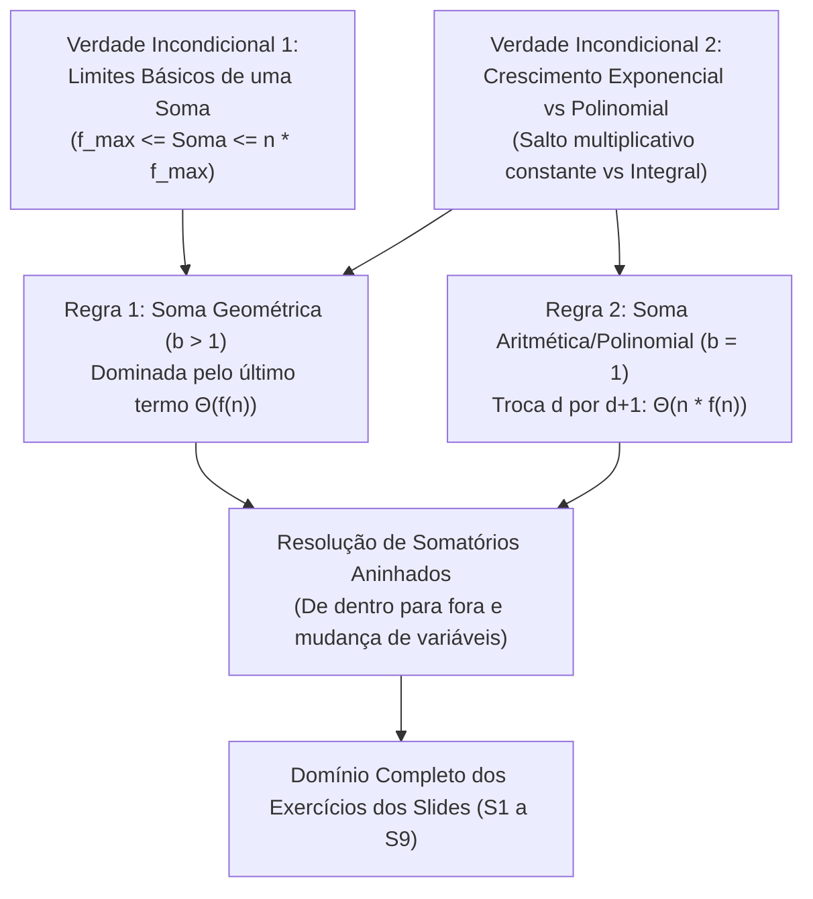

> [!question] Quiz
> Qual é a ordem assintótica em notação $\Theta$ para o somatório aritmético $\sum_{i=1}^n i = 1 + 2 + \dots + n$?
>
> 1. $\Theta(n)$
> 2. $\Theta(n \log n)$
> 3. $\Theta(n^2)$
> 4. $\Theta(n^3)$


> [!success] Quiz — correct ✓
> Your answer: 3. $\Theta(n^2)$
> Correct answer: 3
>
> A soma dos primeiros $n$ inteiros positivos é $\sum_{i=1}^n i = \frac{n(n+1)}{2} = \frac{n^2+n}{2}$. Como o termo dominante é $n^2$, o somatório pertence a $\Theta(n^2)$.


> [!question] Quiz
> Qual é a ordem assintótica em notação $\Theta$ para o somatório geométrico $\sum_{i=1}^n 2^i = 2^1 + 2^2 + \dots + 2^n$?
>
> 1. $\Theta(n \cdot 2^n)$
> 2. $\Theta(2^n)$
> 3. $\Theta(4^n)$
> 4. $\Theta(2^{n+1}/n)$


> [!success] Quiz — correct ✓
> Your answer: 2. $\Theta(2^n)$
> Correct answer: 2
>
> Na progressão geométrica $\sum_{i=1}^n 2^i = 2^1 + 2^2 + \dots + 2^n = 2^{n+1} - 2 = 2 \cdot 2^n - 2$. Como $2 \cdot 2^n \in \Theta(2^n)$, a soma cresce na mesma ordem do último termo.


> [!question] Quiz
> Qual é a ordem assintótica em notação $\Theta$ para o somatório $\sum_{i=1}^n i^2 \log i$?
>
> 1. $\Theta(n^2 \log n)$
> 2. $\Theta(n^3 \log n)$
> 3. $\Theta(n^3 \log^2 n)$
> 4. $\Theta(n^2 \log^2 n)$


> [!failure] Quiz — incorrect ✗
> Your answer: 3. $\Theta(n^3 \log^2 n)$
> Correct answer: 2
>
> Para somatórios polinomiais/aritméticos $\sum_{i=1}^n i^d \log^e i$ com $d > -1$, a soma assintótica é $\Theta(n \cdot f(n)) = \Theta(n^{d+1} \log^e n)$. Para $d=2$ e $e=1$, obtemos $\Theta(n^3 \log n)$.


> [!question] Question
> Como você prefere conduzir o estudo desta aula?
>
> Os slides ensinam como classificar rapidamente somatórios do tipo $\sum f(i)$ em forma básica e resolver laços aninhados em análise de algoritmos.
>
> 1. Intuição matemática + Aplicação nos exercícios dos slides (Recomendado)
> 2. Apenas as fórmulas e exercícios práticos


> [!example] Answer
> 1. Intuição matemática + Aplicação nos exercícios dos slides (Recomendado)


> [!abstract] PI

### Plano de Estudo: Simplificação $\Theta$ de Somatórios na Forma Básica

Com base no mapeamento inicial, você já domina a intuição elementar das somas básicas ($\sum i \in \Theta(n^2)$ e $\sum 2^i \in \Theta(2^n)$). Nosso objetivo agora é entender **por que** a forma genérica $f(i) = b^i \cdot i^d \cdot \log^e i$ se divide em apenas dois comportamentos assintóticos e como aplicar essas regras para resolver qualquer somatório (mesmo com laços aninhados e variáveis dependentes).

---

#### Mapa de Dependências



---

#### Roteiro das Etapas

1. **Fundamentos & Intuição das Duas Regras**:
   - Por que o fator exponencial ($b > 1$) faz a soma ser da ordem do **último termo** $\Theta(f(n))$ independentemente dos termos polinomiais ou logarítmicos que o acompanham.
   - Por que o somatório polinomial ($b = 1$) se comporta como uma integral, fazendo a ordem ser $n \cdot f(n) = \Theta(n^{d+1} \log^e n)$ (apenas o expoente polinomial $d$ vira $d+1$, mantendo $\log^e n$).
2. **Tratamento de Laços Aninhados & Índices Dependentes**:
   - Como avaliar de dentro para fora.
   - O que pode e o que não pode ser tratado como constante (ex: índice de laço externo vs tamanho de entrada $m, n$).
   - Mudança de variável para somas reversas (ex: $\sum (n-i)^3$).
3. **Resolução Ativa dos Exercícios dos Slides (S1 a S9)**.

Podemos dar início ao primeiro nó (Intuição da Soma Geométrica)?


> [!quote] YOU

yes


> [!abstract] PI

### 1. Regra da Soma Geométrica ($b > 1$)

#### Motivação
Em algoritmos, laços que dobram/triplicam valores ou árvores de recursão geram somatórios onde cada termo cresce exponencialmente. Precisamos saber: quanto a história passada da soma contribui em comparação com o último passo?

#### O Ponto Central
Considere uma progressão geométrica simples de base $b > 1$:

$$
\sum_{i=0}^n b^i = \frac{b^{n+1} - 1}{b - 1} = \left(\frac{b}{b - 1}\right) b^n - \frac{1}{b - 1}
$$

Como $b$ é uma constante fixa maior que $1$, o fator $\frac{b}{b - 1}$ é apenas uma **constante multiplicativa fixa**. Por exemplo:
- Para $b = 2$: $\sum_{i=0}^n 2^i = 2 \cdot 2^n - 1 \in \Theta(2^n)$.
- Para $b = 3$: $\sum_{i=0}^n 3^i = \frac{3}{2} \cdot 3^n - \frac{1}{2} \in \Theta(3^n)$.

O último termo sozinho é tão grande que **a soma de todos os termos anteriores é menor que uma fração constante do último termo**. 

Quando temos fatores polinomiais ou logarítmicos juntos, como $f(i) = b^i \cdot i^d \cdot \log^e i$ com $b > 1$, o crescimento exponencial $b^i$ continua dominando completamente a dinâmica do somatório.

---

#### A Regra Geral (Soma Geométrica)
Se $f(i) \in \Theta(b^i \cdot i^d \cdot \log^e i)$ com $b > 1$, então:

$$
\sum_{i=c_0}^{n+c_1} f(i) \in \Theta(f(n)) = \Theta(b^n \cdot n^d \cdot \log^e n)
$$

> **Regra prática:** Se tem base exponencial $b > 1$, o somatório é simplesmente da **mesma ordem do último termo** avaliado em $n$.

---

Vamos validar a fixação dessa regra com um teste rápido:


> [!question] Quiz
> Qual é a ordem assintótica em notação $\Theta$ para o somatório $\sum_{i=1}^n (3^i \cdot i^2)$?
>
> 1. $\Theta(n \cdot 3^n \cdot n^2) = \Theta(3^n \cdot n^3)$
> 2. $\Theta(3^n \cdot n^2)$
> 3. $\Theta(3^{n+1})$
> 4. $\Theta(3^n)$


> [!success] Quiz — correct ✓
> Your answer: 2. $\Theta(3^n \cdot n^2)$
> Correct answer: 2
>
> Como a base exponencial é $b = 3 > 1$, trata-se de um somatório geométrico. Pela regra, a soma é dominada pela ordem do último termo avaliado em $n$: $f(n) = 3^n \cdot n^2$, logo pertence a $\Theta(3^n \cdot n^2)$.


> [!abstract] PI

### 2. Regra da Soma Aritmética / Polinomial ($b = 1$)

#### Motivação
Quando não há fator exponencial ($b = 1$), os termos não explodem multiplicativamente a cada passo. Agora, todos os termos acumulam de forma contínua, muito parecida com uma área sob uma curva (uma integral).

#### A Intuição da Integral
Considere o somatório puramente polinomial:

$$
\sum_{i=1}^n i^d \approx \int_0^n x^d \, dx = \frac{n^{d+1}}{d + 1} \in \Theta(n^{d+1})
$$

Observe que $n^{d+1} = n \cdot n^d = n \cdot (\text{último termo})$.

Quando há fatores logarítmicos $\log^e i$, o logaritmo cresce lentamente e não altera a potência polinomial da integração. Pela aproximação por integral:

$$
\int_1^n x^d \ln^e x \, dx = \frac{n^{d+1} \ln^e n}{d + 1} - \mathcal{O}(n^{d+1} \ln^{e-1} n) \in \Theta(n^{d+1} \log^e n)
$$

---

#### A Regra Geral (Soma Aritmética / Polinomial)
Se $f(i) \in \Theta(i^d \cdot \log^e i)$ com $d > -1$:

$$
\sum_{i=c_0}^{n+c_1} f(i) \in \Theta(n \cdot f(n)) = \Theta(n^{d+1} \cdot \log^e n)
$$

> **Regra prática:** 
> 1. Multiplica-se a ordem do último termo por $n$.
> 2. Na prática: basta **somar $+1$ ao expoente polinomial $d$** ($d \to d + 1$).
> 3. O expoente do logaritmo $e$ **não muda**.

#### Quadro Comparativo

| Tipo | Condição | Resultado $\Theta$ | Regra Prática |
| :--- | :--- | :--- | :--- |
| **Geométrica** | $b > 1$ | $\Theta(f(n))$ | Copia o último termo |
| **Aritmética** | $b = 1, d > -1$ | $\Theta(n \cdot f(n))$ | Troca $d$ por $d+1$ (mantém $\log$) |

---

Vamos verificar essa regra com uma questão diagnóstica:


> [!question] Quiz
> Qual é a ordem assintótica em notação $\Theta$ para o somatório $\sum_{i=1}^n (i^3 \log^2 i)$?
>
> 1. $\Theta(n^3 \log^2 n)$
> 2. $\Theta(n^4 \log^2 n)$
> 3. $\Theta(n^4 \log^3 n)$
> 4. $\Theta(n^3 \log^3 n)$


> [!success] Quiz — correct ✓
> Your answer: 2. $\Theta(n^4 \log^2 n)$
> Correct answer: 2
>
> Aqui temos uma soma aritmética ($b = 1$) com $d = 3$ e $e = 2$. Pela regra, incrementamos o expoente polinomial $d$ de $3$ para $3+1=4$, mantendo a parte logarítmica inalterada ($\log^2 n$). O resultado é $\Theta(n^4 \log^2 n)$.


> [!abstract] PI

### 3. Somatórios Aninhados e Variáveis Dependentes

Para resolver laços aninhados, avaliamos **de dentro para fora**:

1. **Variáveis externas no somatório interno:** O índice do laço externo (como $i$) é uma variável para o somatório interno, não uma constante global! Mas variáveis como $m$ e $n$ que definem o tamanho da entrada não podem ser ignoradas.
2. **Mudança de variável (Somas Reversas):** Quando aparece algo como $(n - i)$ no termo ou no limite:
   - Fazemos a substituição $j = n - i$.
   - Quando $i$ varia de $0$ até $n-1$, $j$ varia de $n$ até $1$.
   - Assim, $\sum_{i=0}^{n-1} (n - i)^d = \sum_{j=1}^n j^d \in \Theta(n^{d+1})$.

---

#### Exemplo Passo a Passo dos Slides:
Considere o somatório aninhado:

$$
S = \sum_{i=0}^{n-1} \sum_{\ell=0}^{n-1-i} (\ell + 1)
$$

1. **Somatório Interno** (em relação a $\ell$):
   - O termo é $(\ell + 1)$, que é aritmético ($b = 1, d = 1$).
   - O limite superior é $\approx (n - i)$.
   - Pela regra aritmética ($d = 1 \to d = 2$): $\sum_{\ell=0}^{n-1-i} (\ell + 1) \in \Theta((n - i)^2)$.

2. **Somatório Externo** (em relação a $i$):
   - Substituímos o resultado interno no somatório externo:
   
   $$
   \sum_{i=0}^{n-1} \Theta((n - i)^2)
   $$

   - Fazendo $j = n - i$, a soma torna-se $\sum_{j=1}^n \Theta(j^2)$.
   - Como é aritmética com $d = 2$, incrementamos para $d = 3$:
   
   $$
   S \in \Theta(n^3)
   $$

---

Vamos testar a aplicação desse raciocínio de dentro para fora:


> [!question] Quiz
> Qual é a ordem assintótica em notação $\Theta$ para o somatório $S = \sum_{i=0}^{n-1} \sum_{j=0}^{m-1} j$?
>
> 1. $\Theta(n^2 \cdot m)$
> 2. $\Theta(n \cdot m^2)$
> 3. $\Theta(n^2 \cdot m^2)$
> 4. $\Theta(n \cdot m)$


> [!success] Quiz — correct ✓
> Your answer: 2. $\Theta(n \cdot m^2)$
> Correct answer: 2
>
> 1. Somatório interno: $\sum_{j=0}^{m-1} j$ é aritmético em $j$ de $0$ a $m-1$, logo pertence a $\Theta(m^2)$.
> 2. Somatório externo: $\sum_{i=0}^{n-1} \Theta(m^2) = \Theta(m^2) \sum_{i=0}^{n-1} 1 = \Theta(n \cdot m^2)$.


> [!question] Quiz
> (Exercício S4) Qual é a ordem $\Theta$ de $S_4 = \sum_{i=1}^n \sum_{j=1}^i 2^j$?
>
> 1. $\Theta(n \cdot 2^n)$
> 2. $\Theta(n^2 \cdot 2^n)$
> 3. $\Theta(2^n)$
> 4. $\Theta(4^n)$


$$
\sum_{i=1}^n{2^i} = \Theta(2^n)
$$

> [!failure] Quiz — incorrect ✗
> Your answer: 1. $\Theta(n \cdot 2^n)$
> Correct answer: 3
>
> 1. Somatório interno: $\sum_{j=1}^i 2^j$ é geométrico ($b=2 > 1$) com limite superior $i$, logo é dominado pelo último termo: $\Theta(2^i)$.
> 2. Somatório externo: $\sum_{i=1}^n \Theta(2^i)$ também é geométrico ($b=2 > 1$) com limite superior $n$, logo é dominado pelo último termo: $\Theta(2^n)$.


> [!abstract] PI

### Ponto Chave: Não Multiplique por $n$ em Somas Geométricas!

Um erro muito comum é pensar: *"o somatório externo vai de $1$ a $n$, então multiplico por $n$"*. 

Vamos analisar passo a passo o que acontece em $S_4$:

1. **Passo 1 (Interno):**
   $$
   \sum_{j=1}^i 2^j \in \Theta(2^i) \quad (\text{geométrico com base } b=2)
   $$
2. **Passo 2 (Externo):**
   Substituímos o resultado interno no laço externo:
   $$
   \sum_{i=1}^n \Theta(2^i)
   $$
   Observe com atenção a função sendo somada: ela é $2^i$ (a variável de controle $i$ está no expoente!).
   - A base é $b = 2 > 1$.
   - Portanto, o somatório externo **também é uma soma geométrica**.
   - Pela regra geométrica, a soma é dominada pelo **último termo** avaliado no limite superior ($i = n$):
   
   $$
   \sum_{i=1}^n 2^i \in \Theta(2^n)
   $$

> **Atenção:** Só multiplicamos por $n$ (ou trocamos $d$ por $d+1$) quando a base é **$b=1$** (soma aritmética). Se o termo acumulado for exponencial na variável do laço (como $2^i$), a regra que se aplica é a **geométrica**!

---

Agora compare com o caso onde o termo interno **não depende** do índice $i$:


> [!question] Quiz
> (Exercício S9) Qual é a ordem $\Theta$ de $S_9 = \sum_{i=1}^n \sum_{j=1}^n \sum_{k=1}^n 2^k$?
>
> 1. $\Theta(2^n)$
> 2. $\Theta(n \cdot 2^n)$
> 3. $\Theta(n^2 \cdot 2^n)$
> 4. $\Theta(n^3 \cdot 2^n)$


$$
\mathrm{Res} = \sum_{i=0}^n \sum_{j=i}^n 2^n = \sum_{i=0}^n{n \cdot2^n} = \Theta(n² \cdot 2^n)
$$

> [!success] Quiz — correct ✓
> Your answer: 3. $\Theta(n^2 \cdot 2^n)$
> Correct answer: 3
>
> 1. Somatório mais interno: $\sum_{k=1}^n 2^k$ vai até $n$, logo é $\Theta(2^n)$.
> 2. Somatório do meio: $\sum_{j=1}^n \Theta(2^n) = \Theta(2^n) \sum_{j=1}^n 1 = \Theta(n \cdot 2^n)$ (pois $2^n$ não varia com $j$).
> 3. Somatório externo: $\sum_{i=1}^n \Theta(n \cdot 2^n) = \Theta(n \cdot 2^n) \sum_{i=1}^n 1 = \Theta(n^2 \cdot 2^n)$ (pois $n \cdot 2^n$ não varia com $i$).


> [!question] Quiz
> (Exercício S8) Qual é a ordem $\Theta$ de $S_8 = \sum_{i=1}^n \sum_{j=1}^i \sum_{k=1}^j 2^k$?
>
> 1. $\Theta(n^2 \cdot 2^n)$
> 2. $\Theta(n \cdot 2^n)$
> 3. $\Theta(2^n)$
> 4. $\Theta(8^n)$


> [!success] Quiz — correct ✓
> Your answer: 3. $\Theta(2^n)$
> Correct answer: 3
>
> 1. Mais interno: $\sum_{k=1}^j 2^k \in \Theta(2^j)$ (geométrico em $k$, dominado por $2^j$).
> 2. Intermediário: $\sum_{j=1}^i \Theta(2^j) \in \Theta(2^i)$ (geométrico em $j$, dominado por $2^i$).
> 3. Externo: $\sum_{i=1}^n \Theta(2^i) \in \Theta(2^n)$ (geométrico em $i$, dominado por $2^n$).
> Como todas as três camadas são somas geométricas encadeadas, o resultado final permanece $\Theta(2^n)$.


> [!question] Quiz
> (Exercício S5) Qual é a ordem $\Theta$ de $S_5 = \sum_{i=0}^{n-1} (n - i)^3$?
>
> 1. $\Theta(n^3)$
> 2. $\Theta(n^4)$
> 3. $\Theta(n^5)$
> 4. $\Theta(n^3 \log n)$


$$
\mathrm{Res} = \sum_{k=1}^n k³= \Theta(n^4)
$$

> [!failure] Quiz — incorrect ✗
> Your answer: 1. $\Theta(n^3)$
> Correct answer: 2
>
> Fazendo a substituição $u = n - i$, quando $i$ varia de $0$ a $n-1$, $u$ varia de $n$ até $1$. Assim, $\sum_{i=0}^{n-1} (n-i)^3 = \sum_{u=1}^n u^3$. Como é uma soma aritmética ($b=1$) com $d=3$, trocamos $d$ por $d+1 = 4$, resultando em $\Theta(n^4)$.


> [!abstract] PI

### O que Aconteceu em $S_5$?

Quando vemos um termo como $(n - i)^3$, pode ser tentador apenas substituir $i = 0$ e obter $n^3$. Porém, precisamos lembrar: **isto é uma soma acumulada de $n$ termos**, não um único termo!

Veja os termos expandidos:
$$
\begin{aligned}
S_5 &= \sum_{i=0}^{n-1} (n - i)^3 \\
&= (n - 0)^3 + (n - 1)^3 + (n - 2)^3 + \dots + (n - (n - 1))^3 \\
&= n^3 + (n - 1)^3 + (n - 2)^3 + \dots + 1^3
\end{aligned}
$$

Repare que isso é exatamente a soma dos cubos de $1$ até $n$, apenas escrita em ordem decrescente:

$$
S_5 = \sum_{u=1}^n u^3
$$

Como a base é $b = 1$ (soma aritmética/polinomial) com expoente $d = 3$:
- Aplicamos a regra da soma aritmética ($d \to d + 1$):

$$
S_5 \in \Theta(n^{3+1}) = \Theta(n^4)
$$

---

Vamos consolidar essa intuição de soma aritmética aninhada com o exercício $S_6$:
$$
S_6 = \sum_{i=1}^n \sum_{j=1}^i (j \log j)
$$


> [!question] Quiz
> (Exercício S6) Qual é a ordem $\Theta$ de $S_6 = \sum_{i=1}^n \sum_{j=1}^i (j \log j)$?
>
> 1. $\Theta(n^2 \log n)$
> 2. $\Theta(n^3 \log n)$
> 3. $\Theta(n^3 \log^2 n)$
> 4. $\Theta(n^4 \log n)$


> [!success] Quiz — correct ✓
> Your answer: 2. $\Theta(n^3 \log n)$
> Correct answer: 2
>
> 1. Interno: $\sum_{j=1}^i (j \log j)$ tem $b=1, d=1, e=1$. Pela regra aritmética ($d \to d+1$), resulta em $\Theta(i^2 \log i)$.
> 2. Externo: $\sum_{i=1}^n \Theta(i^2 \log i)$ tem $b=1, d=2, e=1$. Pela regra aritmética ($d \to d+1$), resulta em $\Theta(n^3 \log n)$.


> [!question] Quiz
> (Exercício S7) Qual é a ordem $\Theta$ de $S_7 = \sum_{i=0}^{n-1} \sum_{j=0}^i \sum_{k=0}^j 1$?
>
> 1. $\Theta(n)$
> 2. $\Theta(n^2)$
> 3. $\Theta(n^3)$
> 4. $\Theta(n^4)$


> [!failure] Quiz — incorrect ✗
> Your answer: 2. $\Theta(n^2)$
> Correct answer: 3
>
> 1. Interno: $\sum_{k=0}^j 1 \in \Theta(j)$ (aritmético com $d=0 \to d=1$).
> 2. Intermediário: $\sum_{j=0}^i \Theta(j) \in \Theta(i^2)$ (aritmético com $d=1 \to d=2$).
> 3. Externo: $\sum_{i=0}^{n-1} \Theta(i^2) \in \Theta(n^3)$ (aritmético com $d=2 \to d=3$).
> Como cada somatório acumula linearmente sobre o índice anterior, o grau sobe de $0 \to 1 \to 2 \to 3$, resultando em $\Theta(n^3)$.


> [!abstract] PI

### Visualizando a Cascata em $S_7$

Pense no somatório $S_7 = \sum_{i=0}^{n-1} \sum_{j=0}^i \sum_{k=0}^j 1$ como três laços `for` aninhados:

```c
for (int i = 0; i < n; i++) {
    for (int j = 0; j <= i; j++) {
        for (int k = 0; k <= j; k++) {
            // operação constante: 1
        }
    }
}
```

Acompanhe como o grau do polinômio cresce camada por camada ($d \to d+1$ a cada laço):

1. **Laço mais interno ($k$):**
   $$
   \sum_{k=0}^j 1 = j + 1 \in \Theta(j^1) \quad (\text{grau } 0 \to 1)
   $$
2. **Laço intermediário ($j$):**
   $$
   \sum_{j=0}^i \Theta(j^1) \in \Theta(i^2) \quad (\text{grau } 1 \to 2)
   $$
3. **Laço externo ($i$):**
   $$
   \sum_{i=0}^{n-1} \Theta(i^2) \in \Theta(n^3) \quad (\text{grau } 2 \to 3)
   $$

> **Regra de Ouro da Cascata:** Cada laço dependente que acumula uma soma aritmética adiciona $+1$ ao grau do polinômio resultante. Com 3 laços em cascata a partir de uma constante $\Theta(1)$, obtemos grau $0 + 1 + 1 + 1 = 3 \implies \Theta(n^3)$.

---

Vamos consolidar tudo em um teste final com uma combinação mista:


> [!question] Quiz
> (Desafio Final) Qual é a ordem $\Theta$ de $S = \sum_{i=1}^n \sum_{j=1}^i (3^j \cdot j^2)$?
>
> 1. $\Theta(3^n \cdot n^2)$
> 2. $\Theta(3^n \cdot n^3)$
> 3. $\Theta(3^n \cdot n^4)$
> 4. $\Theta(9^n \cdot n^2)$


> [!success] Quiz — correct ✓
> Your answer: 1. $\Theta(3^n \cdot n^2)$
> Correct answer: 1
>
> 1. Interno: $\sum_{j=1}^i (3^j \cdot j^2)$ é geométrica com base $b=3 > 1$, logo é dominada pelo último termo: $\Theta(3^i \cdot i^2)$.
> 2. Externo: $\sum_{i=1}^n \Theta(3^i \cdot i^2)$ também tem $b=3 > 1$, logo é novamente geométrica e dominada pelo seu último termo: $\Theta(3^n \cdot n^2)$.
> Portanto, a ordem final é $\Theta(3^n \cdot n^2)$.


> [!abstract] PI

### Síntese Completa: Simplificação $\Theta$ de Somatórios

Cobrimos todos os conceitos e exercícios dos slides de simplificação assintótica de somatórios básicos.

---

#### 1. As Duas Regras Fundamentais

Dada a forma genérica $f(i) \in \Theta(b^i \cdot i^d \cdot \log^e i)$ no somatório $\sum_{i=c_0}^n f(i)$:

| Caso | Condição | Resultado $\Theta$ | Raciocínio Prático |
| :--- | :--- | :--- | :--- |
| **Soma Geométrica** | $b > 1$ | $\Theta(f(n)) = \Theta(b^n \cdot n^d \cdot \log^e n)$ | O crescimento exponencial domina tudo: basta copiar a ordem do **último termo**. |
| **Soma Aritmética / Polinomial** | $b = 1, d > -1$ | $\Theta(n \cdot f(n)) = \Theta(n^{d+1} \cdot \log^e n)$ | Comporta-se como uma integral: **soma $+1$ ao expoente polinomial $d$** ($d \to d+1$). O logaritmo fica inalterado. |

---

#### 2. Resumo de Todos os Exercícios dos Slides ($S_1$ a $S_9$)

| Exercício | Somatório | Resolução & Justificativa | Ordem $\Theta$ |
| :--- | :--- | :--- | :--- |
| $S_1$ | $\sum_{i=1}^n 3^i \cdot i^2$ | Geométrica ($b=3 > 1$): ordem do último termo. | $\Theta(3^n \cdot n^2)$ |
| $S_2$ | $\sum_{i=1}^n i^3 \log^2 i$ | Aritmética ($b=1, d=3, e=2$): $d \to d+1 = 4$, mantém $\log^2 n$. | $\Theta(n^4 \log^2 n)$ |
| $S_3$ | $\sum_{i=0}^{n-1} \sum_{j=0}^{m-1} j$ | Interno: $\Theta(m^2)$; Externo: $\sum_{i=0}^{n-1} \Theta(m^2) = \Theta(n \cdot m^2)$. | $\Theta(n \cdot m^2)$ |
| $S_4$ | $\sum_{i=1}^n \sum_{j=1}^i 2^j$ | Interno: $\Theta(2^i)$ (geom.); Externo: $\sum_{i=1}^n \Theta(2^i) \in \Theta(2^n)$ (geom.). | $\Theta(2^n)$ |
| $S_5$ | $\sum_{i=0}^{n-1} (n - i)^3$ | Mudança $u = n - i \implies \sum_{u=1}^n u^3$ (aritmética com $d=3 \to 4$). | $\Theta(n^4)$ |
| $S_6$ | $\sum_{i=1}^n \sum_{j=1}^i (j \log j)$ | Interno: $\Theta(i^2 \log i)$; Externo: $\sum_{i=1}^n \Theta(i^2 \log i) \in \Theta(n^3 \log n)$. | $\Theta(n^3 \log n)$ |
| $S_7$ | $\sum_{i=0}^{n-1} \sum_{j=0}^i \sum_{k=0}^j 1$ | Cascata de 3 somas aritméticas dependentes: grau $0 \to 1 \to 2 \to 3$. | $\Theta(n^3)$ |
| $S_8$ | $\sum_{i=1}^n \sum_{j=1}^i \sum_{k=1}^j 2^k$ | Cascata de 3 somas geométricas dependentes: $\Theta(2^j) \to \Theta(2^i) \to \Theta(2^n)$. | $\Theta(2^n)$ |
| $S_9$ | $\sum_{i=1}^n \sum_{j=1}^n \sum_{k=1}^n 2^k$ | Limites independentes fixados em $n$: $\Theta(2^n) \to \Theta(n \cdot 2^n) \to \Theta(n^2 \cdot 2^n)$. | $\Theta(n^2 \cdot 2^n)$ |
