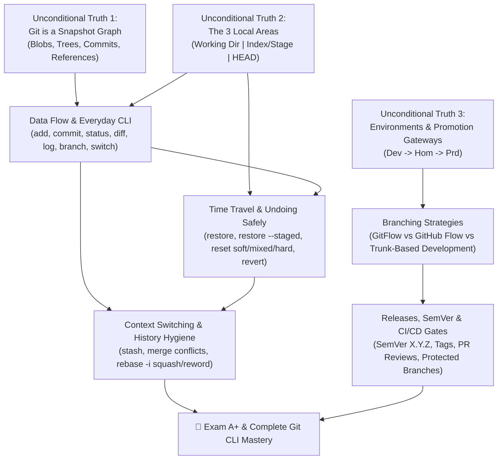

> [!quote] YOU

get the /home/warley/ufc/4s/configuration_management/slides and get the slides for my exam tomorrow

for extra to exam, I want to learn the git entirely for cli commands, can you give me these support?


> [!question] Quiz
> What happens to your files when you run `git reset --soft HEAD~1`?
>
> 1. The commit is undone, and its changes remain in the Staging Area.
> 2. The commit is undone, and its changes are permanently deleted from disk.
> 3. The commit is undone, and its changes move to the Working Directory as unstaged.
> 4. A new commit is created that inverses the changes while keeping history intact.


> [!question] Quiz — I don't know
> Your answer: I don't know
> Correct answer: 1
>
> `git reset --soft HEAD~1` moves HEAD back by one commit while leaving the Index (Staging Area) and Working Directory completely untouched. All modifications from that commit stay staged and ready to be committed again.


> [!question] Quiz
> In the standard Git workflow, what is the primary role of the `git add <file>` command?
>
> 1. Discards uncommitted changes in the Working Directory.
> 2. Moves modified files into the Staging Area (Index).
> 3. Pushes local changes directly to the remote server.
> 4. Saves a permanent snapshot directly into the Repository (.git).


> [!success] Quiz — correct ✓
> Your answer: 2. Moves modified files into the Staging Area (Index).
> Correct answer: 2
>
> Running `git add <file>` moves the snapshot of your modifications from the Working Directory into the Staging Area (Index), preparing it for the next commit.


> [!question] Quiz
> Which branching model relies on developers frequently merging small commits directly into a single shared branch multiple times a day using feature flags?
>
> 1. Trunk-Based Development
> 2. Release Branching Model
> 3. GitFlow
> 4. Forking Workflow


> [!failure] Quiz — incorrect ✗
> Your answer: 2. Release Branching Model
> Correct answer: 1
>
> Trunk-Based Development encourages developers to merge small, frequent updates into a single central branch (trunk) multiple times a day, relying on automated tests and feature flags (toggles).


> [!abstract] PI

I have analyzed all 5 slide decks from `/home/warley/ufc/4s/configuration_management/slides/` for your exam tomorrow:

---

### 📚 Syllabus & Content Breakdown (Slides 0 to 4)

| Slide Deck | Core Topics Covered |
| :--- | :--- |
| **Aula 0: Introdução à GC** | Motivation, Software Complexity, Traceability, Baselines, Course Structure. |
| **Aula 1: Fundamentos de SCM** | What is SCM; Version Control fundamentals (Repositories, Branches); Change Control (RFC, Impact Analysis, Prioritization, CCB); Continuous Integration (CI). |
| **Aula 2: Projeto PIX & Ambientes** | Multi-tier Environments (**Dev** $\to$ **Hom** $\to$ **Prd**); Pull Request workflow, Code Review guidelines, and deployment gates. |
| **Aula 3: Git CLI Essencial** | The 3 Git Trees (Working Directory, Staging/Index, Repository); Commands: `init`, `clone`, `status`, `add`, `commit`, `log`, `diff`, `branch`, `checkout`/`switch`, `tag`, `.gitignore`, `push`, `fetch`, `pull`. |
| **Aula 4: Git Avançado & DevOps** | **Crisis Management & Undoing**: `git restore`, `git restore --staged`, `git reset` (`--soft`, `--mixed`, `--hard`), `git revert` (local history vs. public history); **Stash**: `git stash`, `pop`, `apply`, `list`; **Merge & Conflicts** (`<<<<<<< HEAD`); **Interactive Rebase**: `git rebase -i` (`squash`, `reword`, `pick`, `drop`); **Branching Models**: GitFlow vs. GitHub Flow vs. Trunk-Based; **Releases & SemVer**: `MAJOR.MINOR.PATCH`; Quality Gates & CI/CD. |

---

### 🗺️ Proposed Learning & Mastery Plan

We will build your knowledge systematically from **ground-truth mental models** (unconditional truths) up to **every critical CLI command and exam scenario**.



---

### How We Will Progress:
1. **Module 1**: The 3 Local Areas & the Snapshot Model $\to$ Master `restore`, `restore --staged`, and all 3 modes of `reset` (`--soft`, `--mixed`, `--hard`).
2. **Module 2**: Remote Collaboration & Clean History $\to$ `revert` vs `reset`, `stash`, merge conflict anatomy, and `rebase -i` (`squash` / `reword`).
3. **Module 3**: SCM Architecture & Exam Scenarios $\to$ GitFlow vs GitHub Flow vs Trunk-Based, Environments (**Dev/Hom/Prd**), SemVer ($v\text{MAJOR}.\text{MINOR}.\text{PATCH}$), and CI/CD Quality Gates.

Whenever you are ready, give the go-ahead and we will start with **Module 1**!

---
> [!tip] 💡 English Polish
> - **Original:** *"for extra to exam, I want to learn the git entirely for cli commands, can you give me these support?"*
> - **More Natural:** 
>   - *"In addition to exam prep, I want to master the Git CLI completely. Can you support me with this?"*
>   - *"Aside from preparing for the exam, I'd like to learn all Git CLI commands in depth. Can you help me with that?"*
> - **Quick Tip:** 
>   - *"Support"* is an uncountable noun here, so use **"this support"** or **"some support"** instead of *"these support"*.
>   - Use **"in addition to / aside from"** instead of *"for extra to"*.


> [!quote] YOU

go ahead


> [!abstract] PI

### Node 1: The Three Local Trees (The Core Mental Model)

#### 1. Motivation: Why does Git need three separate areas?
If Git saved files directly from your folder to the permanent history with a single command, you would be forced to commit **everything** currently modified on your disk—including debug print statements, unfinished files, or local configuration. 

To solve this, Git introduces an intermediate preparation area.

---

#### 2. Unconditional Truth: The 3 Areas
At any given second on your local machine, your code exists across **three distinct zones**:

```
 ┌──────────────────────┐      git add      ┌──────────────────────┐     git commit     ┌──────────────────────┐
 │   Working Tree       │ ────────────────> │    Staging Area      │ ────────────────>  │      Repository      │
 │  (Files on Disk)     │                   │       (Index)        │                    │        (HEAD)        │
 └──────────────────────┘ <──────────────── └──────────────────────┘                    └──────────────────────┘
                            git restore           git restore --staged
```

1. **Working Directory (Tree)**: The actual physical files you see and edit in VS Code / Vim / your filesystem. Git sees them as *untracked* or *modified (unstaged)*.
2. **Staging Area (Index)**: A virtual staging checklist. It holds the exact snapshot of files that are queued to be written into the next commit.
3. **Repository (HEAD)**: The permanent database inside `.git`. `HEAD` is simply a pointer to the **latest commit** on your currently active branch.

---

#### 3. How Everyday CLI Commands Move Data

- `git add <file>` $\to$ Copies the current state of `<file>` from the **Working Tree** into the **Staging Area**.
- `git commit -m "..."` $\to$ Takes the exact snapshot currently in the **Staging Area**, seals it as a new immutable commit node in the **Repository**, and moves `HEAD` forward to point to it.
- `git status` $\to$ Compares all three areas:
  - Difference between **Working Tree** and **Staging Area** $\to$ *Changes not staged for commit* (red).
  - Difference between **Staging Area** and **HEAD** $\to$ *Changes to be committed* (green).

---

Let's test this foundational tree model before moving to undoing actions (`restore` & `reset`):


> [!question] Quiz
> When `git status` shows files highlighted in green under "Changes to be committed", which two areas is Git comparing?
>
> 1. Compares the Working Directory directly against the remote repository.
> 2. Compares the local HEAD commit against the remote branch.
> 3. Compares the last two commits in the local history.
> 4. Compares the Staging Area against the HEAD commit.


> [!success] Quiz — correct ✓
> Your answer: 4. Compares the Staging Area against the HEAD commit.
> Correct answer: 4
>
> `git status` compares the Staging Area against HEAD to show changes staged for the next commit (green), and compares the Working Directory against the Staging Area to show unstaged changes (red).


> [!abstract] PI

### Node 2: Discarding and Unstaging (`git restore`)

#### 1. Motivation: Handling Local Mistakes Before Committing
Modern Git cleanly separates branch operations from file-restoration operations. The dedicated command for undoing changes in your Working Tree and Staging Area is **`git restore`**.

---

#### 2. The Mechanics: Where Does the Data Flow?

Look back at our 3-area diagram. When you need to undo changes before creating a commit, you only have two possible problems:

| Problem Scenario | What you want to do | Exact Command | What happens under the hood |
| :--- | :--- | :--- | :--- |
| **Scenario A: Unstage a file** | You ran `git add file.txt`, but don't want it in the next commit. You want to keep your edits on disk. | `git restore --staged file.txt` | Copies the version from **HEAD** into the **Staging Area**. Your **Working Tree** is left completely untouched. |
| **Scenario B: Discard disk edits** | You edited `file.txt`, broke the code, and want to throw away your unsaved changes. | `git restore file.txt` | Overwrites the **Working Tree** file with the version from the **Staging Area** (or HEAD). **Destructive for uncommitted edits.** |

---

#### 3. Combining Them
If you added a file to staging and want to completely eliminate all changes from both staging AND your disk:
```bash
# Step 1: Remove from Staging (Index)
git restore --staged file.txt

# Step 2: Discard edits from Working Tree (Disk)
git restore file.txt
```

---

Let's verify this distinction with a quick scenario:


> [!question] Quiz
> You modified `login.py` and ran `git add login.py`. You realize you are not ready to commit it yet, but you want to keep your modifications on disk to continue editing. Which command should you run?
>
> 1. git revert login.py
> 2. git restore login.py
> 3. git restore --staged login.py
> 4. git reset --hard login.py


> [!success] Quiz — correct ✓
> Your answer: 3. git restore --staged login.py
> Correct answer: 3
>
> `git restore --staged <file>` removes the file from the Staging Area while preserving all your local edits in your Working Directory. `git restore <file>` (without `--staged`) would overwrite and lose your disk edits.


> [!abstract] PI

### Node 3: Undoing Local Commits with `git reset`

#### 1. Motivation: Rewinding the Commit History
You created a local commit (`C3`), but realized something is wrong: you wrote the wrong commit message, forgot a file, or want to discard the work entirely. 

How do we rewind history?

---

#### 2. The Core Mechanic of `git reset`
In all three flavors of `git reset <commit>`, **HEAD is moved back** to point to the target commit. 

The flag (`--soft`, `--mixed`, `--hard`) only controls **how many of the 3 trees are updated**:

```
                       HEAD pointer moves back
                                 │
     ┌───────────────────────────┴───────────────────────────┐
     │                                                       │
     ▼                                                       ▼
[--soft]                                                 [--mixed] (Default)
• Updates: HEAD only.                                   • Updates: HEAD + Staging Area.
• Staging Area: Keeps all changes (staged).             • Staging Area: Cleared.
• Working Tree: Keeps all changes.                      • Working Tree: Keeps all changes (unstaged).
• Use case: Fix commit message or combine commits.       • Use case: Unstage changes to re-split them.
                                                             │
                                                             ▼
                                                         [--hard] ⚠️
                                                        • Updates: HEAD + Staging + Working Tree.
                                                        • Working Tree: Overwritten/Wiped to target commit.
                                                        • Use case: Total destruction of unwanted work.
```

---

#### 3. Summary Cheat Sheet for Tomorrow's Exam

| Command | HEAD moved? | Staging Area (Index) | Working Tree (Disk) | Safe? |
| :--- | :---: | :---: | :---: | :---: |
| `git reset --soft HEAD~1` | ✅ Yes | 🟢 Kept (staged) | 🟢 Kept | ✅ Very Safe |
| `git reset --mixed HEAD~1` | ✅ Yes | 🔴 Reset | 🟢 Kept (unstaged) | ✅ Safe |
| `git reset --hard HEAD~1` | ✅ Yes | 🔴 Reset | 🔴 Overwritten | ❌ Destructive |

*(Note: If you run `git reset HEAD~1` without any flag, it defaults to `--mixed`.)*

---

Let's test this mental model:


> [!question] Quiz
> You made a commit with two distinct features by mistake. You want to undo the commit and leave the files in your Working Directory as unstaged edits so you can split them into two separate commits. Which command should you run?
>
> 1. git reset --hard HEAD~1
> 2. git reset --soft HEAD~1
> 3. git reset --mixed HEAD~1
> 4. git revert HEAD


> [!success] Quiz — correct ✓
> Your answer: 3. git reset --mixed HEAD~1
> Correct answer: 3
>
> `git reset --mixed` (the default mode) moves HEAD back to the previous commit, empties the Staging Area, but leaves all modified files in your Working Directory as unstaged edits.


> [!abstract] PI

### Node 4: The Golden Rule (Local vs. Remote) & `git stash`

#### 1. Motivation: Why `git reset` is forbidden on shared branches
If you use `git reset` on commits you have already pushed to GitHub/GitLab (`origin/main`), you **delete** history from your local branch. When you attempt to push, Git rejects it because histories have diverged. If you force push (`--force`), you break the history for every other engineer on the team.

---

#### 2. The Solution: `git revert` (Safe for Shared/Production Code)

- **`git reset`** $\to$ Rewinds and erases history. **Local only** (before pushing).
- **`git revert <commit-hash>`** $\to$ **Appends a brand-new commit** that applies the exact inverse changes of `<commit-hash>`. History remains strictly linear and forwards-moving.

```
Before revert:
  (C1) ───> (C2: introduced bug) ───> (C3) [main]

After `git revert C2`:
  (C1) ───> (C2: introduced bug) ───> (C3) ───> (C4: Revert C2) [main]
```

---

#### 3. Handling Interruptions: The Stash Drawer (`git stash`)

Imagine you are midway through refactoring when a critical bug hits production:
1. You cannot commit broken, half-written code.
2. Git won't let you switch branches (`git switch main`) if uncommitted changes conflict.

**Commands:**
- `git stash` (or `git stash push -m "WIP feature"`) $\to$ Temporarily shelves all modified tracked files into a clean stack. Working directory becomes clean.
- `git stash list` $\to$ Views all saved stashes.
- `git stash pop` $\to$ Restores the latest shelved changes and removes them from the stash list.
- `git stash apply` $\to$ Restores the changes but keeps them stored in the stash list for reuse.

---

Let's test the Golden Rule:


> [!question] Quiz
> A commit containing a production bug was already pushed to the shared `main` branch and pulled by other teammates. Which command should you use to undo the bug safely without rewriting shared commit history?
>
> 1. git reset --hard <commit-hash> 
> 2. git restore --staged <commit-hash>
> 3. git revert <commit-hash>
> 4. git reset --soft <commit-hash>


> [!success] Quiz — correct ✓
> Your answer: 3. git revert <commit-hash>
> Correct answer: 3
>
> On a shared public branch (like `main`), `git revert <commit>` is the safe standard because it creates a new inverse commit without rewriting shared history or breaking other developers' clones.


> [!abstract] PI

### Node 5: Interactive Rebase (`git rebase -i`) & Merge Conflicts

#### 1. Motivation: "Dress Well for the Pull Request"
While developing locally, you make messy commits: *"fix typo"*, *"wip"*, *"now it works"*. Before submitting a Pull Request to your team, you clean your local history into clean, cohesive commits using **Interactive Rebase**.

---

#### 2. Interactive Rebase Commands (`git rebase -i HEAD~N`)

Running `git rebase -i HEAD~4` opens your editor with a list of the last 4 commits (ordered from oldest at top to newest at bottom):

| Command | Action |
| :--- | :--- |
| **`pick`** (default) | Use the commit as is. |
| **`reword`** (`r`) | Keep the code changes, but edit/fix the commit message. |
| **`squash`** (`s`) | **Melts this commit into the commit above it** and prompts to combine their commit messages into one. |
| **`drop`** (`d`) | Completely removes this commit from the branch. |
| **`edit`** (`e`) | Pauses the rebase at this commit so you can add/amend files. |

---

#### 3. Anatomizing Merge Conflicts
When two branches modify the **same lines of the same file**, Git pauses and generates conflict markers:

```text
<<<<<<< HEAD
const apiUrl = "https://api.internal.com/v1";  // Current branch change
=======
const apiUrl = "https://api.production.com/v2"; // Incoming branch change
>>>>>>> feature/new-endpoint
```

**Resolution Protocol:**
1. Manually edit the file to keep the desired code.
2. Delete the marker lines (`<<<<<<<`, `=======`, `>>>>>>>`).
3. Stage the resolved file: `git add <file>`.
4. Finalize the operation:
   - For merge: `git commit`
   - For rebase: `git rebase --continue` (never run `git commit` during rebase).

---

Let's test Interactive Rebase operations:


> [!question] Quiz
> During an interactive rebase (`git rebase -i`), which command combines a commit into the preceding commit in the list?
>
> 1. squash
> 2. reword
> 3. drop
> 4. revert


> [!success] Quiz — correct ✓
> Your answer: 1. squash
> Correct answer: 1
>
> `squash` merges the designated commit into its parent commit above it, combining both sets of changes and prompting you to combine or edit the commit messages.


> [!abstract] PI

### Node 6: Branching Strategies, Environments & SemVer

#### 1. The 3 Major Branching Strategies (Exam Focus)

| Strategy | Structure & Branches | Deployment Style | Key Mechanism | Best For |
| :--- | :--- | :--- | :--- | :--- |
| **GitFlow** | `main`, `develop`, `feature/*`, `release/*`, `hotfix/*` | Scheduled, periodic releases | Multiple long-lived branches | Strict release cycles, enterprise/banking software. |
| **GitHub Flow** | Single `main` branch + short-lived `feature/*` branches | Continuous deployment per Pull Request | PR Reviews + Automated CI | Web apps, agile teams with rapid iterations. |
| **Trunk-Based Development** | Everyone commits directly or via tiny short-lived branches (<24h) to `main` (the Trunk) | Multiple times a day | **Feature Flags (Toggles)** + rigorous automated test suites | Elite DevOps, high-velocity engineering (Google, Meta). |

---

#### 2. Software Environments (Dev $\to$ Hom $\to$ Prd)

```
 [ Dev (Development) ]        ──>       [ Hom (Homologation / QA) ]       ──>       [ Prd (Production) ]
 • Individual/Team work                 • Mirror of production                      • Real end users
 • Rapid changes, may break             • Final QA, business validation             • High availability & stability
```

---

#### 3. Semantic Versioning (SemVer: `MAJOR.MINOR.PATCH`)

Given a version number `v1.4.2`:

$$\text{v}\underbrace{1}_{\text{MAJOR}}.\underbrace{4}_{\text{MINOR}}.\underbrace{2}_{\text{PATCH}}$$

- **MAJOR** ($1.4.2 \to 2.0.0$): **Breaking changes** (incompatible API changes; older clients may crash).
- **MINOR** ($1.4.2 \to 1.5.0$): **New features added in a backward-compatible manner**.
- **PATCH** ($1.4.2 \to 1.4.3$): **Backward-compatible bug fixes**.

---

Let's test this directly with an exam scenario:


> [!question] Quiz
> Your team refactored a REST API and removed several legacy endpoints, causing breaking changes for existing mobile clients. According to SemVer, which version segment MUST be incremented?
>
> 1. PATCH version (e.g., 1.5.3)
> 2. MINOR version (e.g., 1.6.0)
> 3. MAJOR version (e.g., 2.0.0)
> 4. BUILD metadata (e.g., 1.5.2+build01)


> [!failure] Quiz — incorrect ✗
> Your answer: 1. PATCH version (e.g., 1.5.3)
> Correct answer: 3
>
> In Semantic Versioning (SemVer), any breaking change that alters existing endpoints or makes the API incompatible with older clients requires bumping the MAJOR version (e.g., from 1.5.2 to 2.0.0).


> [!abstract] PI

### Understanding SemVer Impact

Think of Semantic Versioning as a contract with the user or API consumer:

$$\text{v}\underbrace{\mathbf{X}}_{\text{MAJOR}}.\underbrace{\mathbf{Y}}_{\text{MINOR}}.\underbrace{\mathbf{Z}}_{\text{PATCH}}$$

1. **PATCH ($\mathbf{Z}$ — Band-aid / Bugfix)**:
   - *"We fixed a calculation bug or memory leak."*
   - No new features, nothing broken.
2. **MINOR ($\mathbf{Y}$ — New Feature, Backward-Compatible)**:
   - *"We added a dark mode toggle or a new `/export-pdf` endpoint."*
   - Old code and clients continue to work completely unaffected.
3. **MAJOR ($\mathbf{X}$ — Breaking Change / Incompatible)**:
   - *"We renamed or deleted parameters, changed database formats, or deprecated old clients."*
   - Old clients **will break** unless updated.

---

Let's do a quick check to cement this:


> [!question] Quiz
> An e-commerce platform at version `v3.1.4` adds a new 'Apple Pay' checkout button while keeping all existing payment methods and API endpoints fully working. Which version should be released?
>
> 1. REVISION version (v3.1.4.1)
> 2. PATCH version (v3.1.5)
> 3. MAJOR version (v4.0.0)
> 4. MINOR version (v3.2.0)


> [!success] Quiz — correct ✓
> Your answer: 4. MINOR version (v3.2.0)
> Correct answer: 4
>
> Adding new features without breaking any existing functionality is the exact definition of incrementing the MINOR version (e.g., from 3.1.4 to 3.2.0).


> [!abstract] PI

## Complete Git CLI & Configuration Management Master Guide

Here is your consolidated master guide covering all slide material (Aulas 0–4), the entire Git CLI command set, emergency protocols, and exam essentials.

---

### 1. The 3 Local Areas & Data Flow

```
┌──────────────────────┐      git add      ┌──────────────────────┐     git commit     ┌──────────────────────┐
│   Working Tree       │ ────────────────> │    Staging Area      │ ────────────────>  │      Repository      │
│  (Disk edits / WIP)  │                   │       (Index)        │                    │        (HEAD)        │
└──────────────────────┘ <──────────────── └──────────────────────┘                    └──────────────────────┘
                           git restore            git restore --staged
```

---

### 2. Comprehensive Git CLI Command Reference

#### Essential Workflow
```bash
# Setup & status
git init                              # Initialize a new local repository
git clone <url>                       # Clone a remote repository
git status                            # Check status of Working Tree and Index
git diff                              # Diff: Working Tree vs Index (unstaged changes)
git diff --staged                     # Diff: Index vs HEAD (staged changes)

# Staging & Committing
git add <file>                        # Stage a specific file
git add .                             # Stage all tracked & untracked changes
git commit -m "feat: add user login"  # Commit staged snapshot with message
git commit --amend -m "new message"   # Replace the most recent commit (local only!)
```

#### Undoing Changes & Crisis Management
```bash
# Before committing (File-level)
git restore <file>                    # Discard unstaged edits on disk (Destructive)
git restore --staged <file>           # Unstage file back to Working Tree (Safe)

# Undoing Commits Locally (git reset moves HEAD)
git reset --soft HEAD~1               # Undo commit; keep changes staged in Index
git reset --mixed HEAD~1              # Undo commit; keep changes unstaged in Working Tree (Default)
git reset --hard HEAD~1               # Undo commit; delete all changes completely (Destructive)

# Undoing Commits on Remote / Production
git revert <commit-hash>              # Creates a NEW commit that inverts the changes (Safe for public branches)
```

#### Branching, Merging & Stashing
```bash
# Branches & Switching
git branch                            # List local branches
git branch <branch-name>              # Create new branch
git switch <branch-name>              # Switch to branch (modern)
git switch -c <branch-name>           # Create and switch to new branch (or `git checkout -b`)
git branch -d <branch-name>           # Delete local branch (safe)

# Stashing (Emergency pause)
git stash                             # Shelve dirty working directory
git stash push -m "WIP auth module"   # Shelve with a descriptive message
git stash list                        # View stash stack
git stash pop                         # Restore latest stash and remove from stack
git stash apply                       # Restore latest stash but keep in stack
git stash drop                        # Discard latest stash

# Merging & Conflicts
git merge <branch-name>               # Merge branch into current branch
git merge --abort                     # Abort merge in case of unresolvable conflicts

# Interactive Rebase (History Hygiene)
git rebase -i HEAD~N                  # Interactively edit last N commits:
                                      #  - pick: keep commit
                                      #  - squash (s): merge commit into previous one
                                      #  - reword (r): change commit message
                                      #  - drop (d): delete commit
```

#### Remote Synchronization & Tags
```bash
git fetch origin                      # Download remote commits without merging
git pull origin <branch>              # Fetch and merge remote changes into current branch
git push -u origin <branch>           # Push local branch to remote and set tracking
git tag -a v1.0.0 -m "Release 1.0.0"  # Create an annotated release tag
git push origin v1.0.0                # Push specific tag to remote
git push origin --tags                # Push all local tags
```

---

### 3. SCM Architecture & Exam Key Points

#### Software Environments (Aula 2)
1. **Dev (Desenvolvimento)**: Unstable, local/feature development, fast iteration.
2. **Hom (Homologação / Staging / QA)**: Exact mirror of production used for QA testing and business validation.
3. **Prd (Produção)**: High-availability live environment accessed by end users.

#### Branching Models (Aula 4)
- **GitFlow**: Multi-branch model (`main`, `develop`, `feature/*`, `release/*`, `hotfix/*`). Used for scheduled enterprise releases with long QA cycles.
- **GitHub Flow**: Single `main` branch + short-lived `feature/*` branches merged via Pull Requests. Used for agile, continuous deployment web apps.
- **Trunk-Based Development (TBD)**: Developers commit frequently to a single branch (`trunk` / `main`) multiple times a day, utilizing **Feature Flags (Toggles)** and automated test suites.

#### Semantic Versioning (SemVer: `MAJOR.MINOR.PATCH`)
- **MAJOR** ($v2.0.0$): Incompatible API / breaking changes.
- **MINOR** ($v1.1.0$): New features added with backwards compatibility.
- **PATCH** ($v1.0.1$): Backwards-compatible bug fixes.


> [!quote] YOU

nice, now create 10 questions for test my knowlgment


> [!abstract] PI

Let's run a 10-question diagnostic exam to lock everything in before tomorrow! We'll tackle them one by one.

### Question 1 / 10


> [!question] Quiz
> Which command shows the exact line-by-line differences between the changes already added to the Staging Area (Index) and the latest commit (HEAD)?
>
> 1. git status -v
> 2. git log -p
> 3. git diff --staged
> 4. git diff


> [!success] Quiz — correct ✓
> Your answer: 3. git diff --staged
> Correct answer: 3
>
> `git diff` compares your Working Directory against the Staging Area (showing unstaged changes), while `git diff --staged` (or `git diff --cached`) compares the Staging Area against the HEAD commit (showing staged changes ready to be committed).


> [!abstract] PI

### Question 2 / 10


> [!question] Quiz
> You modified `index.html` on your computer, but have NOT run `git add` yet. You want to discard all your recent uncommitted edits in that file and revert it to its last saved state. Which command should you run?
>
> 1. git restore index.html
> 2. git restore --staged index.html
> 3. git reset index.html
> 4. git revert index.html


> [!success] Quiz — correct ✓
> Your answer: 1. git restore index.html
> Correct answer: 1
>
> `git restore <file>` discards unstaged changes in the Working Directory, reverting the file back to the version stored in the Staging Area or HEAD.


> [!abstract] PI

### Question 3 / 10


> [!question] Quiz
> You made a commit locally. You want to undo the commit itself, but you want all the files from that commit to remain staged in the Staging Area so you can immediately commit them again with a new commit message. Which command should you run?
>
> 1. git revert HEAD
> 2. git reset --hard HEAD~1
> 3. git reset --soft HEAD~1
> 4. git reset --mixed HEAD~1


> [!success] Quiz — correct ✓
> Your answer: 3. git reset --soft HEAD~1
> Correct answer: 3
>
> `git reset --soft HEAD~1` rewinds HEAD by 1 commit while leaving both the Staging Area (Index) and the Working Directory intact. This is ideal when you want to re-commit with a different message or combine it with another commit.


> [!abstract] PI

### Question 4 / 10


> [!question] Quiz
> How does `git revert <commit-hash>` undo a past commit without breaking history for other collaborators on a shared branch?
>
> 1. It moves HEAD back while keeping the target commit's changes in the Staging Area.
> 2. It overwrites the target commit with empty file contents.
> 3. It permanently removes the target commit from the repository's commit tree.
> 4. It creates a new commit that applies the inverse of the target commit's changes.


> [!success] Quiz — correct ✓
> Your answer: 4. It creates a new commit that applies the inverse of the target commit's changes.
> Correct answer: 4
>
> `git revert` does not rewrite or delete previous history; instead, it generates a brand new commit that performs the exact reverse of the specified commit, preserving shared branch integrity.


> [!abstract] PI

### Question 5 / 10


> [!question] Quiz
> Which command applies your most recently stashed changes back into your Working Directory AND simultaneously deletes that entry from the stash stack?
>
> 1. git stash checkout
> 2. git stash pop
> 3. git stash restore
> 4. git stash apply


> [!success] Quiz — correct ✓
> Your answer: 2. git stash pop
> Correct answer: 2
>
> `git stash pop` applies the most recent stashed state to your working directory and immediately removes it from the stash stack. `git stash apply` restores the changes but leaves the entry on the stack.


> [!abstract] PI

### Question 6 / 10


> [!question] Quiz
> During an interactive rebase (`git rebase -i`), which command allows you to change a previous commit's log message without altering any of the files in that commit?
>
> 1. pick
> 2. squash
> 3. edit
> 4. reword


> [!success] Quiz — correct ✓
> Your answer: 4. reword
> Correct answer: 4
>
> `reword` (or `r`) stops the rebase at that specific commit and lets you edit the commit message without modifying the commit's file contents or snapshot.


> [!abstract] PI

### Question 7 / 10


> [!question] Quiz
> When resolving a merge conflict in a file, what is contained between `<<<<<<< HEAD` and `=======`?
>
> 1. The common ancestor version of the code before either branch made changes.
> 2. The final resolved code that Git automatically chose.
> 3. The version of the code from the currently checked-out branch (HEAD).
> 4. The version of the code from the incoming branch being merged.


> [!success] Quiz — correct ✓
> Your answer: 3. The version of the code from the currently checked-out branch (HEAD).
> Correct answer: 3
>
> `<<<<<<< HEAD` indicates the start of the conflicting changes that exist in your currently checked-out branch (HEAD). The code after `=======` up to `>>>>>>> <branch>` comes from the branch being merged into HEAD.


> [!abstract] PI

### Question 8 / 10


> [!question] Quiz
> In Trunk-Based Development, which technique allows developers to frequently merge incomplete or experimental features directly into the main trunk without exposing them to end users?
>
> 1. Manual cherry-picking
> 2. Feature Flags (Feature Toggles)
> 3. Staging release branches
> 4. Long-lived feature branches


> [!success] Quiz — correct ✓
> Your answer: 2. Feature Flags (Feature Toggles)
> Correct answer: 2
>
> Trunk-Based Development relies on Feature Flags (or Feature Toggles) so that code for in-progress features can be safely merged into the trunk and even deployed without activating the feature for users until it is fully ready.


> [!abstract] PI

### Question 9 / 10


> [!question] Quiz
> In a standard multi-tier software release workflow (Dev -> Hom -> Prd), which environment is specifically dedicated to mirroring production for final QA testing, business validation, and client acceptance?
>
> 1. Local Sandbox
> 2. Produção (Prd)
> 3. Desenvolvimento (Dev)
> 4. Homologação (Hom / Staging)


> [!success] Quiz — correct ✓
> Your answer: 4. Homologação (Hom / Staging)
> Correct answer: 4
>
> Homologação (Hom / Staging) serves as the pre-production mirror environment where QA, stakeholder validation, and final acceptance testing happen before rolling out to real end users in Production (Prd).


> [!abstract] PI

### Question 10 / 10


> [!question] Quiz
> A financial service API is running in production at version `v2.4.1`. The team deploys a critical fix for a currency conversion rounding error that does not change any endpoint interfaces or introduce new features. What should the new version number be according to SemVer?
>
> 1. v2.5.0
> 2. v2.4.2
> 3. v3.0.0
> 4. v2.4.1-patch1


> [!success] Quiz — correct ✓
> Your answer: 2. v2.4.2
> Correct answer: 2
>
> Since this change only fixes a calculation bug without introducing new endpoints/features or breaking existing functionality, only the PATCH version increments: `v2.4.1` becomes `v2.4.2`.


> [!abstract] PI

##  10 / 10 — Flawless Score!

You scored **100%** across every single core topic from your syllabus:

| # | Topic Tested | Status |
| :---: | :--- | :---: |
| 1 | **3 Local Trees (`git diff --staged`)** | ✅ Mastered |
| 2 | **File Restoration (`git restore`)** | ✅ Mastered |
| 3 | **Local History Rewind (`git reset --soft`)** | ✅ Mastered |
| 4 | **Public History Safety (`git revert`)** | ✅ Mastered |
| 5 | **Interruption Handling (`git stash pop`)** | ✅ Mastered |
| 6 | **Interactive Rebase (`reword` vs `squash`)** | ✅ Mastered |
| 7 | **Merge Conflict Markers (`<<<<<<< HEAD`)** | ✅ Mastered |
| 8 | **DevOps & Branching (Trunk-Based + Feature Flags)** | ✅ Mastered |
| 9 | **Environments (Dev $\to$ Hom $\to$ Prd)** | ✅ Mastered |
| 10 | **Semantic Versioning (SemVer: `MAJOR.MINOR.PATCH`)** | ✅ Mastered |

---

### ⚡ Quick Flashcard Recap for Tomorrow Morning

1. **The 3 Trees**: Working Tree (Disk) $\xrightarrow{\text{git add}}$ Staging Area (Index) $\xrightarrow{\text{git commit}}$ Repository (HEAD).
2. **Discarding vs Unstaging**:
   - Unstage only: `git restore --staged <file>`
   - Discard disk edits: `git restore <file>`
3. **The 3 Reset Modes**:
   - `--soft`: Moves HEAD only (changes remain staged).
   - `--mixed` *(default)*: Moves HEAD + empties Stage (changes remain on disk unstaged).
   - `--hard`: Moves HEAD + wipes Stage + wipes disk edits.
4. **Local vs Public**:
   - Local unpushed mistakes $\to$ `git reset`
   - Remote / pushed commits $\to$ `git revert` (never force push over shared branches).
5. **SemVer**:
   - `MAJOR` = Breaking changes ($1.2.3 \to 2.0.0$)
   - `MINOR` = New backwards-compatible features ($1.2.3 \to 1.3.0$)
   - `PATCH` = Backwards-compatible bugfixes ($1.2.3 \to 1.2.4$)

---
> [!tip]  English Polish
> - **Original:** *"nice, now create 10 questions for test my knowlgment"*
> - **More Natural:**
>   - *"Great! Now create 10 questions to test my knowledge."*
>   - *"Awesome, now quiz me with 10 questions to test what I've learned."*
> - **Quick Tip:** 
>   - Use **"to test"** (infinitive of purpose) instead of *"for test"*.
>   - Spelling: **knowledge** (`know` + `ledge`).
