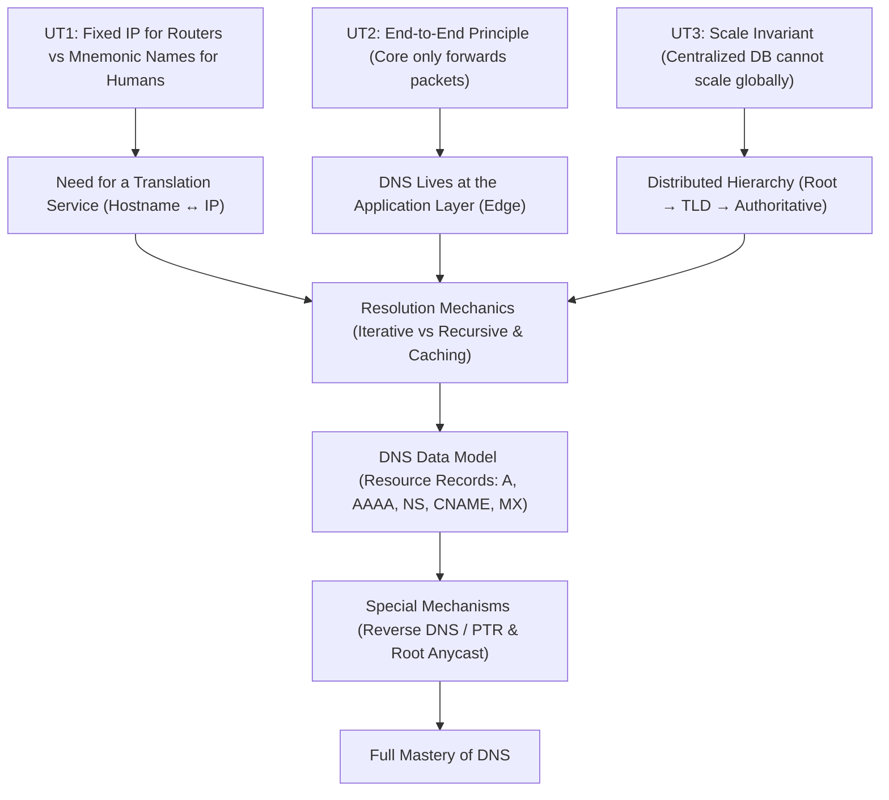

> [!quote] YOU

now we will start with dns, in ./study/computer_science/networks/ has the necessary context

get the book and the my teacher slide in 4s/computer_networks/ , I need a deeply explanation about dns

> [!question] Quiz
> In standard Internet DNS resolution, what does a Root or TLD server do when it receives a query for a hostname it does not authoritatively hold?
>
> 1. It forwards the query downstream on behalf of the client and waits for the final response
> 2. It returns a referral response containing the nameservers for the next subdomain level
> 3. It broadcasts an address resolution request to all authoritative servers in parallel
> 4. It rejects the query and directs the client to restart resolution from the local cache

> [!question] Quiz — I don't know
> Your answer: I don't know
> Correct answer: 2
>
> By default in standard DNS resolution, the local DNS server performs iterative queries to the root, TLD, and authoritative servers. When a queried server does not have the final answer, it responds with a referral containing the NS (Name Server) resource records pointing to the next server down the hierarchy, delegating the lookup step back to the local resolver.

> [!question] Quiz
> Where does DNS sit in the Internet protocol hierarchy and what is its primary service?
>
> 1. A data-link layer protocol used by switches to resolve MAC addresses to IP addresses
> 2. A transport-layer protocol providing reliable byte streams for web connections
> 3. An application-layer service running over UDP and TCP to translate hostnames to IP addresses
> 4. A network-layer protocol built directly into routers to update IP routing tables

> [!failure] Quiz — incorrect ✗
> Your answer: 4. A network-layer protocol built directly into routers to update IP routing tables
> Correct answer: 3
>
> Note: I dont know, but this seems more correct
>
> DNS is an application-layer protocol running above transport protocols (primarily UDP port 53 for standard short queries, and TCP port 53 for large responses or zone transfers). The core routing and forwarding inside the network operate strictly on numerical IP addresses, so host applications invoke DNS resolution before establishing transport connections.

> [!question] Question
> What scope and pacing would you like for this DNS deep dive?
>
> I will build DNS up from first principles all the way to message formats and reverse lookups, aligned with your slides and Kurose/Tanenbaum textbooks.
>
> 1. Full bottom-up deep dive (Recommended)
> 2. Exam/Exercise-focused speedrun

> [!example] Answer
> 1. Full bottom-up deep dive (Recommended)

> [!abstract] PI

### Learning Plan: Domain Name System (DNS)

Based on our diagnostic probe, we will build DNS from the ground up. You noted earlier that DNS felt like a router-level routing protocol — we will clear this up immediately by discovering **why routers cannot handle names** and **why DNS had to be designed as an application-layer service at the edge**.

---

### Dependency Map



---

### How we will proceed:
1. **Node 1 (Foundations):** Why hostnames vs IP addresses, and why DNS is at the Application Layer (over UDP/TCP port 53) rather than inside routers.
2. **Node 2 (The Scale Problem):** Why a single file (`hosts.txt`) or single server fails, leading inevitably to the 3-tier hierarchy (Root, TLD, Authoritative).
3. **Node 3 (Resolution Dynamics):** Step-by-step query tracing (Iterative vs Recursive), DNS caching, and TTL.
4. **Node 4 (Data Representation):** Resource Records (RR format) and zone configurations (`A`, `AAAA`, `NS`, `CNAME`, `MX`).
5. **Node 5 (Reverse DNS & Anycast):** Resolving IPs back to names (`.in-addr.arpa`, `PTR`) and how the 13 logical roots scale via BGP Anycast.

At each node, we will motivate the design choice, establish the mechanism, and run a quick check to lock it in.

Shall we begin with **Node 1**?


> [!quote] YOU

yes


> [!abstract] PI

## Node 1: Why Names vs. IPs, and Why DNS Lives at the Edge

### 1. The Core Conflict: What Humans Want vs. What Routers Need

To understand why DNS exists, consider what happens if we try to build the Internet with only **one** type of identifier:

- **If we only used Hostnames (`www.ufc.br`):**
  Hostnames are variable-length text strings designed for human memory. If intermediate routers had to parse variable-length strings, look up alphabetical names in memory, and make routing decisions for every single packet, high-speed hardware packet forwarding (operating at billions of packets per second) would be impossible.
- **If we only used IP Addresses (`200.17.41.10` / `2801:80::1`):**
  IP addresses are fixed-length binary numbers (32 bits for IPv4, 128 bits for IPv6). Routers can process them directly in hardware using high-speed ternary content-addressable memory (TCAM). However, humans cannot easily remember strings of numbers for thousands of websites, and IP addresses change whenever a server moves to a new ISP (since IP addresses reflect network topology).

$$\text{Human Identifier (Hostname)} \underset{\text{DNS Resolution}}{\overset{\text{Translate}}{\rightleftharpoons}} \text{Router Locator (IP Address)}$$

---

### 2. The End-to-End Principle: Why Routers Don't Know DNS

In the diagnostic probe, you intuitively wondered if routers handle DNS. The Internet architecture is intentionally built around the **End-to-End Principle**:
- **The Core is Simple and Dumb:** Routers inside the network core do exactly one job: read the fixed-length IP header and forward packets toward the destination. They do not know what a hostname is, what a webpage is, or what DNS is.
- **Intelligence Lives at the Edge (Hosts):** All high-level naming, translation, error recovery, and application logic happen at the end-systems (your computer, servers).

Therefore, **DNS is an Application-Layer protocol** running on end-hosts. 

When you type `https://www.ufc.br` into a browser:
1. The browser asks the OS DNS resolver to translate `www.ufc.br` into an IP address.
2. The DNS client constructs an application-layer DNS query packet and sends it over the transport layer (predominantly **UDP port 53**).
3. Once the DNS response returns the IP `200.17.41.10`, the browser opens a TCP connection directly to `200.17.41.10:443`.
4. The intermediate routers only see packets addressed to destination IP `200.17.41.10` and forward them accordingly.

---

Let's do a quick quiz-check to ensure this foundational node is locked in.


> [!question] Quiz
> According to Internet design principles, where does the translation between hostnames and IP addresses execute?
>
> 1. Inside router operating systems as part of the BGP routing table update mechanism
> 2. At the application layer on end-hosts, resolving names before network transmission begins
> 3. At the data link layer within network switches to translate MAC frames directly
> 4. Inside physical network interface cards using hardcoded firmware lookup tables


> [!success] Quiz — correct ✓
> Your answer: 2. At the application layer on end-hosts, resolving names before network transmission begins
> Correct answer: 2
>
> Routers are optimized strictly for fast hardware-level forwarding of fixed-length IP packets. Placing name translation at the application layer on end-hosts preserves the End-to-End Principle, keeping the routing core simple and protocol-agnostic.


> [!abstract] PI

## Node 2: Scaling DNS — From Flat Files to a Distributed Hierarchy

### 1. The Breakdown of Centralization

In the early ARPANET (1970s), name translation was simple: every computer had a file called `/etc/hosts`. A central organization (SRI-NIC) maintained a master copy of `hosts.txt`. Periodically, every computer downloaded the updated file via FTP.

As the network scaled to millions of hosts, this flat/centralized model collapsed due to four fatal bottlenecks:
1. **Single Point of Failure:** If the central server crashes, the entire Internet cannot resolve names.
2. **Traffic Bottleneck:** Billions of devices hitting one server would crush its network link and CPU.
3. **Geographic Latency:** A user in Brazil or Japan querying a single server in North America suffers huge round-trip delays ($150\text{--}300\text{ ms}$) on every new connection.
4. **Maintenance Impossibility:** If every department or company had to request a central administrator to add a local hostname, administrative delay would freeze expansion.

---

### 2. The Solution: A Delegated 3-Tier Hierarchy

To solve scale, DNS divides the global namespace into a tree of delegated authority:

```
                            [ Root DNS Servers ]
                           (Knows who manages TLDs)
                             /        |       \
                            /         |        \
                [ .com TLD ]     [ .org TLD ]   [ .br ccTLD ]
            (Managed by Verisign)               (Managed by Registro.br)
                    |                              |
            [ google.com ]                     [ ufc.br ]  <-- Authoritative Servers
          (Authoritative NS)               (Authoritative NS)
                    |                              |
            [ mail.google.com ]                [ www.ufc.br ]
```

The hierarchy consists of three critical tiers:

1. **Root DNS Servers:**
   - Sit at the apex of the domain tree.
   - They **do not** store website IP addresses (they do not know `www.ufc.br`).
   - They only store the IP addresses of the **TLD servers** responsible for each top-level domain (`.br`, `.com`, `.edu`).
2. **Top-Level Domain (TLD) Servers:**
   - Divided into **generic TLDs** (gTLD: `.com`, `.org`, `.net`, `.edu`) and **country-code TLDs** (ccTLD: `.br`, `.uk`, `.de`).
   - They **do not** store specific host IPs; they store the addresses of the **Authoritative DNS servers** for domains registered under them (e.g., who runs `ufc.br` or `google.com`).
3. **Authoritative DNS Servers:**
   - Maintained directly by organizations, universities, or cloud DNS providers (AWS Route53, Cloudflare).
   - They hold the **definitive, actual IP mappings** for the organization's hosts (e.g., `www.ufc.br $\to$ 200.17.41.10`).

---

### The Local DNS Server (Resolver)
Your laptop does not navigate this tree alone. Your network configuration (via DHCP or manual setup) specifies a **Local DNS Server** (or *Recursive Resolver*, such as your campus DNS, ISP DNS, or public resolvers like `8.8.8.8` / `1.1.1.1`). It acts as your agent to navigate the hierarchy on your behalf.

---

Let's test your understanding of how authority is divided across these tiers.


> [!question] Quiz
> When a TLD server for '.br' receives a query for 'www.ufc.br', what does it return?
>
> 1. It writes the requested hostname into the global root zone routing table
> 2. It forwards the request to every registered subdomain under that top-level domain
> 3. It returns the address of the authoritative DNS server responsible for that domain
> 4. It returns the final IPv4/IPv6 address of the destination web server directly


> [!success] Quiz — correct ✓
> Your answer: 3. It returns the address of the authoritative DNS server responsible for that domain
> Correct answer: 3
>
> TLD servers do not maintain individual host IP addresses (such as www or mail). Instead, they store delegation records (NS records) pointing to the organization's authoritative nameservers, which hold the final IP address.


> [!abstract] PI

## Node 3: Resolution Dynamics — Recursive Queries, Iterative Queries, and Caching

### 1. Step-by-Step Resolution Trace

Suppose your host `laptop.home` wants to connect to `www.amazon.com`:

```
                           [ Root Server ]
                              ^        |
                  (2) Query   |        | (3) Referral: Points to .com TLD
                              |        v
[ Client Host ] <=====> [ Local DNS Server ] <-------- (4) Query --------> [ .com TLD Server ]
 (1) Recursive Query    (e.g., ISP / 8.8.8.8)<======== (5) Referral ====== (Points to amazon.com NS)
 (8) Final IP Answer          |        ^
                              |        | (6) Query
                              v        | (7) Reply: Final IP (Type A = 54.239.28.85)
                          [ Authoritative Server ]
                              (ns1.amazon.com)
```

Notice the two fundamentally different types of queries in this flow:

---

### 2. Recursive vs. Iterative Queries

#### A. Recursive Query (Step 1)
- **Concept:** *"I need the final IP address. Please do whatever lookup is required and return the result to me."*
- **Usage:** Between the **Client Host** and the **Local DNS Server**.
- **Reason:** Keeps the end-user device light and simple. The local resolver bears the burden of navigating the hierarchy.

#### B. Iterative Query (Steps 2–7)
- **Concept:** *"If you don't have the answer, tell me who to ask next."*
- **Usage:** Between the **Local DNS Server** and the **Root, TLD, and Authoritative servers**.
- **Architectural Motivation (Why Root/TLD are Iterative):**
  If Root servers accepted recursive queries, they would have to open connections, hold memory state for millions of simultaneous pending queries, and wait for third-party responses. By remaining **strictly iterative**, a Root server processes a query in microseconds and immediately replies with a referral pointer, maintaining zero connection state.

---

### 3. DNS Caching and TTL (Time-To-Live)

DNS lookups could add substantial latency ($3\text{--}4$ round trips) to every web request. DNS eliminates this via **Aggressive Caching**:

- Whenever a Local DNS server receives any response (whether an intermediate TLD server address or a final IP), it caches the mapping in local RAM.
- **TTL (Time-To-Live):** Every DNS record includes a TTL field (measured in seconds, e.g., $86400 = 24\text{ hours}$). The caching server discards the record once the TTL expires.
- **Impact in Practice:** In real-world operation, TLD server addresses (`.com`, `.br`) are almost permanently cached by local resolvers. As a result, standard daily queries bypass the Root and TLD tiers entirely, jumping straight to the Authoritative server.

---

Let's test this resolution mechanism with a diagnostic check.


> [!question] Quiz
> Why do Root and TLD servers default to answering iteratively rather than recursively?
>
> 1. Because UDP packets are incapable of carrying recursive query flag bits in the header
> 2. To force client operating systems to execute path finding algorithms locally
> 3. Because authoritative servers do not permit local resolvers to cache intermediate records
> 4. To avoid maintaining connection state and managing millions of pending queries at the top of the tree


> [!success] Quiz — correct ✓
> Your answer: 4. To avoid maintaining connection state and managing millions of pending queries at the top of the tree
> Correct answer: 4
>
> Root and TLD servers handle millions of requests per second. Handling recursive queries would force them to maintain open connection state and wait for external servers, exhausting resources and creating severe denial-of-service vulnerabilities. Iterative queries allow them to reply statelessly in a single turn-around.


> [!abstract] PI

## Node 4: The DNS Data Model — Resource Records (RRs)

### 1. The Universal Resource Record (RR) Format

The distributed DNS database stores information in the form of **Resource Records (RRs)**. Every DNS reply packet carries one or more RRs.

A Resource Record is a 4-tuple:
$$\mathbf{RR = (\text{Name}, \text{Value}, \text{Type}, \text{TTL})}$$

The interpretation of `Name` and `Value` depends entirely on the **`Type`** field.

---

### 2. Core Record Types

| Type | Meaning of `Name` | Meaning of `Value` | Concrete Zone File Example |
| :--- | :--- | :--- | :--- |
| **`A`** | Hostname | **IPv4 Address** (32-bit) | `relay1.ufc.br.  86400  IN  A  200.17.41.10` |
| **`AAAA`** | Hostname | **IPv6 Address** (128-bit) | `relay1.ufc.br.  86400  IN  AAAA  2801:80::1` |
| **`NS`** | Domain Name | **Hostname of Authoritative DNS Server** | `ufc.br.  86400  IN  NS  dns1.ufc.br.` |
| **`CNAME`** | Alias Hostname | **Canonical (Real) Hostname** | `www.ufc.br.  86400  IN  CNAME  cluster01.ufc.br.` |
| **`MX`** | Domain Name | **Hostname of Mail Server** (+ Priority) | `ufc.br.  86400  IN  MX  10  mail.ufc.br.` |

---

### 3. Crucial Engineering Nuances

1. **Why `CNAME` vs. `A`?**
   If a company changes its hosting IP address across dozens of subdomains (`www`, `shop`, `blog`), having them point as `CNAME` to a single canonical name means updating the IP in **only one** `A` record, rather than editing dozens of records.
2. **Why does `MX` exist separately?**
   A user might visit `http://ufc.br` in a browser and send an email to `student@ufc.br`. The `MX` record allows web traffic and email traffic destined for the exact same domain string (`ufc.br`) to be routed to completely different physical server infrastructures.
3. **Glue Records:**
   When a parent TLD delegates a domain with an `NS` record pointing to a server *inside* that same domain (e.g., `ufc.br` has `NS dns1.ufc.br`), the resolver cannot resolve `dns1.ufc.br` without asking `dns1.ufc.br` (a circular deadlock!). To prevent this, the parent zone returns a **Glue Record** (an `A` record for `dns1.ufc.br` in the Additional Authority section) alongside the `NS` record.

---

Let's do a quiz-check to test your grasp of DNS Record types.


> [!question] Quiz
> When an SMTP mail server wants to deliver an email to 'user@example.com', which DNS record type does it query first?
>
> 1. A CNAME record pointing the sender's client to the canonical address of the web server
> 2. An NS record delegating the user mailbox path to the regional registrar authority
> 3. An MX record containing the domain name and the hostname of the destination mail server
> 4. A Type A record mapping the individual recipient mailbox string directly to a port number


> [!success] Quiz — correct ✓
> Your answer: 3. An MX record containing the domain name and the hostname of the destination mail server
> Correct answer: 3
>
> The MX (Mail Exchange) record maps a domain name to the hostname of the MTA (Mail Transfer Agent) handling incoming email for that domain, allowing email servers to discover where to deliver messages even when the domain's A record points to a web server.


> [!abstract] PI

## Node 5: Advanced Mechanics — Reverse DNS (rDNS) and Root Server Anycast

### 1. Reverse DNS (Translating IP $\to$ Hostname)

Standard DNS maps **Hostname $\to$ IP Address** (Forward Resolution). But systems frequently need to do the exact opposite: given an IP address `200.17.41.10`, discover its canonical hostname (e.g., for spam verification in email servers, audit logging, and network diagnostics).

#### The Structural Problem
Forward DNS is indexed hierarchically from right to left:
$$\text{Host: } \underbrace{\text{www}}_{\text{Leaf Host}} . \underbrace{\text{ufc}}_{\text{Domain}} . \underbrace{\text{br}}_{\text{TLD}}$$

However, IP addresses are written with the highest network prefix on the **left**:
$$\text{IP: } \underbrace{200}_{\text{Regional Registry}} . \underbrace{17}_{\text{ISP}} . \underbrace{41}_{\text{Subnet}} . \underbrace{10}_{\text{Host}}$$

If you tried to look up an IP in the standard tree, you would have to scan every authoritative server on the planet.

#### The Elegant Solution: The `.in-addr.arpa` Zone & Reversal
DNS creates a dedicated domain tree under the top-level domain **`.arpa`**:
1. **Reverse the Octets:** The IPv4 address is reversed so the most significant network prefix sits on the right, matching domain tree hierarchy:
   $$\text{IP: } 200.17.41.10 \implies \mathbf{10.41.17.200.in\text{-}addr.arpa}$$
2. **Hierarchical Delegation:**
   - Root delegates `in-addr.arpa`
   - `in-addr.arpa` delegates `200.in-addr.arpa` to the regional registrar (e.g., LACNIC / Registro.br)
   - LACNIC delegates `41.17.200.in-addr.arpa` to the organization's authoritative server (UFC)
3. **The `PTR` (Pointer) Record:**
   The authoritative server holds a **Type PTR** record:
   ```text
   10.41.17.200.in-addr.arpa.  86400  IN  PTR  relay1.ufc.br.
   ```
4. Resolvers send a standard DNS query for `10.41.17.200.in-addr.arpa` of `Type = PTR` and receive `relay1.ufc.br`.

---

### 2. The 13 Logical Root Servers & BGP Anycast

You will often see the statement: *"There are 13 root DNS servers in the world (`a.root-servers.net` to `m.root-servers.net`)."*

```
       13 Logical Root Identifiers (a.root-servers.net ... m.root-servers.net)
                                       │
                    ┌──────────────────┴──────────────────┐
                    ▼                                     ▼
        Physical Node in Brazil               Physical Node in Germany
         (Advertises 198.41.0.4)               (Advertises 198.41.0.4)
                    ▲                                     ▲
                    │                                     │
           Routed via BGP to nearest             Routed via BGP to nearest
```

- **Why 13 logical names?** Originally, DNS over UDP was constrained to a maximum payload size of **512 bytes** (to guarantee no IP fragmentation over Ethernet). Thirteen server names and their IP addresses was the maximum that could fit into a single 512-byte response.
- **The Physical Reality (BGP Anycast):**
  Those 13 logical IP addresses are **not** 13 single computers. Today, they are replicated across **over 1,500+ physical servers** distributed across every continent.
- Using **BGP Anycast**, hundreds of physical servers announce the *identical* IP address (e.g., `198.41.0.4` for `a.root-servers.net`) to the Internet's routing mesh. When your resolver sends a packet to that address, BGP routes it to the **topologically nearest** physical instance.

---

Let's test this mechanism with a quiz-check.


> [!question] Quiz
> How does a resolver look up the canonical hostname for the IPv4 address '192.0.2.1'?
>
> 1. Query the forward zone using a Type A record containing the IP in the Name field
> 2. Send a broadcast ARP request to the root server asking for the corresponding CNAME
> 3. Prepend 'ip.' to the domain name and query the local resolver using Type MX
> 4. Reverse the IPv4 octets, append '.in-addr.arpa', and query for a Type PTR record


> [!success] Quiz — correct ✓
> Your answer: 4. Reverse the IPv4 octets, append '.in-addr.arpa', and query for a Type PTR record
> Correct answer: 4
>
> Because DNS hierarchy reads right-to-left (TLD to subdomain) while IP network hierarchy reads left-to-right (network prefix to host), IPv4 octets must be reversed and appended with .in-addr.arpa, querying a Type PTR record.


> [!abstract] PI

## Synthesis: The Domain Name System (DNS)

You have now built up the entire architectural model of DNS from first principles:

```
[Human Mnemonic Name] (e.g. www.ufc.br)
         │
         ▼  (Application Layer: UDP/TCP port 53)
[Local Resolver] ────(1. Iterative Referral)───► [13 Logical Roots / 1,500+ Anycast Instances]
         │                                                      │ (Points to .br TLD)
         ├────────────(2. Iterative Referral)───► [.br ccTLD Servers]
         │                                                      │ (Points to UFC NS: dns1.ufc.br)
         └────────────(3. Iterative Query)──────► [UFC Authoritative Server]
                                                                │
                                                                ▼ (Returns Type A = 200.17.41.10)
                                                    [Final IP Address for Routers]
```

---

### Core Takeaway Cheatsheet

1. **Why at the Edge (Application Layer):**
   - Keeps the router core simple and fast (End-to-End Principle).
   - Routers only forward fixed-length binary IP packets.
2. **The 3-Tier Hierarchy:**
   - **Root Servers:** Point to TLD authorities.
   - **TLD Servers:** Point to Authoritative domain nameservers (`NS` records).
   - **Authoritative Servers:** Hold the actual organizational mappings (`A`, `AAAA`, `CNAME`, `MX`, `PTR`).
3. **Query Modes & Scaling:**
   - **Recursive:** Client $\leftrightarrow$ Local Resolver (client offloads work).
   - **Iterative:** Local Resolver $\leftrightarrow$ Hierarchy (stateless, zero overhead for roots).
   - **Caching + TTL:** Eliminates redundant queries to Root/TLD tiers for the lifetime of the TTL.
4. **Data Model (Resource Records):**
   - `A` / `AAAA`: Hostname $\to$ IPv4 / IPv6
   - `NS`: Domain $\to$ Authoritative Name Server hostname
   - `CNAME`: Alias $\to$ Canonical hostname
   - `MX`: Domain $\to$ Mail Server hostname (+ priority)
   - `PTR`: Reversed IP (`.in-addr.arpa`) $\to$ Hostname (Reverse DNS)
5. **Physical Infrastructure:**
   - 13 logical root server addresses (`a`–`m`), scaled across 1,500+ physical nodes worldwide using **BGP Anycast**.

---

Would you like to solve some real exam-style DNS problem scenarios, or proceed to the next network layer topic?


> [!quote] YOU

yes


> [!question] Quiz
> Exam Scenario 1: A client queries its Local DNS Server for 'www.example.com'. The Local DNS Server's cache contains an active (unexpired) entry for the '.com' TLD server, but no entry for 'example.com'. What is the very next message exchange initiated by the Local DNS Server?
>
> 1. Send a recursive query directly to the authoritative server ns1.example.com
> 2. Broadcast an ARP request to find the MAC address of www.example.com
> 3. Query the Root DNS server iteratively to discover the .com TLD server address
> 4. Query the .com TLD server iteratively and receive the authoritative NS record for example.com


> [!success] Quiz — correct ✓
> Your answer: 4. Query the .com TLD server iteratively and receive the authoritative NS record for example.com
> Correct answer: 4
>
> Because the local resolver has already cached the .com TLD server's address, it bypasses the Root server completely. It sends an iterative query to the .com TLD server, which responds with the NS record for example.com (and the glue A record for ns1.example.com), allowing the resolver to next query the authoritative server directly.


> [!question] Quiz
> Exam Scenario 2 (UFC List Exercise 10): An organization (UFC) owns the IP block 200.17.41.0/24 and runs a server at 200.17.41.10 (web.ufc.br). How is reverse name resolution configured between the registry (Registro.br) and UFC's authoritative nameserver?
>
> 1. UFC configures a CNAME record in the .br TLD pointing the IP integer value to the hostname
> 2. The client creates a local BGP route entry binding the MAC address of the web server to the hostname
> 3. Registro.br writes a Type A record mapping '200.17.41.10' directly to 'web.ufc.br' in the root zone
> 4. Registro.br delegates '41.17.200.in-addr.arpa' to UFC, which configures a Type PTR record for host '10'


> [!success] Quiz — correct ✓
> Your answer: 4. Registro.br delegates '41.17.200.in-addr.arpa' to UFC, which configures a Type PTR record for host '10'
> Correct answer: 4
>
> To configure reverse DNS for subnet 200.17.41.0/24, Registro.br delegates the zone '41.17.200.in-addr.arpa' to UFC's nameserver. UFC configures an authoritative reverse zone containing '10.41.17.200.in-addr.arpa. IN PTR web.ufc.br.'. When a resolver receives a query for that IP, it queries under 41.17.200.in-addr.arpa and receives the PTR record.


> [!abstract] PI

### Outstanding Work! 🎯

You have demonstrated complete mastery across the core architectural and mechanical pillars of DNS:
- **Foundations:** The End-to-End principle and why name translation sits at the Application Layer rather than inside routers.
- **Hierarchy & Scale:** The 3-tier hierarchy (Root $\to$ TLD $\to$ Authoritative) eliminating single points of failure and bottlenecks.
- **Resolution Dynamics:** Recursive vs. Iterative queries, caching behavior, and TTL dynamics.
- **Data Model:** Resource Record formats (`A`, `AAAA`, `NS`, `CNAME`, `MX`).
- **Exam Edge Cases:** Physical replication of the 13 logical root servers via **BGP Anycast** (solving Exercise 9), and Reverse DNS delegation using **`.in-addr.arpa`** and **`PTR`** records (solving Exercise 10).

---

### Where should we go next?

From your course syllabus and exercise sheet (Lista 1), here are the natural next topics:

1. **Peer-to-Peer (P2P) Systems & Content Distribution:** Pure vs. Hybrid P2P architectures, DHTs, and the Gnutella query-flooding protocol *(Exercises 11 & 12)*.
2. **Transport Layer Foundations:** Principles of Reliable Data Transfer (rdt 1.0 $\to$ 3.0), Go-Back-N vs. Selective Repeat.
3. **TCP Deep Dive:** 3-way handshake, 4-way teardown, sequence/ACK numbers, flow control (receive window), and congestion control (AIMD, Slow Start, Fast Recovery).

What would you like to explore next?


> [!quote] YOU

create the notes for dns, with deeply explanation, and create the flashcards, ultils flashcards


> [!abstract] PI

The comprehensive DNS study notes and high-yield flashcard deck have been created and integrated into your Obsidian vault:

---

### 1. Atomic Deep-Dive Note
📄 **Path:** `study/computer_science/networks/atomics/Protocol - Domain Name System (DNS).md`

**Contents & Rigor:**
- **First Principles & End-to-End Principle:** Detailed rationale for why routers cannot parse variable-length strings and why name translation must execute at the application layer on end-hosts.
- **The Scale Invariant & 3-Tier Hierarchy:** The collapse of centralized `hosts.txt` and the formal mechanics of **Root**, **TLD** (gTLDs vs ccTLDs), and **Authoritative** tiers.
- **Physical Root Architecture (Exercise 9):** The 13 logical root authorities (`a`–`m`), the 512-byte UDP historical origin, administrative distribution across 12 institutions, and physical replication across **1,500+ servers via BGP Anycast Routing**.
- **Resolution Dynamics:** Formal step-by-step trace of **Recursive** (host $\leftrightarrow$ resolver) vs. **Iterative** (resolver $\leftrightarrow$ hierarchy) queries, caching dynamics, negative caching (`NXDOMAIN`), and TTL.
- **Resource Records Data Model:** Detailed analysis and zone-file syntax for `A`, `AAAA`, `NS`, `CNAME`, `MX`, `TXT`, `SOA`, and `PTR`.
- **Glue Records:** Solving circular delegation deadlocks between parent registries and child nameservers.
- **Reverse DNS Mechanics (Exercise 10):** Right-to-left DNS tree alignment vs. left-to-right IP routing prefixes, decimal octet inversion, `.in-addr.arpa` hierarchy, and `PTR` record zone delegation.
- **Transport Dynamics:** UDP port 53 (0-RTT best-effort) vs. TCP port 53 fallback via the Truncation flag bit (`TC=1`), zone transfers (`AXFR`/`IXFR`), and DNS message structure.
- **Security & Modern Extensions:** Cache poisoning / Kaminsky attacks, Source Port Randomization (SPR), DNSSEC (`RRSIG`, `DNSKEY`, `DS`), and DoT (port 853) vs. DoH (port 443).

---

### 2. High-Yield Spaced Repetition Flashcards
📄 **Path:** `study/computer_science/networks/flashcards/flashcards-02-application-layer.md`

**Added 10 high-precision flashcards covering:**
1. Why DNS lives at the Application Layer (End-to-End principle & TCAM forwarding).
2. Logical 13 Root authorities vs. 1,500+ physical servers & BGP Anycast *(Exercise 9)*.
3. The 3 tiers of DNS hierarchy and their data holdings.
4. Iterative vs. Recursive resolution & why root servers refuse recursion.
5. The 7 core Resource Record types (`A`, `AAAA`, `NS`, `CNAME`, `MX`, `TXT`, `PTR`).
6. DNS Glue Records and circular delegation resolution.
7. Complete Reverse DNS delegation flow & `PTR` lookup *(Exercise 10)*.
8. UDP vs. TCP port 53 switching conditions & Truncation bit `TC=1`.
9. DNS Cache Poisoning mechanics, Source Port Randomization, and DNSSEC.
10. DNS over TLS (DoT) vs. DNS over HTTPS (DoH) architectural trade-offs.

---

### 3. Application Layer Hub Note Updated
📄 **Path:** `study/computer_science/networks/02-application-layer.md`
- Transcludes the DNS summary callout seamlessly and links directly to the flashcards and deep-dive note.
