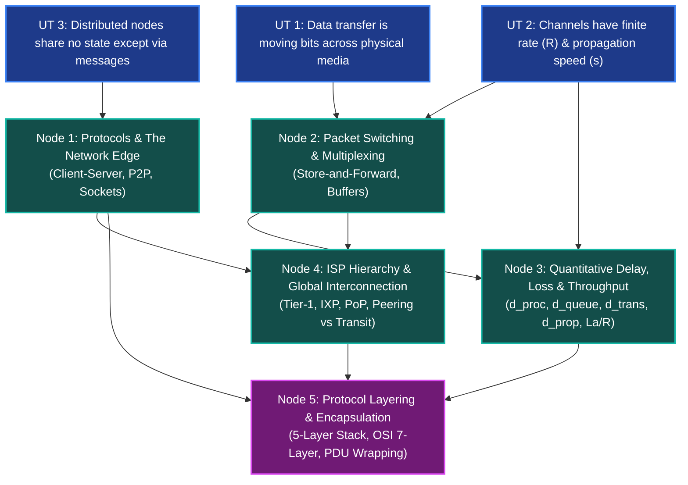

> [!quote] YOU

teach me about the /home/warley/ufc/4s/computer_networks/slides/rc-02-IntroducaoRedes.pdf use the "/home/warley/ufc/4s/computer_networks/books/Computer Networking A Top-Down Approach, 8th Edition by James F. Kurose, Keith W. Ross-Pearson-9780136681557.pdf"


> [!question] Quiz
> When two computers communicate across the Internet, how do intermediate nodes (routers) determine where to direct the incoming data?
>
> Diagnostic probe — let's find where your baseline understanding sits before structuring our roadmap.
>
> 1. Intermediate routers maintain dedicated circuits reserved exclusively for that session.
> 2. The sending host broadcasts raw continuous bitstreams across all global physical links.
> 3. A central global controller manages and synchronizes every data transfer step.
> 4. Data is segmented into packets with headers, allowing routers to forward chunks independently.


> [!success] Quiz — correct ✓
> Your answer: 4. Data is segmented into packets with headers, allowing routers to forward chunks independently.
> Correct answer: 4
>
> In packet-switched networks like the Internet, long messages are broken into independent chunks called packets. Each packet carries header metadata (such as source and destination IP addresses) so intermediate routers can inspect and forward each chunk independently along the path without needing a dedicated pre-allocated physical circuit.


> [!question] Quiz
> What physical event occurs inside a router when the rate of arriving packets exceeds the transmission rate of its outgoing link?
>
> Testing the mechanics of the network core under load.
>
> 1. Packets wait in a finite buffer memory, and overflowing packets are discarded.
> 2. The router physically throttles the source host's network interface card in real time.
> 3. Incoming packets are bounced back to the sender's memory until the link frees up.
> 4. The router compresses all payload data dynamically to avoid queue accumulation.


> [!success] Quiz — correct ✓
> Your answer: 1. Packets wait in a finite buffer memory, and overflowing packets are discarded.
> Correct answer: 1
>
> When packets arrive at a router's output link faster than the link transmission rate (bits/sec), packets queue up in the router's hardware buffer. If the buffer fills to capacity, new incoming packets cannot be stored and are dropped (packet loss).


> [!question] Quiz
> In a standard Internet architecture, what is the highest protocol layer that intermediate core routers typically inspect and process to forward normal traffic?
>
> Probing architectural boundaries across the 5-layer Internet model.
>
> 1. They inspect up to Layer 3 (Network layer / IP headers).
> 2. They inspect up to Layer 4 (Transport layer / TCP segments).
> 3. They inspect up to Layer 5 (Application layer messages).
> 4. They inspect only Layer 1 (Physical signals and bit pulses).


> [!success] Quiz — correct ✓
> Your answer: 1. They inspect up to Layer 3 (Network layer / IP headers).
> Correct answer: 1
>
> Standard Internet routers operate up to Layer 3 (the Network layer). They process Physical signals, Link-layer frames, and read the Network-layer IP header to make forwarding decisions. They do not parse or process Transport (Layer 4) or Application (Layer 5) payloads, which are end-to-end abstractions terminated only at the end hosts.


> [!question] Quiz
> What is the precise mechanical distinction between transmission delay and propagation delay on a network link?
>
> Testing quantitative/mechanistic distinctions in packet switching delays.
>
> 1. Transmission delay and propagation delay are synonymous terms for serial interface latency.
> 2. Transmission delay scales with distance; propagation delay scales with packet bit-length.
> 3. Transmission delay happens in buffer queues; propagation delay happens during router CPU lookups.
> 4. Transmission delay depends on packet size and link rate; propagation delay depends on link distance and medium speed.


> [!success] Quiz — correct ✓
> Your answer: 4. Transmission delay depends on packet size and link rate; propagation delay depends on link distance and medium speed.
> Correct answer: 4
>
> Note: I dont know, but the propagation name suggests physcal speed
>
> Transmission delay ($d_{\text{trans}} = L/R$) is the time required to push/inject all $L$ bits of a packet onto the physical wire at link rate $R$. Propagation delay ($d_{\text{prop}} = d/s$) is the time it takes for a single bit to physically travel across the medium over distance $d$ at propagation speed $s$ (near the speed of light in the medium). A common misconception conflates link bandwidth with physical propagation speed.


> [!question] Question
> What is your primary goal and preferred focus for this lecture?
>
> We're covering slide deck rc-02-IntroducaoRedes.pdf alongside Chapter 1 of Kurose & Ross (8th ed.). How would you like us to approach this?
>
> 1. Comprehensive deep dive with problem-solving rigor (Recommended)
> 2. Conceptual architecture & design intuition
> 3. Slide-by-slide walkthrough with textbook depth


> [!example] Answer
> 1. Comprehensive deep dive with problem-solving rigor (Recommended)


> [!abstract] PI

## Teaching Plan: Foundations of Computer Networks & The Internet

Based on your diagnostic responses and goal for **deep technical rigor and problem-solving readiness**, we will build the entire networking mental model from **unconditional physical truths** up to the full **5-layer Internet architecture** and **ISP topology**.

### Approach & Pedagogical Structure

We will decompose the slide deck (`rc-02-IntroducaoRedes.pdf`) and Kurose & Ross (Chapter 1) into **5 logical stages**. Each stage is motivated by a physical constraint or design challenge, showing why the Internet *had* to be engineered the way it is:

1. **The Network Edge & The Protocol Contract**: Why distributed systems require strict message protocols, client-server vs P2P topologies, and edge vs core separation.
2. **The Network Core: Packet Switching vs Circuit Switching**: The store-and-forward mechanism, statistical multiplexing, and why packet switching outperforms circuit switching for bursty data.
3. **Quantitative Delay, Loss & Throughput (The Math)**: Decomposing nodal delay ($d_{\text{proc}}, d_{\text{queue}}, d_{\text{trans}}, d_{\text{prop}}$), traffic intensity ($La/R$), buffer overflow mechanics, and end-to-end throughput bottlenecks.
4. **Internet Structure & ISP Hierarchy**: How a global "network of networks" scales hierarchically without quadratic link explosion (Tier-1 ISPs, IXPs, PoPs, peering vs transit).
5. **Protocol Layering & Encapsulation**: Why layering provides modularity, the 5-layer TCP/IP stack vs 7-layer OSI model, and the lifecycle of a packet (PDUs, headers, and intermediate forwarding).

---

### Dependency Map



---

Ready to begin with **Node 1: Protocols & The Network Edge**? Let me know if you want to tweak anything in the scope or dive straight in!


> [!quote] YOU

proceed, Ah! teach me oriented to this exercises /home/warley/ufc/4s/computer_networks/exercises/rc-lista1-aplicacao-transporte.doc


> [!abstract] PI

## Node 1: Protocols & The Network Edge

---

### 1. Motivation: The Boundary Problem

Imagine building a global communication system with billions of devices running millions of different applications (web browsers, multiplayer games, email, video streaming). If every intermediate forwarding device (router/switch) inside the network had to understand the specific rules and logic of every user application, two catastrophic problems would occur:

1. **The Core would collapse under complexity**: Routers would need limitless memory and processing power to track user session states and parse ever-changing application payloads.
2. **The network could never evolve (Ossification)**: You could never invent a new application protocol (like HTTP/3 or a new gaming protocol) without upgrading every single router on the planet.

To solve this, the Internet architecture makes a fundamental structural separation: **The Network Edge** vs. **The Network Core**.

---

### 2. Establish: Foundational Concepts

#### A. The Edge vs. The Core
* **Network Edge (Borda da Rede)**: Composed exclusively of **End Systems (Hosts)**—laptops, smartphones, servers, IoT sensors. 
  * *Unconditional Rule*: **All application logic and user programs execute strictly at the edge.**
* **Network Core (Núcleo da Rede)**: A mesh of interconnected **Routers and Switches** whose sole purpose is to move data chunks (packets) from input links to output links as fast as possible. 
  * Routers inside the core do not know or care whether the bytes they carry belong to a YouTube video, a banking transaction, or an email.

```
       [ Client Host ] ---- (Access Network) ----\
                                                   +===> [ Network Core ] ===> (Access Network) ---- [ Server Host ]
       [ Smartphone  ] ---- (Access Network) ----/      (Mesh of Routers)
       \_______________________________________/        \_______________/
                     NETWORK EDGE                         NETWORK CORE
```

#### B. What is a Protocol?
In human interaction, we follow implicit social protocols ("Hello" $\to$ "Hello", "What time is it?" $\to$ "It is 3:00 PM"). If one person speaks Portuguese and the other speaks Swahili, communication fails.

In computer networks, an unconditional definition holds:
$$\text{Protocol} = \text{A set of rules defining the } \mathbf{format}\text{, the } \mathbf{order}\text{ of messages, and the } \mathbf{actions}\text{ taken upon sending/receiving them.}$$

Every activity on the Internet is governed by protocols running at peer entities (e.g., $HTTP$ at the application layer, $TCP$ at the transport layer, $IP$ at the network layer).

---

#### C. Edge Paradigms: Client-Server vs. Peer-to-Peer (P2P)

At the application layer on the network edge, hosts organize their communication into two primary architectures:

```
  CLIENT-SERVER ARCHITECTURE                     PEER-TO-PEER (P2P) ARCHITECTURE

      [ Client 1 ]                                    [ Peer A ] <========> [ Peer B ]
            \                                             ^  \                /  ^
             \                                            |   \              /   |
   [ Client 2 ] ---> [ Dedicated Server ]                 |    \            /    |
             /        (Fixed, Known IP)                   |     v          v     |
            /                                         [ Peer C ] <========> [ Peer D ]
      [ Client 3 ]                                    (Arbitrary, intermittent hosts)
```

| Dimension | Client-Server Architecture | Peer-to-Peer (P2P) Architecture |
| :--- | :--- | :--- |
| **Topology** | Asymmetric: Centralized server (often in data centers) with a known, fixed IP address; clients initiate requests. | Symmetric: Interconnected distributed end systems (peers) communicate directly without dedicated central servers. |
| **Scalability** | **Server Bottleneck**: As client demand increases ($N \to \infty$), server bandwidth and compute capacity saturate unless scaled out at high infrastructure cost. | **Self-Scalability**: Each new peer brings not only download demand (consumption) but also upload capacity (service capacity) to the swarm. |
| **Management & Complexity** | Simple state management, centralized access control, and straightforward security/billing. | Complex distributed indexing, high churn (peers join and leave arbitrarily), NAT traversal hurdles, and incentive management (free-riding). |
| **Examples** | Web ($HTTP$), Email ($SMTP/IMAP$), DNS. | BitTorrent, Gnutella, early Skype. |

---

### 3. Direct Connection to Problem Set (Lista 1)

* **Lista 1, Q1**: *In which physical parts of the network topology are application-layer protocols implemented and why?*
  * **Answer Foundation**: They are implemented **exclusively on the end systems (hosts) at the network edge**. The network core (routers/switches) is designed around the *End-to-End Principle* (salt-to-salt): it only forwards packets at lower layers (up to Layer 3 for routers, Layer 2 for switches). This keeps the core fast, stateless with respect to applications, and allows application developers to deploy new protocols without requiring any changes to intermediate network hardware.
* **Lista 1, Q2**: *Differentiate Client-Server from P2P architectures, with pros and cons.*
  * **Answer Foundation**: Contrast the centralized server with fixed IP (reliable, manageable, but single-point bottleneck/failure) against direct peer-to-peer sharing (self-scaling and resilient, but complex distributed tracking and vulnerable to peer churn).

---

### 4. Checkpoint Probe

Let's verify this architectural foundation before we move into **Node 2: Packet Switching vs. Circuit Switching**.


> [!question] Quiz
> Why are application-layer protocols (e.g., HTTP, SMTP, BitTorrent) implemented strictly at the network edge rather than inside the intermediate routers of the network core?
>
> Connecting network edge placement to foundational architectural design principles.
>
> 1. Core routers lack the electrical power required to decode higher-layer application protocols.
> 2. Application protocols physically require wireless radio media available only at access links.
> 3. Application logic stays at end systems so the core remains simple, fast, and application-agnostic.
> 4. Telecommunication regulations strictly prohibit intermediate hardware from inspecting packets.


> [!success] Quiz — correct ✓
> Your answer: 3. Application logic stays at end systems so the core remains simple, fast, and application-agnostic.
> Correct answer: 3
>
> Under the End-to-End Principle of Internet design, application intelligence, session state, and protocol processing reside strictly at the edge hosts. The network core remains application-agnostic, simply forwarding packets without needing protocol upgrades when new edge applications are deployed.


> [!abstract] PI

## Node 2: The Network Core — Packet Switching vs. Circuit Switching & Multiplexing

---

### 1. Motivation: How to Share a Finite Link?

Imagine an optical fiber link between Fortaleza and São Paulo with a transmission capacity of $R = 10 \text{ Mbps}$. There are $N = 35$ users connected to it. When an active user is browsing, they send data at $100 \text{ kbps}$, but they only generate traffic $10\%$ of the time (web browsing and messaging are inherently **bursty**).

How should the intermediate switches allocate this finite $10 \text{ Mbps}$ medium?

Two competing paradigms exist in telecommunications history:

```
PARADIGM A: CIRCUIT SWITCHING                 PARADIGM B: PACKET SWITCHING
(Traditional Telephone Network)              (The Modern Internet)

Link carved into rigid dedicated slices       Packets queued on-demand ("Statistical Multiplexing")
[ User 1 ][ User 2 ][ User 3 ][ User 4 ]      [ Pkt A1 ][ Pkt B1 ][ Pkt A2 ][ Pkt C1 ] ---> [ Output Link ]
   |                                              ^
   v (Idle slot remains empty if user pauses)     | (100% link utilization when any packet arrives)
```

---

### 2. Establish: Deep Dive into Switching & Multiplexing

#### A. What is Multiplexing?
$$\text{Multiplexing} = \text{The technique of combining multiple independent signals/data streams over a single shared physical channel.}$$

*At the Transport Layer (Layer 4)*, multiplexing means gathering data from multiple process sockets and attaching port numbers to create segments for the network layer.  
*Outside the Transport Layer (Physical/Link/Core Layers)*, multiplexing refers to how the physical transmission medium is partitioned:

1. **Frequency-Division Multiplexing (FDM)**: The link's total electromagnetic frequency spectrum is sliced into narrow frequency bands. Each call/transmission gets its own dedicated frequency band continuously (e.g., analog FM radio stations, legacy cable TV channels).
2. **Time-Division Multiplexing (TDM)**: Time is divided into recurring fixed-duration frames, and each frame is partitioned into $N$ time slots. Each call gets a dedicated time slot in every frame (e.g., traditional T1/E1 telephony lines, GSM cell calls).
3. **Statistical Multiplexing (Packet Switching)**: There are **no** predefined time slots or frequency bands. Resources are allocated on-demand on a first-come, first-served packet basis.

```
FDM (Frequency Slicing)                  TDM (Time Slicing)
Frequency                                Time
    ^                                        ^  Slot 1  Slot 2  Slot 3  Slot 4
f3  | [ Channel 3 - Continuous ]         t4  | [ Pkt 1 ][ Pkt 2 ][ Pkt 3 ][ Pkt 4 ] Frame 2
f2  | [ Channel 2 - Continuous ]         t2  | [ Pkt 1 ][ Pkt 2 ][ Pkt 3 ][ Pkt 4 ] Frame 1
f1  | [ Channel 1 - Continuous ]             +------------------------------------> Channel
    +--------------------------> Time
```

---

#### B. The Rigorous Math: Why Packet Switching Outperforms Circuit Switching

Let's revisit our $R = 10 \text{ Mbps}$ link with users needing $r = 100 \text{ kbps} = 0.1 \text{ Mbps}$ when active, where each user is active with probability $p = 0.1$ ($10\%$ of the time).

1. **Under Circuit Switching (TDM / FDM)**:
   The link must reserve dedicated $0.1 \text{ Mbps}$ per user for the entire duration of a session:
   $$N_{\text{circuit}} = \frac{R}{r} = \frac{10 \text{ Mbps}}{0.1 \text{ Mbps}} = 100 \text{ simultaneous users (or 10 users on a 1 Mbps link)}$$
   Even if a user is silent for 5 minutes reading a webpage, their circuit slice sits completely idle and **wasted**. No 101st user can connect.

2. **Under Packet Switching**:
   Suppose $N = 35$ users share a $1 \text{ Mbps}$ link (where circuit switching could only support $\frac{1 \text{ Mbps}}{100 \text{ kbps}} = 10$ users).
   Since each user independently transmits with probability $p = 0.1$, the number of simultaneously active users $X$ follows a **Binomial Distribution**:
   $$X \sim \text{Binomial}(n = 35, p = 0.1)$$
   The link will experience congestion only if **more than 10 users transmit at the exact same instant**:
   $$P(X > 10) = 1 - \sum_{k=0}^{10} \binom{35}{k} (0.1)^k (0.9)^{35-k} \approx 0.0004 \quad (0.04\%)$$
   **Conclusion**: With packet switching, the link supports **3.5 times more users** ($35$ vs $10$) while maintaining a $99.96\%$ probability of zero congestion.

---

#### C. The Trade-Off: Store-and-Forward & Buffers
Packet switching gains efficiency at a cost:

1. **Store-and-Forward Transmission**: A packet switch (router) must receive the **entire** packet of $L$ bits into its memory before it can begin transmitting the first bit onto the outbound link.
2. **Queuing & Loss**: If packets arrive at an aggregate rate exceeding the outgoing link rate, they wait in a hardware queue (**buffer**). If the buffer fills to maximum physical capacity, subsequent arriving packets are dropped (**packet loss / buffer overflow**).

---

### 3. Direct Connection to Problem Set (Lista 1)

* **Lista 1, Q13**: *What is multiplexing? Give an example NOT related to the transport layer.*
  * **Answer Foundation**: Multiplexing is the aggregation of multiple communication signals or data streams onto a single shared transmission medium. Non-transport layer examples include:
    1. **FDM in Cable TV / Radio**: Broadcasting hundreds of distinct video/audio channels simultaneously over the same coaxial cable or atmosphere by assigning each to a distinct carrier frequency band.
    2. **TDM in Traditional Telephony (T1 line)**: Interleaving digital voice calls into discrete, rotating time slots over a single copper pair.
    3. **WDM (Wavelength-Division Multiplexing) in Fiber Optics**: Transmitting multiple light beams of different wavelengths (colors) down a single strand of optical fiber.

---

### 4. Checkpoint Probe

Let's test this multiplexing and core switching concept before we compute exact nodal delays.


> [!question] Quiz
> What enables packet switching to support significantly more active users on a shared link than circuit switching for bursty network traffic?
>
> Diagnosing the mechanical difference between reserved and on-demand resource allocation.
>
> 1. Every connected host is forced to transmit exactly one bit in synchronous rounds.
> 2. Static frequency slices are permanently reserved for every registered host.
> 3. Dedicated time slots are reserved end-to-end prior to transmission.
> 4. Packets from active users share full link bandwidth dynamically on demand.


> [!success] Quiz — correct ✓
> Your answer: 4. Packets from active users share full link bandwidth dynamically on demand.
> Correct answer: 4
>
> Statistical multiplexing allocates link bandwidth on demand: packets from various sources share the full transmission rate dynamically as they arrive, rather than holding static, pre-allocated time or frequency slices regardless of active transmission.


> [!abstract] PI

## Node 3: Quantitative Delay, Loss, and Throughput

---

### 1. Motivation: Where Does Time Go in a Network?

When a packet of $L$ bits leaves your host in Quixadá bound for a server in California, it does not arrive instantaneously. As it traverses each intermediate router, it experiences four distinct physical delays.

Conflating these delays is the single most common conceptual error in computer networking. Let's isolate the mechanics of each component.

---

### 2. Establish: The Nodal Delay Formula

At any intermediate router (node), the total nodal delay is:

$$d_{\text{nodal}} = d_{\text{proc}} + d_{\text{queue}} + d_{\text{trans}} + d_{\text{prop}}$$

```
[ Router Input Buffer ] ---> [ CPU / Routing Lookup ] ---> [ Router Output Queue ] ======> [ Physical Link ] ======> [ Next Router ]
                                (d_proc)                      (d_queue)                 (d_trans = L/R)           (d_prop = d/s)
```

#### 1. Processing Delay ($d_{\text{proc}}$)
* **What happens**: The router checks bit errors (checksum) and inspects the packet header to look up the destination IP in its routing/forwarding table.
* **Order of magnitude**: Typically microseconds ($\mu\text{s}$) or less in high-speed hardware ASICs.

#### 2. Queuing Delay ($d_{\text{queue}}$)
* **What happens**: The packet waits in the output buffer memory until preceding packets ahead of it finish transmitting.
* **Governing Metric — Traffic Intensity ($I$)**:
  Let $a$ be the average packet arrival rate (packets/sec), $L$ be the packet length (bits), and $R$ be the link transmission rate (bits/sec).
  $$\text{Traffic Intensity } I = \frac{L \cdot a}{R}$$
  * If $I \ll 1$: Average queuing delay is virtually zero.
  * As $I \to 1$: Queuing delay approaches $\infty$ exponentially due to burst arrivals.
  * If $I > 1$: Arrival rate exceeds departure capacity $\to$ queue grows without bound $\to$ buffer overflows $\to$ **packet loss**.

```
Average Queuing Delay
     ^
     |         /|
     |        / |
     |       /  |
     |      /   |
     |_____/    |
     0          1      Traffic Intensity (La / R) --->
```

#### 3. Transmission Delay ($d_{\text{trans}}$)
* **What happens**: The time required for the router's network interface to push (serialize) all $L$ bits of the packet onto the physical transmission link.
* **Equation**:
  $$d_{\text{trans}} = \frac{L}{R} \quad \left[\frac{\text{bits}}{\text{bits/second}} = \text{seconds}\right]$$
* *Key insight*: Dependent entirely on **packet size ($L$)** and **interface bandwidth ($R$)**; completely independent of physical distance.

#### 4. Propagation Delay ($d_{\text{prop}}$)
* **What happens**: The time required for a physical bit (electromagnetic pulse or photon) to travel from the beginning of the link to the destination router across physical distance $d$.
* **Equation**:
  $$d_{\text{prop}} = \frac{d}{s} \quad \left[\frac{\text{meters}}{\text{meters/second}} = \text{seconds}\right]$$
  where $s$ is the propagation speed in the medium ($s \approx 2 \times 10^8 \text{ m/s}$ in optical fiber and copper, $\approx 3 \times 10^8 \text{ m/s}$ in vacuum).
* *Key insight*: Dependent entirely on **physical distance ($d$)** and **speed of light in the medium ($s$)**; completely independent of packet size and link rate.

---

### 3. The Highway Tollbooth Analogy (Kurose-Ross)

To permanently distinguish $d_{\text{trans}}$ from $d_{\text{prop}}$:

* Imagine a caravan of $L = 10$ cars (bits) traveling along a $d = 100 \text{ km}$ highway.
* The tollbooth services $1$ car every $12$ seconds (Link Rate $R = 5 \text{ cars/min}$).
* Cars travel on the road at speed $s = 100 \text{ km/h}$.

1. **Transmission Delay ($d_{\text{trans}}$)**: The time for the tollbooth to process and release all $10$ cars onto the highway:
   $$d_{\text{trans}} = \frac{10 \text{ cars}}{5 \text{ cars/min}} = 2 \text{ minutes}$$
2. **Propagation Delay ($d_{\text{prop}}$)**: The time it takes for the first car to drive the $100 \text{ km}$ stretch to the next tollbooth:
   $$d_{\text{prop}} = \frac{100 \text{ km}}{100 \text{ km/h}} = 1 \text{ hour}$$

---

### 4. End-to-End Throughput & The Bottleneck Link

$$\text{Throughput} = \text{Rate (bits/sec) at which bits are successfully transferred from sender to receiver.}$$

In a network path consisting of $N$ links in series with rates $R_1, R_2, \dots, R_N$, the end-to-end throughput is constrained by the slowest link on the path (**The Bottleneck Link**):

$$\text{Throughput} = \min(R_1, R_2, \dots, R_N)$$

```
[ Sender Host ] == (100 Mbps) ==> [ Router 1 ] == (1.5 Mbps Bottleneck) ==> [ Router 2 ] == (1 Gbps) ==> [ Receiver Host ]
                                                   \___________________/
                                                   Limits Throughput to 1.5 Mbps
```

---

### 5. Checkpoint Probe

Let's test this quantitative distinction with a concrete numerical calculation.


> [!question] Quiz
> A host sends a packet of size $L = 1000\text{ bytes}$ over a link with transmission rate $R = 800\text{ kbps}$ and length $d = 2500\text{ km}$ ($s = 2 \times 10^8\text{ m/s}$). What is the transmission delay ($d_{\text{trans}}$)?
>
> Applying the quantitative delay formulas: L = 1000 bytes (8000 bits), R = 800 kbps (800,000 bps).
>
> 1. 1 ms
> 2. 25 ms
> 3. 12.5 ms
> 4. 10 ms


> [!failure] Quiz — incorrect ✗
> Your answer: 1. 1 ms
> Correct answer: 4
>
> Transmission delay is $d_{\text{trans}} = \frac{L}{R} = \frac{1000 \times 8 \text{ bits}}{800 \times 10^3 \text{ bps}} = \frac{8000}{800{,}000} = 0.01 \text{ s} = 10 \text{ ms}$. Notice that distance and propagation speed play zero role in transmission delay.


> [!abstract] PI

Let's pinpoint why that slip happened: it's the classic **Bytes vs. Bits unit conversion trap** that catches many networking students on exams!

* Packet size was given in **Bytes** ($B$): $L = 1000 \text{ bytes}$.
* Since $1 \text{ Byte} = 8 \text{ bits}$, the length in bits is:
  $$L = 1000 \times 8 = 8000 \text{ bits}$$
* The transmission rate was $R = 800 \text{ kbps} = 800 \times 10^3 \text{ bps} = 800{,}000 \text{ bits/s}$.
* Applying $d_{\text{trans}} = \frac{L}{R}$:
  $$d_{\text{trans}} = \frac{8000 \text{ bits}}{800{,}000 \text{ bits/s}} = \frac{8}{800} \text{ s} = \frac{1}{100} \text{ s} = 0.01 \text{ s} = 10 \text{ ms}$$

Now let's calculate the other half of that link: the **propagation delay** ($d_{\text{prop}}$).


> [!question] Quiz
> Using the same link parameters ($d = 2500\text{ km}$, $s = 2 \times 10^8\text{ m/s}$), what is the propagation delay ($d_{\text{prop}}$) for any bit traversing the wire?
>
> Computing propagation delay: distance d = 2500 km = 2.5 * 10^6 m, propagation speed s = 2 * 10^8 m/s.
>
> 1. 22.5 ms
> 2. 10 ms
> 3. 12.5 ms
> 4. 1.25 ms


> [!success] Quiz — correct ✓
> Your answer: 3. 12.5 ms
> Correct answer: 3
>
> Propagation delay is $d_{\text{prop}} = \frac{d}{s} = \frac{2500 \times 10^3 \text{ m}}{2 \times 10^8 \text{ m/s}} = \frac{2.5 \times 10^6}{2 \times 10^8} = 0.0125 \text{ s} = 12.5 \text{ ms}$. Here, packet size ($L$) and transmission rate ($R$) have zero effect.


> [!abstract] PI

## Node 4: Internet Structure & The ISP Hierarchy

---

### 1. Motivation: The $O(N^2)$ Scaling Collapse

Suppose the world has $N = 100{,}000$ local access Internet Service Providers (Access ISPs) connecting homes and universities.

If we tried to make the Internet a flat, fully connected mesh where every Access ISP connected directly to every other Access ISP:

$$\text{Required Direct Links} = \frac{N(N - 1)}{2} = \frac{100{,}000 \times 99{,}999}{2} \approx 5 \times 10^9 \text{ physical inter-continental links!}$$

This is economically and physically impossible. The Internet *had* to evolve into a loosely hierarchical **"Network of Networks"**.

---

### 2. Establish: The Hierarchical Structure of the Internet

```
                    +--------------------------------------------+
                    |           Tier-1 Global ISPs               |
                    | (Lumen, AT&T, NTT, Tata, Telia Carrier)    |
                    +-----+--------------------------------+-----+
                          |   \ (Settlement-Free Peering) / |
              Customer    |    \                         /  |  Customer
              Transit     |     +=======================+   |  Transit
              (Paid)      v     |  IXP (Internet Exch)  |   v  (Paid)
                    +-----+-----+                       +---+-----+
                    | Regional ISP A | <--- Peering ---> | Regional ISP B | (Tier-2)
                    +-----+-----+                       +---+-----+
                          |                                 |
              Customer    |                                 |  Customer
              Transit     v                                 v  Transit
                    +-----+---------+                 +-----+---------+
                    | Access ISP 1  |                 | Access ISP 2  | (Local ISPs)
                    +---------------+                 +---------------+
                      /           \                     /           \
                 [ Homes ]     [ UFC ]             [ Homes ]    [ Enterprise ]
```

#### A. The Hierarchy Layers
1. **Access ISPs (Local / Tier-3)**: The networks at the edge providing connectivity to end hosts (e.g., local fiber providers, university networks like UFC).
2. **Regional ISPs (Tier-2)**: Intermediate networks spanning a state or country that connect multiple Access ISPs to the global backbone.
3. **Tier-1 ISPs (Global Backbone Providers)**:
   * Companies with massive global fiber backbones (e.g., Lumen, AT&T, NTT, Telia, Tata).
   * **Unconditional Property of Tier-1 ISPs**: **No Tier-1 ISP pays anyone for transit.** They have full global reach solely by interconnecting with all other Tier-1 ISPs via free peering.

---

#### B. Key Interconnection Mechanisms

1. **PoP (Point of Presence)**:
   * A physical group of routers in a provider's network where customer ISPs (or end enterprises) can physically connect into the provider.
2. **Multi-Homing**:
   * An Access or Regional ISP connects to **two or more** upstream provider ISPs simultaneously for redundancy, fault tolerance, and load balancing.
3. **Peering (Acordo de Peering)**:
   * Two ISPs at similar levels agree to exchange traffic between their respective customers directly **without paying each other** ("Settlement-Free Peering").
4. **IXP (Internet Exchange Point / Ponto de Troca de Tráfego - PTT)**:
   * A dedicated physical building/datacenter with high-speed switches where tens or hundreds of ISPs and Content Providers meet to peer directly (e.g., **IX.br** in Brazil).
5. **Content Provider Networks (e.g., Google, Netflix, Cloudflare)**:
   * Private global networks that bypass the public Tier-1 transit hierarchy by deploying private data centers and caching servers (CDNs) directly connected to IXPs and local Access ISPs.

---

### 3. Checkpoint Probe

Let's verify this architectural and economic hierarchy with a diagnostic quiz.


> [!question] Quiz
> What is the defining economic and topological characteristic of a Tier-1 Internet Service Provider (ISP)?
>
> Testing the defining operational and economic property of Tier-1 ISPs.
>
> 1. They achieve full global reach without paying any upstream provider for transit.
> 2. They purchase transit bandwidth from inter-governmental regulatory agencies.
> 3. They connect solely to wireless cellular networks at the network edge.
> 4. They must forward all packets through a single international master switch.


> [!success] Quiz — correct ✓
> Your answer: 1. They achieve full global reach without paying any upstream provider for transit.
> Correct answer: 1
>
> Note: why do you not teach me these topics more deeply?
> like transit etc
>
> By definition, Tier-1 ISPs have global reach without purchasing IP transit from any upstream provider. They connect to all other Tier-1 ISPs via settlement-free peering agreements, forming the global backbone.


> [!abstract] PI

## Deep Dive: The Mechanics and Economics of Internet Interconnection (Transit vs. Peering)

Let's unpack the exact mechanisms, routing physics, and economic agreements that drive how packets flow across autonomous networks.

---

### 1. The Core Economic Dichotomy: Transit vs. Peering

Every Autonomous System (AS) on the Internet operates under one of two primary commercial relationships:

```
                CUSTOMER-PROVIDER (IP TRANSIT)                          PEERING (SETTLEMENT-FREE)
                    +-------------------+                                  +-------------------+
                    |   Provider ISP    |                                  |       ISP A       |
                    +---------+---------+                                  +---------+---------+
                              | $$$ (Charges $/Mbps/mo)                              |  $0 (No money changes hands)
                              |                                                      |  "Symmetric benefit"
                              v                                                      v
                    +---------+---------+                                  +---------+---------+
                    |   Customer ISP    |                                  |       ISP B       |
                    +-------------------+                                  +-------------------+
          Provider sells access to the ENTIRE INTERNET.             ISPs ONLY exchange traffic destined for
                                                                   EACH OTHER's direct customers.
```

#### A. IP Transit (The Paid Service)
* **Contract**: A downstream customer (e.g., a regional ISP like Brisanet or an enterprise like UFC) pays an upstream provider (e.g., Embratel/Claro or Lumen) a recurring fee based on bandwidth capacity (e.g., $95^{\text{th}}$ percentile billing in $\$ / \text{Mbps}$).
* **Service Guarantee**: The upstream provider guarantees to route traffic from the customer to **any routable IP address in the entire global IPv4/IPv6 address space** (the "Default-Free Zone") and deliver incoming traffic destined for the customer's allocated IP prefixes back to them.
* **BGP Behavior**: The provider advertises the customer's IP prefixes to the entire world and sends the customer either a **full global BGP routing table** (~$950{,}000$ IPv4 routes today) or a **default route** ($0.0.0.0/0$).

---

#### B. Settlement-Free Peering (The Mutual Barter)
* **Contract**: Two ISPs (often of roughly equal size, traffic volume, and geographic footprint) agree to interconnect their networks directly **without paying each other**.
* **The Golden Peering Rule**: 
  $$\text{An ISP will NEVER route third-party transit traffic across a settlement-free peering link.}$$
  * If ISP A peers with ISP B:
    * ISP A will **only** send packets destined for ISP B's own infrastructure and ISP B's direct paying customers.
    * ISP A will **never** allow ISP B to use this free link to reach the rest of the world (e.g., to reach a third ISP C that isn't ISP A's customer).
* **Why do ISPs peer?**
  1. **Cost Reduction**: Every gigabit of traffic exchanged over a free peering link is a gigabit that does not need to be sent across expensive, paid upstream transit links.
  2. **Latency Reduction**: Direct physical connection eliminates intermediate router hops, drastically cutting propagation delay ($d_{\text{prop}}$) and queuing delay ($d_{\text{queue}}$).

---

### 2. Physical Interconnection: PoPs vs. IXPs

How do two separate commercial entities physically wire their routers together?

```
A. DIRECT PoP INTERCONNECT (Private Peering / PNI)      B. IXP / PTT INTERCONNECT (Public Peering)

   [ ISP A Router in PoP ]                                 [ ISP A ]    [ ISP B ]    [ Netflix CDN ]
              |                                                \            |            /
     (Cross-Connect Fiber)                                      \           |           /
              |                                           +------v----------v-----------v------+
   [ ISP B Router in PoP ]                                |       IXP Shared Switching Fabric   |
   (Colocation Data Center)                               |       (e.g., IX.br Route Server)    |
                                                          +------------------------------------+
```

#### 1. Point of Presence (PoP) & Private Network Interconnect (PNI)
* A **PoP** is a physical location (usually a colocation data center like Equinix or Ascenty) where an ISP places a cluster of core and edge routers.
* When two networks have massive, continuous traffic between them (e.g., Netflix sending $40\text{ Gbps}$ directly into an Access ISP), they order a physical fiber cable within the datacenter cage (**Cross-Connect**) directly linking router port to router port. This is called a **Private Network Interconnect (PNI)**.

#### 2. Internet Exchange Point (IXP / PTT - Ponto de Troca de Tráfego)
* An **IXP** is a multi-tenant switching fabric (a large Layer-2 Ethernet switch matrix).
* Instead of running dozens of individual cables to dozens of different networks:
  1. An ISP connects **one** high-speed optical port (e.g., $100\text{ Gbps}$) into the IXP switch.
  2. Through that single physical port, the ISP can establish BGP peering sessions with **hundreds of different networks** connected to that same IXP fabric.
  3. **Route Servers**: IXPs provide centralized BGP Route Servers. Instead of configuring $N$ individual BGP sessions ("Bilateral Peering"), an ISP peers once with the IXP Route Server ("Multilateral Peering"), instantly announcing its prefixes to all participating members.

---

### 3. Hot-Potato Routing (Roteamento Batata-Quente)

When traffic flows between two large networks spanning entire continents, an economic game occurs known as **Hot-Potato Routing**:

```
                       ISP A Network (Origin)
       [ Origin Host ] ---> [ Router A1 ] ======================> [ Router A2 ] (New York)
       (Los Angeles)              |                                      |
                                  | (Cheap internal fiber)               | (Hand off ASAP)
                                  v                                      v
                             [ Router B1 ] ======================> [ Router B2 ] ---> [ Destination ]
                             (Los Angeles)                          (New York)
                                            ISP B Network (Destination)
```

* **The Problem**: Carrying traffic across long continental distances consumes expensive internal router capacity and fiber links.
* **The Algorithm**: When an ISP receives a packet from a customer destined for another network, it consults its intra-domain routing protocol (OSPF/IS-IS) and finds the **closest exit point (egress router)** that connects to the destination ISP.
* **The Goal**: Get rid of the packet as fast as humanly possible—dumping the packet onto the neighbor's network like a "hot potato"—forcing the receiving ISP to bear the cost of carrying the packet across the continent to the final destination host.

---

### 4. Content Provider Networks (The Modern Disruptor)

Tech giants (Google, Meta, Netflix, Microsoft, Amazon) have fundamentally altered the classic ISP hierarchy:

* Rather than paying Tier-1 ISPs billions of dollars to deliver petabytes of 4K video, they built their own **Private Global Optical Networks**.
* They place **Content Delivery Network (CDN) edge servers / caches** directly inside local Access ISP datacenters and at regional IXPs.
* **Result**: When you stream a YouTube video in Quixadá, your request never touches a Tier-1 transit link or travels across the Atlantic. It is served directly from a Google edge cache hosted in Fortaleza or inside the local provider's IXP presence!

---

### Checkpoint Diagnostic: Testing Interconnection Rules

Let's verify these deep mechanics of transit, peering, and hot-potato routing.


> [!question] Quiz
> If ISP A and ISP B establish a settlement-free peering agreement, which routing prefixes will ISP A advertise to ISP B over their BGP session?
>
> Applying the strict BGP routing and commercial policies of settlement-free peering.
>
> 1. ISP A restricts the link to raw ICMP and UDP datagrams only.
> 2. ISP A invoices ISP B based on real-time packet header byte counts.
> 3. ISP A advertises its full global routing table to ISP B.
> 4. ISP A only advertises prefixes of its own infrastructure and its direct customers.


> [!success] Quiz — correct ✓
> Your answer: 4. ISP A only advertises prefixes of its own infrastructure and its direct customers.
> Correct answer: 4
>
> Under settlement-free peering, an ISP will only advertise its own IP prefixes and the prefixes of its direct paying customers to its peering partner. It will never advertise routes learned from upstream transit providers or other peering partners, as doing so would provide free transit to third parties without commercial compensation.


> [!abstract] PI

## Node 5: Protocol Layering, The 5-Layer Stack vs. OSI Model, & Encapsulation

---

### 1. Motivation: Managing Massive System Complexity

A computer network involves physical radio/optical transmitters, cryptographic engines, dynamic path-finding algorithms, congestion control loops, hardware drivers, and high-level user applications.

If this were implemented as one monolithic piece of software:
* Any change to physical hardware (e.g., upgrading from Wi-Fi 5 to Wi-Fi 6) would break web browsers and video streaming apps.
* No two vendors could interoperate without copying every internal software detail.

**The Solution — Protocol Layering & Modular Abstraction**:
Each layer provides a specific **Service** to the layer above it by executing its own internal protocol actions and relying on the service provided by the layer below it. Changes within a layer's implementation are completely transparent to adjacent layers as long as the interface contract remains intact.

---

### 2. Establish: The 5-Layer Internet Stack vs. The 7-Layer OSI Model

```
       5-LAYER INTERNET (TCP/IP) STACK                   7-LAYER OSI REFERENCE MODEL
      +--------------------------------+               +--------------------------------+
   5  |          Application           |            7  |          Application           |
      +--------------------------------+               +--------------------------------+
                                                    6  |          Presentation          |
                                                       +--------------------------------+
                                                    5  |            Session             |
      +--------------------------------+               +--------------------------------+
   4  |           Transport            |            4  |           Transport            |
      +--------------------------------+               +--------------------------------+
   3  |            Network             |            3  |            Network             |
      +--------------------------------+               +--------------------------------+
   2  |           Data Link            |            2  |           Data Link            |
      +--------------------------------+               +--------------------------------+
   1  |            Physical            |            1  |            Physical            |
      +--------------------------------+               +--------------------------------+
```

#### A. The 5 Internet Layers and their Protocol Data Units (PDUs)

| Layer | Name | PDU Name | Core Responsibility | Key Protocols | Physical Location |
| :--- | :--- | :--- | :--- | :--- | :--- |
| **5** | **Application** | **Message** | Supporting user applications; defines message exchange semantics. | HTTP, SMTP, DNS, SSH, FTP | Edge Hosts (User space / OS) |
| **4** | **Transport** | **Segment** | Process-to-process data transfer, port multiplexing, reliability, flow/congestion control. | TCP, UDP, QUIC | Edge Hosts (OS Kernel) |
| **3** | **Network** | **Datagram** | Host-to-host routing and global logical addressing across multiple intermediate hops. | IPv4, IPv6, BGP, OSPF, ICMP | Edge Hosts & Core Routers |
| **2** | **Data Link** | **Frame** | Node-to-adjacent-node data transfer across a single physical link/hop (MAC addressing). | Ethernet (802.3), Wi-Fi (802.11), PPP | Hosts, Routers, Layer-2 Switches |
| **1** | **Physical** | **Bit** | Moving individual raw bits across physical media (voltages, light pulses, radio waves). | Optical fiber, Cat6 copper, Radio frequencies | Network Interface Cards (NICs), PHY chips |

---

#### B. The Missing OSI Layers: Why did TCP/IP drop Presentation & Session?

In the theoretical 7-layer OSI model:
* **Layer 6 (Presentation)**: Handled data interpretation, byte-ordering (endianness), data compression, and encryption/decryption.
* **Layer 5 (Session)**: Handled dialogue synchronization, checkpointing, and recovery of interrupted exchanges.

**Why TCP/IP won without them**:
The designers of TCP/IP adhered strictly to the *End-to-End Principle*. If an application needs encryption (TLS/SSL) or compression (gzip/brotli), **the application developer implements it directly inside Layer 5 (Application Layer)**. There is no need to bloat the operating system protocol stack with mandatory presentation and session layers for applications that do not need them.

---

### 3. The Physical Encapsulation & Decapsulation Lifecycle

Let's trace what happens byte-by-byte when a web browser sends an HTTP request:

```
SENDING HOST                                                                                  RECEIVING HOST
[ Application Layer ]                                                                     [ Application Layer ]
         |  Message (M)                                                                             ^  Message (M)
         v                                                                                          |
[  Transport Layer  ] ---- Attaches Transport Header (Ht: Port numbers) ---------------> [  Transport Layer  ]
         |  Segment = [ Ht | M ]                                                                    ^  Segment
         v                                                                                          |
[   Network Layer   ] ---- Attaches Network Header (Hn: Source/Dest IP) ----------------> [   Network Layer   ]
         |  Datagram = [ Hn | Ht | M ]                                                              ^  Datagram
         v                                                                                          |
[     Link Layer    ] ---- Attaches Link Header (Hl: MAC addresses) & Trailer (CRC) ----> [     Link Layer    ]
         |  Frame = [ Hl | Hn | Ht | M | Tl ]                                                       ^  Frame
         v                                                                                          |
[   Physical Layer  ] ======================= 0101101100101010 =========================> [   Physical Layer  ]
```

#### What happens at intermediate devices along the path?

```
      [ Source Host ] =======> [ Layer-2 Switch ] =======> [ Core Router ] =======> [ Destination Host ]
      
      5: Application                                                             5: Application
      4: Transport                                                               4: Transport
      3: Network                                             3: Network          3: Network
      2: Link                  2: Link                       2: Link             2: Link
      1: Physical              1: Physical                   1: Physical         1: Physical
```

1. **At a Layer-2 Switch**:
   * Inspects only **Layer 1 (Physical)** and **Layer 2 (Data Link)**.
   * Reads the destination MAC address in the Frame header ($H_l$) to forward the frame to the correct local port. It **never** decapsulates or reads the IP datagram or TCP segment.
2. **At a Core Router (Layer 3)**:
   * Strips the incoming Link-layer Frame header ($H_l$).
   * Decapsulates up to **Layer 3 (Network)** and inspects the IP header ($H_n$) to check the destination IP address against its routing table.
   * Decrements the TTL (Time-To-Live) field, updates the IP checksum, and **re-encapsulates** the datagram into a **brand new Link-layer Frame header ($H_l'$)** matching the next link's physical medium (e.g., converted from an incoming Wi-Fi frame into an outgoing Ethernet/Fiber frame).

---

### 4. Direct Connections to Problem Set (Lista 1)

* **Lista 1, Q16**: *In a transmission, how is a specific process on a machine identified?*
  * **Answer Foundation**: Identifying a specific network process requires **Two-Level Addressing**:
    1. **IP Address (Layer 3 - Network Layer)**: Identifies the specific **host interface** globally across the Internet.
    2. **Port Number (Layer 4 - Transport Layer)**: A 16-bit identifier ($0$ to $65535$) that identifies the specific **software process / socket** running on that host (e.g., Port 80 for HTTP, Port 443 for HTTPS, Port 53 for DNS).
* **Lista 1, Q17**: *What are Sockets? What functions are necessary to use sockets?*
  * **Answer Foundation**: A **Socket** is the software interface (API) between an application-layer process (in user space) and the operating system's network protocol stack (transport layer in kernel space). It acts as the "door" through which an application writes outbound data and reads inbound data. Key Berkeley socket system calls include: `socket()`, `bind()`, `listen()`, `accept()`, `connect()`, `send()` / `write()`, `recv()` / `read()`, and `close()`.
* **Lista 1, Q18**: *What is the purpose of Checksum? How does it work?*
  * **Answer Foundation**: The Checksum provides **error detection** against bit flips caused by physical channel noise or hardware faults. In the Internet Checksum algorithm (RFC 1071):
    1. The sender treats header bytes as a sequence of 16-bit integers and sums them using **1's complement arithmetic** (any carry bit wrapped around and added to the lowest bit).
    2. The sender inverts (negates) all bits of the sum to produce the checksum field.
    3. The receiver computes the sum over all 16-bit words **including the checksum**. If no bit errors occurred, the resulting 16-bit word will be all 1s (`0xFFFF`).

---

### 5. Checkpoint Probe

Let's test this deep understanding of layering, encapsulation, and intermediate forwarding.


> [!question] Quiz
> What specific encapsulation and decapsulation operations does a standard core router perform when forwarding a packet from an incoming Wi-Fi interface to an outgoing optical Ethernet link?
>
> Analyzing the exact packet manipulation performed by intermediate Layer-3 routers.
>
> 1. The router passes the physical bits unmodified without inspecting or rewriting any headers.
> 2. The router decapsulates all 5 layers, edits the application payload, and re-encrypts the stream.
> 3. The router decapsulates the Transport TCP header to rewrite port numbers at every hop.
> 4. The router strips the Link frame, reads the IP header, and re-encapsulates into a new outgoing Link frame.


> [!success] Quiz — correct ✓
> Your answer: 4. The router strips the Link frame, reads the IP header, and re-encapsulates into a new outgoing Link frame.
> Correct answer: 4
>
> An intermediate router strips the incoming Layer-2 Link header, inspects the Layer-3 Network IP header to make a forwarding lookup, and then re-encapsulates the datagram into a new Layer-2 Link frame tailored to the physical medium of the outgoing link. It does not touch or decapsulate Layer 4 (Transport) or Layer 5 (Application) payloads.


> [!abstract] PI

## Complete Architectural Synthesis & Exam-Ready Reference

We have systematically constructed the mental model of **Computer Networks and the Internet** from foundational physical constraints to the complete 5-layer architecture. Here is your unified technical summary mapping **`rc-02-IntroducaoRedes.pdf`**, **Kurose & Ross (Chapter 1)**, and **`rc-lista1-aplicacao-transporte.doc`**:

---

### 1. Conceptual Architecture & Structural Taxonomy

```
                                  THE INTERNET
                                 /            \
        THE NETWORK EDGE                        THE NETWORK CORE
      (Sistemas Finais / Hosts)               (Roteadores / Comutadores)
      - Application Layer (L5)                - Network Layer (L3 Routing/Forwarding)
      - Transport Layer (L4)                  - Link Layer (L2 Hop-by-Hop Framing)
      - Socket API boundary                   - Physical Layer (L1 Bit Transmission)
      - Client-Server & P2P models            - Statistical Multiplexing & Packet Queues
```

* **Physical Topology vs. Logical Architecture (Lista 1, Q1)**:
  * Application protocols ($HTTP, SMTP, DNS, P2P$) run **exclusively at the network edge** on end systems (hosts).
  * The network core remains application-agnostic, simply forwarding datagrams based on Layer-3 IP headers (End-to-End Principle).
* **Client-Server vs. P2P (Lista 1, Q2)**:
  * **Client-Server**: Asymmetric, fixed server IP, simple administration, but vulnerable to server bottleneck ($O(N)$ capacity scaling cost).
  * **Peer-to-Peer**: Symmetric distributed swarms, self-scaling bandwidth, but subject to high churn, complex indexing, and NAT traversal challenges.

---

### 2. Network Core Mechanics & Multiplexing

* **Multiplexing Outside Transport (Lista 1, Q13)**:
  * **FDM (Frequency-Division)**: Dividing physical spectrum into dedicated frequency bands (e.g., Cable TV, Radio).
  * **TDM (Time-Division)**: Dividing transmission time into synchronous repeating slots (e.g., T1/E1 telephony lines).
  * **Statistical Multiplexing**: Demand-driven sharing of packet queues without pre-allocated slots, enabling high link utilization for bursty data.

---

### 3. Quantitative Delays & Throughput Equations

$$\boxed{d_{\text{nodal}} = d_{\text{proc}} + d_{\text{queue}} + d_{\text{trans}} + d_{\text{prop}}}$$

1. **Processing Delay ($d_{\text{proc}}$)**: Header inspection, checksum verification, routing table lookup ($\mu\text{s}$).
2. **Queuing Delay ($d_{\text{queue}}$)**: Waiting in hardware buffers. Controlled by traffic intensity $I = \frac{L \cdot a}{R}$. ($I \to 1 \implies \text{delay} \to \infty$, $I > 1 \implies \text{packet drop/loss}$).
3. **Transmission Delay ($d_{\text{trans}} = \frac{L}{R}$)**: Time to serialize $L$ bits onto the link at rate $R$ (independent of distance).
4. **Propagation Delay ($d_{\text{prop}} = \frac{d}{s}$)**: Time for physical signal to traverse distance $d$ at speed $s \approx 2 \times 10^8 \text{ m/s}$ (independent of packet size and bandwidth).
5. **Bottleneck Throughput**: $\text{Throughput} = \min(R_1, R_2, \dots, R_k)$.

---

### 4. ISP Interconnection & Internet Hierarchy

* **Tier-1 ISPs**: Global backbone operators that peer with each other for free (settlement-free peering) and pay zero transit fees.
* **Transit (Paid)**: Customer pays upstream provider for reachability to the entire global Internet ($0.0.0.0/0$).
* **Peering (Free)**: Two ISPs at similar scale exchange traffic exclusively between their own customers across direct fiber links (**PoP / PNI**) or shared switching fabrics (**IXP / PTT**).
* **Hot-Potato Routing**: Egressing traffic at the nearest peering router to minimize internal backbone transit costs.

---

### 5. Layering, Encapsulation, & Addressing

| Layer | PDU Name | Identifiers Used | Core Function |
| :--- | :--- | :--- | :--- |
| **5. Application** | **Message** | URL, Domain name, Email address | User application semantics ($HTTP, DNS, SMTP$) |
| **4. Transport** | **Segment** | **Port Number (16-bit)** (e.g., 80, 443) | Process-to-process communication, multiplexing, TCP/UDP logic |
| **3. Network** | **Datagram** | **IP Address (32-bit/128-bit)** | Host-to-host routing across multi-hop networks ($IP$) |
| **2. Data Link** | **Frame** | **MAC Address (48-bit)** | Hop-to-hop transfer across single physical link (Ethernet, Wi-Fi) |
| **1. Physical** | **Bit** | Electromagnetic / optical signal | Transmitting raw pulses over physical medium |

* **Sockets (Lista 1, Q17)**: The software abstraction / API between user-space application processes (Layer 5) and kernel-space transport protocols (Layer 4) via system calls (`socket`, `bind`, `listen`, `accept`, `connect`, `send`, `recv`, `close`).
* **Checksum (Lista 1, Q18)**: 1's complement sum algorithm for bit-error detection in headers/payloads.

---

You now have a complete, mathematically grounded, and exercise-aligned mastery of the entire introductory networking module. Let me know if you want to dive into subsequent exercises or the next slide deck!


> [!quote] YOU

write now write the notes, I it already exists notes for these topics in ./study/computer_science/networks/ but read them and if necessary rewrite, I need the deeply explanation about the topics, also check the flashcards


> [!abstract] PI

All atomic study notes and flashcards in `study/computer_science/networks/` have been audited, rewritten, and upgraded to full technical depth with complete alignment to **`rc-02-IntroducaoRedes.pdf`**, **Kurose & Ross (Chapter 1)**, and **`rc-lista1-aplicacao-transporte.doc`**.

---

### Structure of Your Notes Vault

```
study/computer_science/networks/
├── 01-introduction-to-networks.md               <-- Main Hub / Map of Content (MOC)
├── lecture_01.md                                 <-- Lecture Note with transclusions
├── atomics/
│   ├── Concept - Network Edge and Application Architectures.md  (Edge vs Core, C/S vs P2P, Q1 & Q2)
│   ├── Concept - Circuit Switching vs Packet Switching.md       (Statistical Multiplexing, FDM/TDM, Q13)
│   ├── Concept - Router Buffers Delays and Packet Loss.md       (d_proc, d_queue, d_trans, d_prop, La/R)
│   ├── Concept - Internet Hierarchy and ISPs.md                 (Transit vs Peering, PoPs, IXPs, Hot-Potato)
│   ├── Architecture - Protocol Layers OSI vs TCP-IP.md          (5-Layer vs 7-Layer, End-to-End argument)
│   ├── Mechanism - Encapsulation and Decapsulation.md           (PDU flow: M -> Segment -> Datagram -> Frame)
│   └── Concept - Physical Transmission Media and Topologies.md  (Twisted-pair, Fiber, Radio, Star vs Bus)
└── flashcards/
    └── flashcards-01-intro-networks.md          <-- 25 Active Recall Anki/Obsidian Flashcards
```

---

### Key Deep Enhancements Added

1. **Internet Interconnection & Economics (`Concept - Internet Hierarchy and ISPs.md`)**:
   * **Paid IP Transit vs. Settlement-Free Peering**: Strict BGP routing announcement invariants (never providing free transit over peering links).
   * **Physical Infrastructure**: Points of Presence (**PoPs**), Private Network Interconnects (**PNIs**), and Internet Exchange Points (**IXPs / PTTs** like **IX.br**).
   * **Multilateral Peering & Route Servers**: How route servers eliminate $O(N^2)$ bilateral BGP sessions.
   * **Hot-Potato Routing**: How origin ISPs minimize backbone carrying costs by handing off packets at the nearest egress router.
   * **Content Provider Networks**: Private optical networks and CDN edge caches bypassing the public Tier-1 hierarchy.

2. **Exercise Set Alignment (`rc-lista1-aplicacao-transporte.doc`)**:
   * **Q1 (Edge vs Core)**: End-to-End Principle and why core routers remain application-agnostic.
   * **Q2 (Client-Server vs P2P)**: Dedicated servers vs distributed swarms (pure vs hybrid P2P).
   * **Q13 (Multiplexing outside Transport)**: Physical/link layer FDM (Cable/Radio), TDM (T1/E1 telephony), and WDM (Fiber).
   * **Q16 & Q17 (Process Addressing & Sockets)**: Two-level addressing (IP + Port) and Berkeley socket system calls (`socket`, `bind`, `listen`, `accept`, `connect`, etc.).
   * **Q18 (Checksum)**: 1's complement arithmetic error-detection algorithm.

3. **Active Recall Flashcards (`flashcards-01-intro-networks.md`)**:
   * Expanded with dedicated cards for transit vs. peering, hot-potato routing, IXP route servers, socket abstractions, process addressing, and checksum algorithms.
