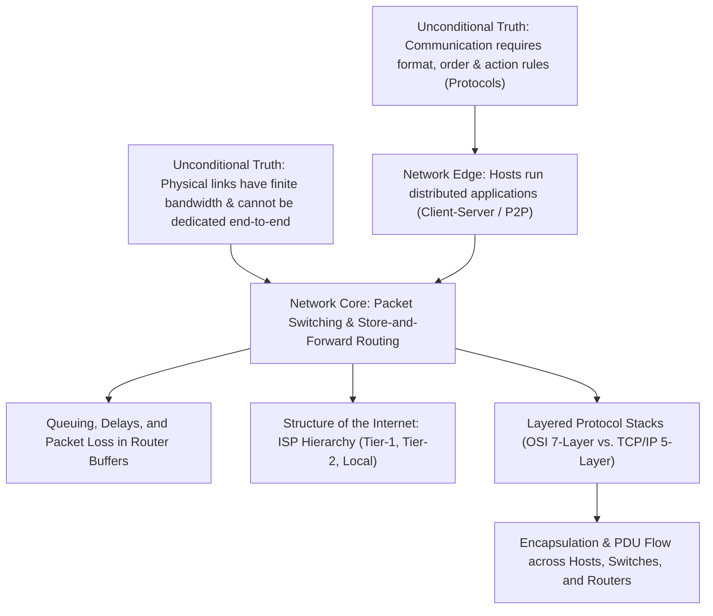

> [!quote] YOU

can you teach me about the /home/warley/ufc/4s/computer_networks/slides/rc-02-IntroducaoRedes.pdf ?


> [!question] Quiz
> In the core of the Internet, how do intermediate nodes transmit data between two end systems?
>
> 1. Signals are broadcast simultaneously across all physical links directly to every host
> 2. A dedicated physical circuit is reserved end-to-end for the duration of the communication
> 3. Hosts read and write directly to a globally synchronized shared memory space
> 4. Packets are received, buffered, and forwarded hop-by-hop by intermediate routers


> [!failure] Quiz — incorrect ✗
> Your answer: 2. A dedicated physical circuit is reserved end-to-end for the duration of the communication
> Correct answer: 4
>
> In a packet-switched network (like the Internet), data is broken into discrete packets. Routers along the path buffer each packet and forward it individually based on addressing information, rather than reserving an unbroken physical link for the entire duration of communication.


> [!question] Quiz
> When an end system sends data down through the network protocol layers, what does each layer do to the data it receives from the layer above?
>
> 1. Removes protocol headers added by higher layers
> 2. Flattens the entire payload into raw binary without any metadata
> 3. Replaces the payload content with network routing instructions
> 4. Adds its own protocol header to the payload received from above


> [!failure] Quiz — incorrect ✗
> Your answer: 1. Removes protocol headers added by higher layers
> Correct answer: 4
>
> During encapsulation, as application data moves down the stack on the sender, each layer prepends (or appends) its own control information (a header) containing layer-specific metadata like port numbers, IP addresses, or MAC addresses.


> [!question] Quiz
> In networking terminology, what is a "host" (or "end system")?
>
> 1. Central database servers that assign global domain names
> 2. Physical media transmitting electrical or optical signals
> 3. Devices at the network edge that run end-user applications
> 4. Hardware inside the network core that only forwards packets


> [!success] Quiz — correct ✓
> Your answer: 3. Devices at the network edge that run end-user applications
> Correct answer: 3
>
> Hosts (or end systems) are computing devices at the network edge that run user applications (e.g., PCs, smartphones, web servers). Core network devices like routers and link-layer switches primarily forward packets.


> [!question] Question
> What is your primary goal for studying this introductory slide deck?
>
> Your answer will help me tailor the pace and depth of each concept from the slide deck.
>
> 1. Complete first-principles walkthrough of the entire slide deck (Recommended)
> 2. Deep dive on core mechanics (Switching, Delays, Layering & Encapsulation)
> 3. Exam-focused conceptual review


> [!example] Answer
> 1. Complete first-principles walkthrough of the entire slide deck (Recommended)


> [!abstract] PI

## Teaching Plan: Introduction to Computer Networks & The Internet

Based on our initial probe, you already understand what **hosts / end systems** are at the edge of the network. We will start directly from the foundational physical constraints of connecting computers, discover why the Internet chose **packet switching** over dedicated circuits, understand how data encounters **delays and loss**, and finally discover why and how the **layered architecture (OSI & TCP/IP)** and **encapsulation** solve massive system complexity.

---

### The Approach

We will build the entire topic through **5 core nodes**, where each node solves a concrete problem introduced by the previous one:

1. **The Edge & Protocols**: Why applications run only at the edge, and why communication strictly requires agreed rules (**protocols**).
2. **The Core Problem & Switching**: How to connect billions of devices without running billions of dedicated physical wires (Circuit Switching vs. Packet Switching).
3. **The Reality of Packet Switching**: How buffers in routers lead to transmission delays, queuing, and packet loss.
4. **Internet Hierarchy**: How local ISPs connect to regional and global Tier-1 backbones to form a "network of networks".
5. **Layered Architecture & Encapsulation**: Why we divide networking tasks into layers (OSI 7-layer vs. TCP/IP 5-layer) and how data is packaged (encapsulated) with headers as it travels down and up the stack.

---

### Dependency Map



---

Ready to begin Node 1 (Protocols & The Network Edge)? Let me know if you'd like to adjust anything before we start.


> [!quote] YOU

yes


> [!abstract] PI

## Node 1: The Network Edge & What is a Protocol?

### 1. Motivation: Why start at the edge?
Imagine two computers in different parts of the world. Neither computer knows anything about the other's internal hardware, CPU architecture, or operating system. Yet, a web browser on one machine needs to request a webpage from a web server on the other, and both must interpret the request and response without ambiguity.

How can two completely independent machines reliably communicate?

---

### 2. The Concepts

#### A. The Network Edge (Hospedeiros / Sistemas Finais)
All user-facing activity happens strictly at the **edge** of the network:
* **Hosts (End Systems)**: Computers, phones, servers, IoT devices that run **distributed applications** (e.g., Web, email, video streaming, games).
* Application architectures at the edge operate in two primary models:
  1. **Client/Server**: A central server is always on and waits for requests; clients initiate communication (e.g., your browser requesting a page from a web server).
  2. **Peer-to-Peer (P2P)**: Distributed hosts communicate directly with each other without relying on a dedicated central server (e.g., BitTorrent, Gnutella).

#### B. Scale Classification
Depending on geographical span, networks are traditionally classified as:
* **LAN (Local Area Network)**: Rooms, buildings, or a university campus ($10\text{ m} - 1\text{ km}$).
* **MAN (Metropolitan Area Network)**: City-wide scale ($\approx 10\text{ km}$).
* **WAN (Wide Area Network)**: Spans countries or continents ($100\text{ km} - 1{,}000\text{ km}$).
* **The Internet**: Interconnects LANs, MANs, and WANs globally ($\approx 10{,}000\text{ km}$).

#### C. Unconditional Truth: What is a Protocol?
Just as humans follow social protocols (saying "Hello" $\rightarrow$ waiting for a reply $\rightarrow$ asking "What time is it?"), machines require strict communication rules.

> **Unconditional Truth**: A **protocol** defines:
> 1. The **format** of messages (what the bits mean).
> 2. The **order** of messages sent and received.
> 3. The **actions** taken upon sending or receiving a message or on external events (such as a timeout).

---

### 3. Quiz Check

Let's test this foundation before we look inside the network core:


> [!question] Quiz
> Which statement precisely defines a network protocol?
>
> 1. It dynamically allocates maximum bandwidth and CPU time among connected end systems
> 2. It specifies the physical electrical voltage and wire composition used across hardware
> 3. It defines the format of messages, the order of their exchange, and the actions taken upon transmission or receipt
> 4. It encrypts raw application payloads to prevent unauthorized intermediate inspection


> [!warning] Quiz — cancelled
> (user skipped)


> [!quote] YOU

continu


> [!abstract] PI

## Node 2: The Network Core — Circuit Switching vs. Packet Switching

### 1. Motivation: How do we interconnect millions of hosts?
If you have $N$ computers and want them all to talk to each other directly with dedicated cables, you would need:
$$\frac{N(N - 1)}{2} \text{ links}$$

For $1{,}000{,}000$ devices, that would require roughly **500 billion cables**. That is physically impossible. 

Instead of full direct cabling, computers connect to **intermediate switching devices** forming a mesh: **the network core**.

The fundamental engineering question is: **how should this core transfer data between any sender and receiver?**

---

### 2. How We Could Have Discovered This: Two Core Philosophies

```
                  Redes de Telecomunicações
                           │
         ┌─────────────────┴─────────────────┐
         ▼                                   ▼
Comutação de Circuitos               Comutação de Pacotes
 (Circuit Switching)                  (Packet Switching)
    ├── FDM (Frequency)                  ├── Redes de Circuitos Virtuais (VC)
    └── TDM (Time)                       └── Redes de Datagramas (Internet / IP)
```

---

#### Approach A: Circuit Switching (Comutação de Circuitos)
This was the model of the traditional telephone network:
* **Mechanism**: Before any communication starts, a dedicated end-to-end path is reserved for the entire duration of the session.
* **Division of capacity**:
  * **FDM (Frequency Division Multiplexing)**: The total frequency spectrum of a cable is split into fixed frequency bands (like radio stations). Each call gets its own band.
  * **TDM (Time Division Multiplexing)**: Time is divided into periodic frames with fixed time slots. Each call gets a recurring time slot.
* **Pros**: Guaranteed bandwidth, zero queuing delay once established.
* **The Fatal Flaw for Computers**: Computer data is **bursty** (you click a link, download for 0.5s, then read for 2 minutes). Reserving a dedicated circuit means the link sits idle and wasted 99% of the time.

---

#### Approach B: Packet Switching (Comutação de Pacotes) — The Internet's Choice
To maximize link utilization for bursty traffic, the Internet uses **packet switching**:
1. **Divide into chunks**: Long messages are broken into smaller chunks called **packets** (pacotes).
2. **Store-and-Forward**: Routers receive an entire packet, inspect its destination address, and forward it along the next link toward the destination.
3. **Statistical Multiplexing**: Resources are not reserved in advance. Multiple users share the same transmission link on demand.

In the Internet's **datagram architecture** (*Redes de Datagramas*):
* Each packet travels independently through the mesh.
* Routers do not maintain per-connection state; they simply forward each datagram based on its destination address.

---

### 3. Key Contrast

| Property | Circuit Switching | Packet Switching (Datagram) |
| :--- | :--- | :--- |
| **Resource Reservation** | Dedicated end-to-end reservation | On-demand (no prior reservation) |
| **Link Utilization** | Low with bursty data | High (shared dynamically) |
| **Path behavior** | Fixed path for entire session | Each packet routed independently |
| **Performance guarantee** | Constant bandwidth, no queuing | Variable delay, potential packet loss |

---

### 4. Check Your Understanding

Let's confirm this core distinction:


> [!question] Quiz
> Why did the Internet adopt packet switching instead of circuit switching for computer communication?
>
> 1. It routes data purely via physical wiring without inspecting packet headers
> 2. It reserves dedicated frequency bands for each active application stream
> 3. It guarantees fixed delivery times and eliminates the need for buffers
> 4. It allows bursty computer traffic to share transmission capacity efficiently on demand


> [!success] Quiz — correct ✓
> Your answer: 4. It allows bursty computer traffic to share transmission capacity efficiently on demand
> Correct answer: 4
>
> Computer traffic is typically bursty with long periods of silence between transmissions. Packet switching allows many users to dynamically share the full link capacity on-demand, whereas circuit switching wastes reserved capacity whenever a user is idle.


> [!abstract] PI

## Node 3 & 4: Router Buffers, Delays, Packet Loss & The Internet Structure

### 1. The Cost of Packet Switching: Buffers, Delays, and Loss (Slide 15)

In packet switching, since links are shared on-demand, multiple hosts might simultaneously send packets that need to cross the **same outgoing link** of a router.

```
Incoming packets ───► [ Router Buffer / Queue ] ───► Outgoing Link (Rate R bits/sec)
                      [ █ █ █ █ █ _ _ ]
                      └─── Capacity ──┘
```

When packets arrive faster than the link can transmit them:
1. **Queuing Delay (*Atraso de enfileiramento*)**: Incoming packets cannot be sent immediately; they must wait in memory (**router buffers**).
2. **Transmission Delay (*Atraso de transmissão*)**: The time required to push all $L$ bits of a packet onto the physical link of speed $R$ ($\text{Delay} = \frac{L}{R}$).
3. **Packet Loss (*Perda / Descarte de pacotes*)**: A router buffer has finite memory. If a packet arrives when all buffers are full, the router has nowhere to store it and simply **drops (discards) the packet**.

---

### 2. The Global Structure: A Network of Networks (Slide 14)

How are billions of access networks (homes, universities, companies) connected together across the globe?

The Internet is structured as a **loosely hierarchical network of networks** managed by **ISPs (Internet Service Providers)**:

```
                      ┌──────────────────────┐
                      │    ISP Tier-1        │ (Global Backbone)
                      │ (e.g., Lumen, AT&T)  │
                      └──────────┬───────────┘
                                 │
             ┌───────────────────┴───────────────────┐
             │                                       │
             ▼                                       ▼
  ┌─────────────────────┐                 ┌─────────────────────┐
  │     ISP Tier-2      │                 │     ISP Tier-2      │ (Regional / National)
  │ (e.g., Claro, Vivo) │                 │  (e.g., Embratel)   │
  └──────────┬──────────┘                 └──────────┬──────────┘
             │                                       │
      ┌──────┴──────┐                         ┌──────┴──────┐
      ▼             ▼                         ▼             ▼
 [Local ISP]   [Local ISP]               [Local ISP]   [University/UFC]
      │             │                         │             │
   [Hosts]       [Hosts]                   [Hosts]       [Hosts]
```

* **Local / Access ISPs**: Connect end-users, residences, and institutions to the network.
* **Regional ISPs (Tier-2)**: Connect local ISPs within a region or country.
* **Tier-1 ISPs**: Global backbone providers spanning continents. They interconnect directly with each other at **NAPs (Network Access Points) / IXPs (Internet Exchange Points)** without paying each other transit fees.

---

### 3. Check Your Understanding

Let's verify how buffers and delays interact:


> [!question] Quiz
> In packet-switched network routing, under what condition does packet loss occur at a router?
>
> 1. Two end systems attempt to send data during the same clock cycle
> 2. A packet arrives at a router whose queue buffers are completely full
> 3. The transmission link slows down below the host application speed
> 4. A packet traverses more than two intermediate Tier-2 routing hops


> [!success] Quiz — correct ✓
> Your answer: 2. A packet arrives at a router whose queue buffers are completely full
> Correct answer: 2
>
> Note: get the contextet needed in /home/warley/ufc/4s/network_computers/book/.pdf teach me oriented to the exercises in the network folder / exerciese .doc
>
> Because router memory buffers are finite, when packets arrive faster than the outgoing link can transmit them and fill all available queue space, any newly arriving packet is discarded (packet loss).


> [!abstract] PI

## Node 5: Layered Architecture & Encapsulation

### 1. Motivation: Why Organize Into Layers? (Slides 16–19)
A computer network is an immensely complex system involving electrical/optical signals, hardware adapters, routing algorithms, retransmission logic, error checking, cryptography, and user applications.

If we built network software as a single monolithic block:
* A tiny change in physical cables (e.g., swapping Wi-Fi for Ethernet) would require rewriting your web browser!

**The Solution: Modular Layering**
* Each layer implements a **specific service** using its own internal mechanisms.
* Each layer relies on the service provided by the layer immediately below it and provides a service to the layer above it.
* **Modularity**: Changes to a layer's implementation are **transparent** to the rest of the system (e.g., changing how airplanes board passengers does not change flight navigation procedures).

---

### 2. The Reference Models: OSI vs. TCP/IP (Slides 20–22)

```
        Modelo OSI (7 Camadas)                 Modelo Internet / TCP-IP (5 Camadas)
      ┌─────────────────────────┐                  ┌─────────────────────────┐
    7 │ Aplicação (Application) │ ───────────────► │ Aplicação (Application) │
      ├─────────────────────────┤                  │ (FTP, HTTP, SMTP, DNS)  │
    6 │ Apresentação (Present.) │ ───────────────► │                         │
      ├─────────────────────────┤                  │                         │
    5 │ Sessão (Session)        │ ───────────────► │                         │
      ├─────────────────────────┤                  ├─────────────────────────┤
    4 │ Transporte (Transport)  │ ───────────────► │ Transporte (Transport)  │ (TCP, UDP)
      ├─────────────────────────┤                  ├─────────────────────────┤
    3 │ Rede (Network)          │ ───────────────► │ Rede (Network)          │ (IP, Roteamento)
      ├─────────────────────────┤                  ├─────────────────────────┤
    2 │ Enlace (Link)           │ ───────────────► │ Enlace (Link)           │ (Ethernet, Wi-Fi)
      ├─────────────────────────┤                  ├─────────────────────────┤
    1 │ Física (Physical)       │ ───────────────► │ Física (Physical)       │ (Bits nos fios/ar)
      └─────────────────────────┘                  └─────────────────────────┘
```

> **Why TCP/IP merged layers 5, 6, and 7:** In the Internet architecture, if an application needs data presentation (e.g., encryption or compression) or session management, it is implemented directly inside the application layer itself, keeping the network stack lean and fast.

---

### 3. PDUs (Protocol Data Units) & The Encapsulation Process (Slide 23)

As data travels down the stack at the sender (**Source Host**), each layer wraps the payload with its own **header** ($H$):

```
Camada               PDU (Nome do Bloco)               Estrutura
─────────────────────────────────────────────────────────────────────────────
Aplicação            Mensagem (Message)                [   M   ]
Transporte           Segmento (Segment)                [ H_t | M ]
Rede                 Datagrama / Pacote (Datagram)     [ H_n | H_t | M ]
Enlace               Quadro (Frame)                    [ H_l | H_n | H_t | M ]
Física               Bits no canal físico              010110010101...
```

```
     HOST ORIGEM               SWITCH DE ENLACE             ROTEADOR               HOST DESTINO
 ┌─────────────────┐                                                         ┌─────────────────┐
 │ 5. Aplicação    │                                                         │ 5. Aplicação    │
 ├─────────────────┤                                                         ├─────────────────┤
 │ 4. Transporte   │                                                         │ 4. Transporte   │
 ├─────────────────┤                                   ┌─────────────────┐   ├─────────────────┤
 │ 3. Rede         │                                   │ 3. Rede         │   │ 3. Rede         │
 ├─────────────────┤         ┌─────────────────┐       ├─────────────────┤   ├─────────────────┤
 │ 2. Enlace       │ ──────► │ 2. Enlace       │ ────► │ 2. Enlace       │ ─►│ 2. Enlace       │
 ├─────────────────┤         ├─────────────────┤       ├─────────────────┤   ├─────────────────┤
 │ 1. Física       │         │ 1. Física       │       │ 1. Física       │   │ 1. Física       │
 └─────────────────┘         └─────────────────┘       └─────────────────┘   └─────────────────┘
```

#### Where are layers implemented in physical network topology? (Exam Question Insight)
* **Hosts / End Systems (Bordas)**: Implement **all 5 layers** (Layers 1 through 5). Application code only runs here.
* **Routers (Núcleo)**: Implement only up to **Layer 3 (Network)**. A router examines the IP header ($H_n$) to determine the next hop, replaces the Layer 2 frame header ($H_l$) for the next medium, and forwards the packet.
* **Link-Layer Switches**: Implement only up to **Layer 2 (Link)**. They forward frames based on MAC addresses.

---

### 4. Check Your Understanding

Let's test this foundational concept:


> [!question] Quiz
> In the physical topology of the Internet, up to which layer do standard intermediate routers in the network core process incoming packets?
>
> 1. Link-layer switches process up to Layer 4 (Transport) to track port sessions
> 2. Routers process only up to Layer 3 (Network) to route datagrams
> 3. End hosts process only Layer 1 and delegate upper layers to the ISP
> 4. Routers process all 5 layers to validate application data content


> [!success] Quiz — correct ✓
> Your answer: 2. Routers process only up to Layer 3 (Network) to route datagrams
> Correct answer: 2
>
> Note: I think these class you give me is most summarized, is because you teach prompted skill .md?
>
> In standard IP network topology, routers operate up to Layer 3 (Network) to inspect IP headers and route datagrams, while intermediate switches operate up to Layer 2 (Link). Only end hosts at the network edge process Layer 4 (Transport) and Layer 5 (Application).


> [!abstract] PI

### Yes, exactly!

The **`teach` skill** enforces a strict pedagogical methodology:
1. **Compress down to core unconditional truths and first principles**: Strip out noise and lonely disconnected facts so the mental model is solid and derivable.
2. **Motivate every concept before introducing it**: ("How could we have discovered this? What engineering problem forced this design?").
3. **Verify every step with diagnostic checks**: Ensure each node in your mental graph is locked in before adding more on top.

Since `rc-02-IntroducaoRedes.pdf` is the high-level introductory chapter (Chapter 1 of Kurose & Ross), we covered the foundational map of the entire subject:
- **Network Edge vs. Network Core**
- **Circuit Switching (FDM/TDM) vs. Packet Switching (Statistical Multiplexing & Datagrams)**
- **Router Buffers, Transmission/Queuing Delays, and Packet Loss**
- **ISP Hierarchy (Tier-1, Tier-2, Local)**
- **OSI (7 Layers) vs. TCP/IP (5 Layers)**
- **Encapsulation / Decapsulation & PDUs (Message $\rightarrow$ Segment $\rightarrow$ Datagram $\rightarrow$ Frame $\rightarrow$ Bits)**

---

### Where would you like to go next?

We have the full context from your course materials:
* **Books**: Kurose & Ross (*Top-Down Approach, 8th Ed.*) and Tanenbaum (*5th Ed.*).
* **Next Slide Decks**: `rc-03-CamadaAplicacao.pdf` (Application Layer), `rc-04-CamadaTransporte.pdf`, `rc-05-programacao-sockets.pdf`, `rc-06-CamadaRede.pdf`, etc.
* **Exercises**: Solving and mastering the questions from `rc-lista1-aplicacao-transporte.doc` or `rc-lista2-rede.doc`.

Would you like to move into **`rc-03-CamadaAplicacao`**, start working through the **exercise lists**, or go deeper into any specific topic from this intro?


> [!quote] YOU

I want to you create the notes, atomics in ./study/computer_science/networks/ and make the flascards


> [!quote] YOU

based in my teacher exercises


> [!abstract] PI

I have created the atomic notes and flashcards in `/home/warley/vault/study/computer_science/networks/`, structured specifically around your course slide deck (`rc-02-IntroducaoRedes.pdf`), the Kurose & Ross / Tanenbaum references, and your professor's exercise lists (`rc-lista1`, `rc-lista2`, and `rc-lista3`).

---

### 📂 Created Knowledge Structure

#### 1. Main Hub / Synthesis Note
* **`study/computer_science/networks/01-introduction-to-networks.md`**: Master roadmap and conceptual overview linking and transcluding all sub-notes and diagrams.

#### 2. Atomic Sub-Notes (`study/computer_science/networks/atomics/`)
* **`Concept - Network Edge and Application Architectures.md`**:
  * Hosts/End Systems, Client-Server vs. Peer-to-Peer (P2P), and **why application logic only runs at the edge** *(List 1, Q1 & Q2)*.
* **`Concept - Circuit Switching vs Packet Switching.md`**:
  * FDM and TDM multiplexing *(List 1, Q13)*, Statistical Multiplexing, Store-and-Forward, and **why packets can arrive out of order** *(List 2)*.
* **`Concept - Router Buffers Delays and Packet Loss.md`**:
  * The 4 nodal delay components ($d_{\text{proc}}, d_{\text{queue}}, d_{\text{trans}} = \frac{L}{R}, d_{\text{prop}} = \frac{d}{s}$), traffic intensity $\frac{L \cdot a}{R}$, and buffer overflow packet loss.
* **`Concept - Internet Hierarchy and ISPs.md`**:
  * Tier-1 global backbones, Tier-2 regional ISPs, Access ISPs, IXPs/NAPs, and Transit vs. Peering agreements.
* **`Architecture - Protocol Layers OSI vs TCP-IP.md`**:
  * The 7-layer OSI model vs. 5-layer TCP/IP stack, responsibilities by layer, and why layers 5 & 6 were absorbed into the Application layer.
* **`Mechanism - Encapsulation and Decapsulation.md`**:
  * PDU naming convention ($M \to \text{Segment} \to \text{Datagram} \to \text{Frame} \to \text{Bits}$), header transformations, and operational layers of **Hosts (L1–L5)**, **Routers (L1–L3)**, and **Switches (L1–L2)** *(List 3)*.
* **`Concept - Physical Transmission Media and Topologies.md`**:
  * Star vs. Bus vs. Ring topologies, Twisted-pair, Fiber, Radio, spectrum regulation, and **Hub vs. Switch vs. Router comparison** *(List 3)*.

#### 3. Active Recall Flashcards (`study/computer_science/networks/flashcards/`)
* **`flashcards-01-intro-networks.md`**:
  * Contains 19 high-yield spaced-repetition flashcards formatted with `#flashcards/networks` and `Q::A` syntax for Obsidian Spaced Repetition / Anki plugins.
