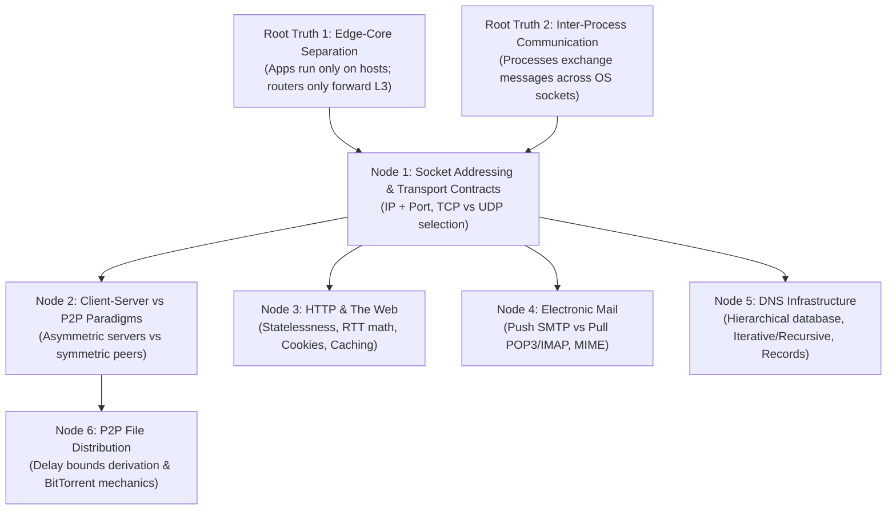

> [!quote] YOU

teach me about /home/warley/ufc/4s/computer_networks/slides/rc-03-CamadaAplicacao.pdf uses ../books/ kurouse book

deeply explanation

> [!question] Quiz
> Regarding the services that the Internet transport layer protocols (TCP and UDP) provide to network applications, which statement is true?
>
> 1. TCP guarantees maximum end-to-end packet delay, whereas UDP does not
> 2. UDP provides no delivery or timing guarantees, whereas TCP provides reliable data transfer
> 3. UDP provides congestion control to prevent packet loss, whereas TCP does not
> 4. TCP guarantees a minimum throughput bandwidth, whereas UDP does not

> [!success] Quiz — correct ✓
> Your answer: 2. UDP provides no delivery or timing guarantees, whereas TCP provides reliable data transfer
> Correct answer: 2
>
> UDP provides an unconnection-oriented, best-effort service without delivery guarantees, congestion control, or flow control. TCP provides reliable in-order byte stream delivery, flow control, and congestion control, but neither protocol provides minimum throughput or maximum delay guarantees.

> [!question] Quiz
> Suppose a browser requests a base HTML page containing references to 2 separate JPEG images. Assuming negligible transmission time and no parallel TCP connections, what is the total response time measured in RTTs under non-persistent HTTP?
>
> 1. 4 RTTs
> 2. 5 RTTs
> 3. 6 RTTs
> 4. 8 RTTs

> [!question] Quiz — I don't know
> Your answer: I don't know
> Correct answer: 3
>
> In non-persistent HTTP without parallel connections, fetching the base HTML file requires 2 RTTs (1 RTT for TCP 3-way handshake + 1 RTT for HTTP request/response). Each of the 2 referenced objects requires its own separate TCP connection (1 RTT handshake + 1 RTT request/response = 2 RTTs each). Total time = 2 + 2 + 2 = 6 RTTs. (In contrast, persistent HTTP without pipelining would take 1 RTT handshake + 1 RTT base HTML + 2 RTTs for objects = 4 RTTs; with pipelining it would take 3 RTTs).

> [!question] Quiz
> During an iterative DNS resolution for www.example.com initiated by a Local DNS Server, what does the .com TLD server return to the Local DNS Server?
>
> 1. The Authoritative server returns a Type MX record containing the IP of the local DNS server
> 2. The TLD server returns a Type NS record pointing to the domain's authoritative DNS server
> 3. The Local DNS server delegates all queries to the client browser to resolve iteratively
> 4. The Root server returns a Type A record mapping the full domain directly to its IP address

> [!question] Quiz — I don't know
> Your answer: I don't know
> Correct answer: 2
>
> In the DNS hierarchy, Root and TLD servers typically do not store the direct host-to-IP (A/AAAA) mapping for arbitrary domains; instead, they return NS (Name Server) records that point to the authoritative DNS servers for that zone, along with Type A glue records providing the IP of those name servers. The authoritative server itself provides the final Type A record.

> [!question] Quiz
> What is the primary role of the Domain Name System (DNS) in the Internet architecture?
>
> 1. Encrypting application payload data during transport transmission
> 2. Translating human-readable hostnames into numeric IP addresses
> 3. Routing individual IP packets hop-by-hop across core routers
> 4. Assigning port numbers dynamically to client application processes

> [!success] Quiz — correct ✓
> Your answer: 2. Translating human-readable hostnames into numeric IP addresses
> Correct answer: 2
>
> The fundamental purpose of DNS is to translate human-friendly hostnames (like www.google.com) into 32-bit (IPv4) or 128-bit (IPv6) numeric IP addresses required by the network layer to route packets.

> [!question] Quiz
> In Internet email architecture, how do SMTP and mail access protocols (like POP3 or IMAP) divide their responsibilities?
>
> 1. Both SMTP and IMAP are push protocols used exclusively between end-user clients
> 2. SMTP is used to retrieve mail from a server, whereas POP3 is used to push mail between servers
> 3. SMTP is a push protocol for sending mail, whereas IMAP and POP3 are pull protocols for retrieving mail
> 4. IMAP is used to route mail between intermediate mail transfer agents across the Internet

> [!question] Quiz — I don't know
> Your answer: I don't know
> Correct answer: 3
>
> SMTP is a push protocol used to send/forward mail from the sender's client to their mail server, and between mail servers. Access protocols like IMAP, POP3, or HTTP are pull protocols used by the recipient's client to retrieve mail from the recipient's mail server.

> [!question] Quiz
> When distributing a file of size $F$ to $N$ users, how does P2P distribution fundamentally compare in scalability to Client-Server distribution as $N$ becomes very large?
>
> 1. Client-server distribution time is independent of $N$ because clients pull in parallel
> 2. Client-server distribution time decreases as $N$ grows due to client-side caching
> 3. P2P distribution time scales linearly with $N$ because the tracker must serve every chunk
> 4. P2P distribution time is bounded/sublinear with $N$ because downloading peers also upload chunks

> [!failure] Quiz — incorrect ✗
> Your answer: 2. Client-server distribution time decreases as $N$ grows due to client-side caching
> Correct answer: 4
>
> In client-server file distribution, distribution time grows linearly with the number of peers $N$ because the server upload bandwidth $u_s$ is the bottleneck ($N F / u_s$). In P2P file distribution, each peer contributes upload capacity $u_i$, making the aggregate upload bandwidth grow with $N$ ($u_s + \sum u_i$), making P2P self-scaling.

> [!question] Question
> How would you like us to pace and structure our deep dive into the Application Layer?
>
> We mapped your current baseline across the five key pillars of Kurose Chapter 2 / Slide Set 03. Let's confirm your primary goal and emphasis.
>
> 1. Comprehensive Deep Dive (Full Chapter 2) (Recommended)
> 2. Exercise & Exam-Oriented Focus
> 3. Modular Topic-by-Topic Breakdown

> [!example] Answer
> 1. Comprehensive Deep Dive (Full Chapter 2) (Recommended)

> [!abstract] PI

Here is our diagnostic summary and teaching plan for **Chapter 2: Application Layer** (*Computer Networking: A Top-Down Approach*, Kurose & Ross / Slide Set 03).

---

### Diagnostic Summary
From our initial probing:
- **Rock-solid baseline:** You understand the core distinction between TCP (reliable, connection-oriented) and UDP (unreliable, best-effort), and you know that DNS translates domain names to IP addresses.
- **Edges & Frontiers identified:**
  1. *Connection dynamics & timing:* Calculating round-trip times ($RTT$) across non-persistent vs. persistent HTTP connections with embedded objects.
  2. *DNS mechanics:* Hierarchical tree delegation (Root $\rightarrow$ TLD $\rightarrow$ Authoritative), iterative vs. recursive queries, and resource record types (`A`, `NS`, `CNAME`, `MX`).
  3. *Email mechanics:* The structural asymmetry between push protocols (SMTP) and pull access protocols (POP3, IMAP, HTTP).
  4. *P2P scalability:* Deriving the mathematical distribution bounds ($D_{CS}$ vs. $D_{P2P}$) and BitTorrent chunking/incentive mechanisms (tit-for-tat).

---

### The Teaching Approach

We will build the entire Application Layer from ground truth up to complex distributed architectures in **5 sequential milestones**:

1. **Foundations of Network Applications:** Why applications exist *only* at the network edge, how processes identify and speak to each other via sockets `(IP, Port)`, and how application requirements dictate the choice between TCP and UDP.
2. **The Web & HTTP:** The request-response paradigm, statelessness, state tracking with Cookies, non-persistent vs. persistent connections with exact $RTT$ mathematical breakdowns, and Web Caching with Conditional `GET`.
3. **Electronic Mail (SMTP, POP3, IMAP):** Why email is inherently two-tier, push vs. pull protocol architectures, 7-bit ASCII constraints, and MIME encoding.
4. **DNS (Domain Name System):** The distributed hierarchical database, step-by-step trace of iterative vs. recursive queries, DNS caching, and Resource Record structure (`A`, `NS`, `CNAME`, `MX`).
5. **P2P Architectures & BitTorrent:** Deriving the mathematical distribution delay formulas for Client-Server vs. P2P, and BitTorrent's chunking, rarest-first, and tit-for-tat game theory.

---

### Dependency Map



---

Whenever you are ready, give the go-ahead and we will dive straight into **Node 1: Edge-Core Separation, Sockets, and Transport Contracts**!

> [!quote] YOU

proceed, and 

use the /home/warley/ufc/4s/computer_networks/exercises/rc-lista1-aplicacao-transporte.doc for teach me oriented for these exercises

> [!abstract] PI

# Milestone 1: Edge-Core Separation, Sockets & Transport Requirements
*(Directly solves Exercises 1, 3, 16, and 17 from your list)*

---

### 1. The Foundational Truth: Edge vs. Core Separation
*(Exercise 1: Where in the physical topology are application protocols implemented, and why?)*

To understand network applications, we must first accept an **unconditional truth of the Internet architecture**:

> **Unconditional Truth:** Network application software executes **strictly on end systems (hosts)** at the edge of the network. The network core (routers and switches) has **zero knowledge** of application-layer protocols.

```
+-------------------+                                   +-------------------+
|    End System     |                                   |    End System     |
| (Host / Terminal) |                                   | (Host / Terminal) |
| +---------------+ |                                   | +---------------+ |
| |  Application  | |                                   | |  Application  | |
| +-------|-------+ |                                   | +-------^-------+ |
|         v         |       +---------------+           |         |         |
| |   Transport   | |       |    Router     |           | |   Transport   | |
| +-------|-------+ |       | (Network Core)|           | +-------^-------+ |
|         v         |       | +-----------+ |           |         |         |
| |    Network    | =======>| |  Network  | |==========>| |    Network    | |
| +-------|-------+ |       | +-----------+ |           | +-------^-------+ |
| |   Link/Phys   | |       | | Link/Phys | |           | |   Link/Phys   | |
+-------------------+       +---------------+           +-------------------+
```

#### Why was the Internet designed this way?
1. **The End-to-End Principle (*Saltzer, Reed, Clark, 1981*):** The core's sole job is to move bits from source to destination as fast and dumb as possible (routing and packet switching at Layer 3/2). 
2. **Rapid Application Innovation:** If routers needed software updates every time someone invented a new application protocol (like HTTP in 1989 or BitTorrent in 2001), the Internet could never scale or evolve. Anyone can write a distributed app today simply by running code on two edge computers.

---

### 2. Inter-Process Communication & Sockets
*(Exercises 16 & 17: How is a process identified, and what is a socket?)*

A host's Operating System runs multiple concurrent applications. How does a message travelling across the globe reach the exact application process intended?

#### How a Process is Uniquely Identified
An IP address alone identifies only the **host interface** (the physical/logical machine). To identify the **specific process** running inside that machine, we need:
$$\text{Endpoint Identifier} = (\text{IP Address}, \text{Port Number})$$

- **IP Address (32-bit IPv4 / 128-bit IPv6):** Directs the packet across the global Internet to the destination host.
- **Port Number (16-bit integer, $0 \text{ to } 65535$):** Directs the payload inside the destination host's OS to the specific process listening on that port.
  - *Well-Known Ports ($0 - 1023$):* HTTP (`80`), HTTPS (`443`), SMTP (`25`), DNS (`53`), FTP control (`21`).

#### What is a Socket?
A **Socket** is the software interface (the API) between the **Application Layer** (user space) and the **Transport Layer** (operating system kernel).
- Think of a socket as the **door** of a house: the application process creates a message, walks to the door, and pushes the message out into the transport infrastructure.
- The developer has complete control of everything *inside* the application layer (the message format, syntax, semantics), but only minimal control over the transport layer (selecting TCP vs. UDP, and setting a few buffer sizes or timeout parameters).

```
+-----------------------------------------------------------+
| User Space       Application Process (e.g., Web Server)  |
|                               |                           |
|                    write() / send() / recv()              |
+===============================v===========================+
| Socket Interface (The "Door" between App and OS Kernel)   |
+===============================v===========================+
| OS Kernel                     Transport Layer (TCP / UDP) |
+-----------------------------------------------------------+
```

#### Core Socket Functions:
1. `socket()`: Creates a new socket descriptor.
2. `bind()`: Binds the socket to a specific local IP and Port number.
3. `listen()` *(TCP only)*: Puts the socket into a passive state waiting for incoming connections.
4. `accept()` *(TCP only)*: Blocks until a client connects, creating a dedicated connection socket.
5. `connect()` *(TCP client)*: Initiates the 3-way handshake to the server's IP and port.
6. `send()` / `recv()` (or `write()` / `read()`): Transmits and receives data bytes.
7. `close()`: Teardowns the socket and releases resources.

---

### 3. Application Requirements vs. Transport Guarantees
*(Exercise 3: Differentiate application transport requirements with examples)*

When building an application, you must choose what transport protocol fits its service requirements across four dimensions:

| Dimension | What the Application Needs | Example Applications |
| :--- | :--- | :--- |
| **Data Integrity / Loss Tolerance** | Must deliver 100% of bits without loss (requires reliable transport). | Web (HTTP), File transfer (FTP), Email (SMTP), Remote shell (SSH). |
| **Throughput / Bandwidth** | Needs guaranteed minimum bandwidth (bandwidth-sensitive) vs. adapts to whatever is available (elastic). | Bandwidth-sensitive: Video streaming, VoIP.<br>Elastic: Web, Email, File transfer. |
| **Timing / Delay Sensitivity** | Requires very low end-to-end latency & jitter (e.g., $< 150 \text{ ms}$). | Interactive online gaming, VoIP, real-time video conference. |
| **Security** | Confidentiality, integrity, authentication. | Banking/e-commerce (HTTPS via TLS). |

#### The Reality of the Internet Transport Layer:
The Internet offers two fundamental transport protocols:
1. **TCP (Transmission Control Protocol - RFC 793):**
   - **Guarantees:** 100% Reliable in-order byte stream (via ACKs, retransmissions, timeouts), Flow Control (receiver buffer safety), Congestion Control (network safety), Connection setup (3-way handshake).
   - **Does NOT Guarantee:** Minimum throughput (bandwidth), nor maximum delay/latency guarantees.
2. **UDP (User Datagram Protocol - RFC 768):**
   - **Guarantees:** None! Unreliable, connectionless, no ordering, no retransmissions, no flow or congestion control.
   - **Advantage:** No handshake delay, no head-of-line blocking, zero protocol overhead (8-byte header vs. TCP's 20-byte header). Perfect for DNS queries, real-time audio, broadcast/multicast.

---

Let's test this foundation with a diagnostic question before moving to HTTP and connection timing!

> [!question] Quiz
> In computer networking architecture, what precisely is a socket?
>
> 1. An encryption protocol that guarantees real-time delivery and minimum bandwidth for video streams
> 2. A physical hardware interface located inside network core routers to switch packet buffers
> 3. A network-layer routing table entry that translates hostnames into 32-bit IP addresses
> 4. The software interface between an application process in user space and the OS transport layer

> [!success] Quiz — correct ✓
> Your answer: 4. The software interface between an application process in user space and the OS transport layer
> Correct answer: 4
>
> A socket is the operating-system interface/door through which an application process in user space sends messages to and receives messages from the transport layer in the kernel. The application controls the application-layer logic above the socket, while the OS kernel manages the transport protocols below it.

> [!abstract] PI

# Milestone 2: Web, HTTP, Forms, Proxies & Connection Mechanics
*(Directly solves Exercises 4, 5, and 6 from your list, plus RTT and Caching mechanics)*

---

### 1. HTTP Architecture & Statelessness
**HTTP (HyperText Transfer Protocol - RFC 1945/2616/7230)** is an application-layer request/response protocol operating over **TCP** (port `80` by default, or port `443` for HTTPS over TLS).

> **Unconditional Truth:** HTTP is **stateless**. The HTTP server maintains **no information** about past client requests. If the same client requests the exact same resource two seconds later, the server processes it completely afresh.

#### Why Stateless?
- **Server Simplicity & High Concurrency:** A server holding no client session state can handle millions of concurrent users without memory exhaustion or state corruption when connections crash.
- **How State is Maintained in Practice: Cookies (RFC 6265)**
  Because web applications (shopping carts, user logins) *require* state, HTTP uses **Cookies**:
  1. The server includes a `Set-Cookie: userID=12345` header in its HTTP response.
  2. The browser stores this cookie locally.
  3. Every subsequent request from that browser to that domain automatically includes `Cookie: userID=12345`.
  4. The server uses the `userID` as a key into its backend database to look up the session state.

---

### 2. HTTP Form Methods: GET vs. POST
*(Exercise 4: Explain HTTP form methods)*

When an HTML form (`<form action="..." method="...">`) is submitted by a user, the browser encodes the form input fields and sends them using one of two primary HTTP methods:

```
+-----------------------------------------------------------------------------------+
| GET Method: Data encoded in URL Query String                                     |
| GET /search?q=networks&lang=en HTTP/1.1                                           |
| Host: www.google.com                                                              |
| [No Entity Body]                                                                  |
+-----------------------------------------------------------------------------------+
| POST Method: Data encoded in the HTTP Request Entity Body                         |
| POST /login HTTP/1.1                                                              |
| Host: www.example.com                                                             |
| Content-Type: application/x-www-form-urlencoded                                   |
| Content-Length: 27                                                                |
|                                                                                   |
| username=alice&password=secret                                                    |
+-----------------------------------------------------------------------------------+
```

#### Comparison:
1. **`GET` Method:**
   - **How it works:** Form data is appended directly to the URL in the Request Line as key-value pairs (the *query string*, e.g., `/search?user=warley&term=tcp`).
   - **Characteristics:** Idempotent and safe. URLs can be bookmarked, cached by proxies, and shared.
   - **Limitations:** Limited in size (URL length limits), and **insecure for credentials** (passwords appear directly in browser history, logs, and screen).
2. **`POST` Method:**
   - **How it works:** Form data is placed in the **entity body** (payload) of the HTTP request message, beneath the header lines. The URL remains clean (e.g., `/login`).
   - **Characteristics:** Not cached by default; ideal for state-altering actions (database inserts, payments, logins). Allows sending arbitrary payload sizes (e.g., uploading large files via `multipart/form-data`).

*(Other standard HTTP methods: `HEAD` (requests only headers, no body), `PUT` (replaces/creates resource at target URL), `DELETE` (removes resource at URL)).*

---

### 3. Non-Persistent vs. Persistent HTTP: The Exact RTT Math
A web page typically consists of a **base HTML file** and several **referenced objects** (images, CSS stylesheets, JavaScript files).

Let **$RTT$ (Round-Trip Time)** be the time it takes for a small packet to travel from client to server and back.

#### Case A: Non-Persistent HTTP (HTTP/1.0 default)
Under non-persistent connections, **each TCP connection is closed immediately after the server sends a single object**.
1. **Handshake:** Client sends TCP SYN; Server replies with SYN-ACK ($\mathbf{1 \times RTT}$).
2. **Base HTML Request/Response:** Client sends HTTP GET combined with TCP ACK; Server transmits base HTML ($\mathbf{1 \times RTT} + \text{transmission time}$).
3. **Closing:** Connection is closed.
4. **Referenced Objects:** For each of the $M$ referenced objects, the browser must open a *new* TCP connection:
   $$\text{Per Object Time} = 1 \text{ RTT (handshake)} + 1 \text{ RTT (HTTP GET/response)} = 2 \text{ RTT}$$

$$\text{Total Response Time (Non-Persistent, Serial)} = 2 \text{ RTT (base HTML)} + M \times 2 \text{ RTT} = 2(M + 1) \text{ RTT} + \sum \text{transmissions}$$

*(Example: For 1 base HTML + 2 images $\implies 2(2 + 1) = \mathbf{6 \text{ RTTs}}$).*

```
Client                                                         Server
  | ----------------- TCP SYN ----------------------------->     |
  | <---------------- TCP SYN-ACK --------------------------     | (1 RTT: TCP Handshake)
  | ----------------- HTTP GET (base.html) + ACK ---------->     |
  | <---------------- HTTP 200 OK + base.html --------------     | (1 RTT: Base HTML)
  | [Connection Closes]                                          |
  |                                                              |
  | ----------------- TCP SYN ----------------------------->     |
  | <---------------- TCP SYN-ACK --------------------------     | (1 RTT: TCP Handshake)
  | ----------------- HTTP GET (image1.jpg) --------------->     |
  | <---------------- HTTP 200 OK + image1.jpg -------------     | (1 RTT: Image 1)
  | [Connection Closes]                                          |
```

#### Case B: Persistent HTTP (HTTP/1.1 default)
The TCP connection remains open after sending a response.
- **Handshake:** $1 \text{ RTT}$ (only once!).
- **Base HTML:** $1 \text{ RTT}$.
- **Referenced Objects without Pipelining:** Client waits for each object before requesting the next: $1 \text{ RTT}$ per object.
  $$\text{Total Time} = 1 \text{ RTT (handshake)} + 1 \text{ RTT (base)} + M \times 1 \text{ RTT} = (M + 2) \text{ RTT}$$
- **Referenced Objects with Pipelining:** Client sends all $M$ requests back-to-back as soon as it sees them:
  $$\text{Total Time} = 1 \text{ RTT (handshake)} + 1 \text{ RTT (base)} + 1 \text{ RTT (all pipelined objects)} = \mathbf{3 \text{ RTTs}}$$

---

### 4. HTTP Proxies (Web Caching) & "Transparent Proxy"
*(Exercise 5: Explain HTTP proxy and how transparent proxy is implemented)*

A **Web Proxy (Cache)** is an intermediary network entity that satisfies HTTP requests on behalf of an origin web server.

```
                    +--------------------+
                    |  Origin Web Server | (e.g., in California)
                    +---------^----------+
                              | Internet Access Link (Bottleneck)
                              v
[Client 1] -----\   +--------------------+
                 ==>|     Local Proxy    | (Inside Institutional / ISP LAN)
[Client 2] -----/   +--------------------+
```

#### How Standard Proxying Works:
1. The client browser is explicitly configured to direct all requests to `http://proxy.ufc.br:8080`.
2. The proxy checks if the requested object is in its local storage.
   - If **Cache Hit:** Proxy serves the object instantly (low latency, 0 bottleneck traffic).
   - If **Cache Miss:** Proxy opens a TCP connection to the origin server, downloads the object, caches a copy, and forwards it to the client.

#### What is a "Transparent Proxy" and How is it Implemented?
In a **Transparent Proxy (also known as an Intercepting Proxy)**, the user's browser is **NOT configured** with any proxy settings. The client believes it is communicating directly with the origin server!

- **How it is implemented:**
  1. An edge router or firewall at the network perimeter inspects outgoing traffic.
  2. When it sees TCP packets directed to destination port `80` (HTTP), it uses **Destination NAT / Policy Routing (e.g., Linux `iptables` / `nftables` with `REDIRECT` or `DNAT` targets)** to intercept those packets.
  3. The router silently redirects the TCP stream to the local proxy server process listening on the LAN.
  4. The proxy terminates the connection, processes the request, fetches the remote resource if necessary, and returns the response spoofing the origin server's identity to the client.

#### Cache Consistency: The Conditional GET
How does a proxy know if a cached object has changed at the origin server?
- The proxy sends an HTTP request containing the header:
  `If-Modified-Since: <date of cached copy>`
- If the object **has not changed**, the origin server returns:
  `HTTP/1.1 304 Not Modified` (with **no entity body**, saving bandwidth!).
- If the object **has changed**, the origin server returns:
  `HTTP/1.1 200 OK` (with the new entity body).

---

### 5. FTP: "Out-of-Band" Control
*(Exercise 6: Explain why FTP is controlled "out of band")*

**FTP (File Transfer Protocol - RFC 959)** uses **two separate parallel TCP connections**:

```
Client                                                   Server
  |                                                        |
  | ================= Control Connection (Port 21) ======> | (Commands: USER, PASS, RETR, STOR)
  |                                                        | (Remains open for entire session)
  |                                                        |
  | ----------------- Data Connection (Port 20 / Ephemeral)| (Carries the actual file data)
  | <====================================================> | (Opens for ONE file, then CLOSES!)
```

#### Why is FTP Called "Out-of-Band"?
- **In-Band (e.g., HTTP):** Control information (headers like `GET`, `Host`, status codes) and the actual data (HTML, JPEG) travel through the **exact same TCP connection**.
- **Out-of-Band (FTP):** Control information (commands, authentication, responses) travels over a **dedicated control connection (Port 21)**, completely separate from the **data connection (Port 20/ephemeral)** used exclusively to transfer raw file bytes.

---

Let's test these Web/Proxy mechanisms with a quiz question!

> [!question] Quiz
> When an HTTP proxy validates a cached object using a Conditional GET request ('If-Modified-Since'), what does the origin server return if the object has NOT been modified since that date?
>
> 1. The server sends '304 Not Modified' with no message body to save bandwidth
> 2. The proxy issues a POST request to overwrite the origin server's invalid cache
> 3. The server sends '404 Not Found' instructing the proxy to invalidate its local entry
> 4. The server sends '200 OK' containing the full object and a new timestamp header

> [!success] Quiz — correct ✓
> Your answer: 1. The server sends '304 Not Modified' with no message body to save bandwidth
> Correct answer: 1
>
> When a proxy cache checks if a cached resource is still valid, it sends a Conditional GET with the 'If-Modified-Since' header. If the file has not changed, the origin server returns '304 Not Modified' with an empty body, avoiding retransmission of the data across the network link.

> [!abstract] PI

# Milestone 3: Electronic Mail Architecture & Protocols
*(Directly solves Exercises 7 and 8 from your list)*

---

### 1. The Three Core Components of Email
Internet email architecture consists of three distinct components:
1. **User Agents (UAs):** Mail readers (Thunderbird, Outlook, Apple Mail, Webmail interfaces) allowing users to read, compose, and send messages.
2. **Mail Servers:** Core infrastructure hosts running a **mailbox** for each local user and a **message queue** for outgoing messages awaiting delivery.
3. **Application Protocols:**
   - **SMTP (Simple Mail Transfer Protocol - RFC 5321):** A **push** protocol used to transfer mail between servers and from UA to the sender's mail server.
   - **Mail Access Protocols (POP3, IMAP, HTTP):** **Pull** protocols used by the recipient's UA to fetch messages from their mailbox on the server.

```
+-----------+                +-------------+                     +-------------+                +-----------+
| Alice's   |     SMTP       | Alice's     |       SMTP          | Bob's       |  POP3 / IMAP   | Bob's     |
| User      | -------------> | Mail Server | ------------------> | Mail Server | -------------> | User      |
| Agent     |     (Push)     | (Queue)     |   Server-to-Server  | (Mailbox)   |     (Pull)     | Agent     |
+-----------+                +-------------+        (Push)       +-------------+                +-----------+
```

---

### 2. Why SMTP is a Push Protocol and Why Access Requires Pull
- **SMTP (Push over TCP port 25):** The sending side initiates the TCP connection to push the message forward.
  - Alice pushes to her mail server $\rightarrow$ Alice's mail server looks up Bob's mail server via DNS `MX` records $\rightarrow$ Alice's mail server connects directly to Bob's mail server and pushes the email into Bob's mailbox.
- **Why can't Bob's mail server use SMTP to push the email directly to Bob's laptop?**
  - Because Bob's laptop is an end-system that is often **turned off, asleep, or behind a dynamic NAT/firewall IP**. It is not a permanent server listening on port 25.
  - Therefore, Bob's mail server holds the mail in Bob's mailbox until Bob turns on his UA and initiates a **pull connection** via **POP3** (port 110), **IMAP** (port 143), or **HTTP** (webmail).

---

### 3. SMTP Spoofing: Why Can Anyone Impersonate Anyone?
*(Exercise 7: Explain why it is possible to send SMTP messages impersonating another person without knowing their password)*

To understand why SMTP spoofing exists, we look at the historical origin of SMTP (RFC 821, published in 1982 for ARPANET):

#### The Architecture of an SMTP Conversation:
When an SMTP client connects to an open mail server, the protocol consists of plain text ASCII commands:

```text
S: 220 mail.server.ufc.br ESMTP Sendmail
C: HELO client.ufc.br
S: 250 mail.server.ufc.br Hello client.ufc.br
C: MAIL FROM: <reitor@ufc.br>            <-- Sender Envelope Address
S: 250 2.1.0 Ok
C: RCPT TO: <aluno@ufc.br>               <-- Recipient Envelope Address
S: 250 2.1.5 Ok
C: DATA
S: 354 End data with <CR><LF>.<CR><LF>
C: From: "Reitor da UFC" <reitor@ufc.br> <-- Message Header Line
C: To: "Aluno" <aluno@ufc.br>
C: Subject: Cancelamento das Aulas
C:
C: Caros alunos, hoje nao havera aula.
C: .
S: 250 2.0.0 Ok: queued as 12345
C: QUIT
S: 221 2.0.0 Bye
```

#### The Root Cause:
1. **Zero Built-In Authentication in Base SMTP:** Base SMTP was designed for a trusted academic network. It does **not require a password** to execute `MAIL FROM: <any_address@domain.com>`.
2. **Decoupling of Transport Envelope and Header:** The server trusts whatever string the client writes in `MAIL FROM:` (envelope) and the `From:` header inside the message body.
3. **Open Relays:** If a mail server is configured to accept mail from any arbitrary host to any destination without authentication, an attacker can simply connect to port 25 of that server, type `MAIL FROM: <billgates@microsoft.com>`, and the server will faithfully deliver it.

*(Modern defenses added on top of SMTP to mitigate this include **SMTP AUTH**, **SPF - Sender Policy Framework**, **DKIM - DomainKeys Identified Mail**, and **DMARC**).*

---

### 4. POP3 vs. IMAP: The Architectural Advantages of IMAP
*(Exercise 8: What are the advantages of IMAP over POP3?)*

| Feature / Dimension | **POP3 (Post Office Protocol v3 - RFC 1939)** | **IMAP (Internet Message Access Protocol - RFC 3501)** |
| :--- | :--- | :--- |
| **State Paradigm** | **Stateless across sessions.** The server maintains no state about which messages were read/deleted once the connection closes. | **Stateful across sessions.** The server continuously maintains the exact state of every message. |
| **Storage Model** | **Local download model ("Download-and-Delete" or "Download-and-Keep"):** Messages are pulled down to the local device. | **Centralized remote storage:** Messages remain permanently stored on the central server; the UA is merely a synchronizing viewer. |
| **Multi-Device Sync** | **Broken.** If you read or delete an email on your phone via POP3, your laptop has no awareness of it and downloads it as an unread message. | **Seamless synchronization across multiple devices.** If you read, flag, or delete an email on your phone, your laptop instantly reflects the change. |
| **Folder Hierarchy** | **None on server.** Folders exist only locally on the client's hard drive. | **Full server-side folder management.** Users can create, rename, and organize folders/labels on the server (`INBOX`, `Work`, `Archive`). |
| **Partial / Component Fetching** | **All-or-nothing.** Must download the entire message payload (including massive 50MB attachments) before reading. | **Component retrieval.** UA can fetch just the message header line or preview text, downloading large attachments only on explicit user demand (saves mobile bandwidth). |

---

### 5. Why Sending Raw Files Over Base SMTP Fails (Without Base64 / MIME)

Sending an unencoded binary file (image, PDF, executable, zip) directly through SMTP causes **5 critical failures**:

1. **7-Bit ASCII Cleanliness & Parity Stripping:** Base SMTP mandates 7-bit ASCII ($0\text{x}00-0\text{x}7F$). Raw binary contains bytes $\ge 128$ (MSB = `1`). Legacy gateways and serial links strip or overwrite bit 7 for parity checks, corrupting the payload.
2. **False Termination Collision (`<CRLF>.<CRLF>`):** SMTP ends the message body when it detects `\r\n.\r\n` (`0x0D 0x0A 0x2E 0x0D 0x0A`). In a raw binary file, this exact 5-byte sequence can appear purely at random, causing the mail server to prematurely truncate the file and crash trying to interpret the rest as commands.
3. **Line Length Limit (RFC 5321):** SMTP enforces a hard maximum of **998 characters per line** (plus CRLF). Binary streams have no natural line breaks, overflowing server line buffers.
4. **Newline Normalization (`\n` vs `\r\n`):** Intermediate mail transfer agents normalize line breaks (converting `0x0A` to `0x0D 0x0A`), which alters byte values inside binary data and corrupts file hashes.
5. **Null Byte (`0x00`) String Termination:** C-based mail server daemons terminate string operations upon reading `\0`, cutting off binary data streams.

**How MIME & Base64 Solves This:**
* Maps raw 24 bits (3 binary bytes) into four 6-bit units ($4 \times 6 = 24\text{ bits}$), representing 64 safe, printable 7-bit ASCII characters (`A-Z`, `a-z`, `0-9`, `+`, `/`).
* Wraps text every 76 characters with `<CRLF>` to strictly honor line-length limits.
* Incurs a predictable $\approx 33.3\%$ bandwidth overhead in exchange for guaranteed corruption-free delivery.

---

### 6. SMTP vs. HTTP (Kurose & Ross Comparison)

| Dimension | **SMTP (RFC 5321)** | **HTTP (RFC 7230 / 9110)** |
| :--- | :--- | :--- |
| **Direction** | Primarily a **Push** protocol | Primarily a **Pull** protocol |
| **Encoding** | **7-bit ASCII** (requires Base64 MIME for binary) | **8-bit binary transparent** (no encoding overhead) |
| **Encapsulation** | Combines **all objects** into a **single multipart body** | Encapsulates **each object in its own HTTP response** |
| **Default Port** | TCP Port `25` | TCP Port `80` / `443` |

---

Let's test this with a quiz question!

> [!question] Quiz
> Which of the following is a primary architectural advantage of IMAP over POP3?
>
> 1. IMAP maintains server-side folders and synchronizes state across multiple client devices
> 2. IMAP encrypts message payloads end-to-end without requiring TLS transport encryption
> 3. IMAP deletes all remote messages immediately upon the initial client TCP handshake
> 4. IMAP automatically routes outgoing email between intermediate mail transfer agents using port 25

> [!success] Quiz — correct ✓
> Your answer: 1. IMAP maintains server-side folders and synchronizes state across multiple client devices
> Correct answer: 1
>
> IMAP keeps all messages and user folder structures permanently synchronized on the remote mail server, allowing state (read/unread, tags, folders) to remain consistent across multiple client devices. POP3 downloads messages to a single local machine without server-side folder management.

> [!abstract] PI

# Milestone 4: DNS (Domain Name System) Architecture & Reverse Resolution
*(Directly solves Exercises 9 and 10 from your list)*

---

### 1. The Core Purpose and Need for a Distributed Hierarchy
The Internet's routers locate machines using numeric **IP addresses** (e.g., `142.250.190.46`), but humans communicate using mnemonic **hostnames** (e.g., `www.google.com`).

**DNS (RFC 1034 / 1035)** is an application-layer service operating over **UDP (port 53)** (and TCP for large payloads or zone transfers) that translates hostnames to IP addresses.

> **Why NOT a single centralized DNS server?**
> A single centralized database would be a **single point of failure**, create **impossible traffic volume**, suffer from **huge geographic latency**, and make **centralized maintenance impossible**.
> Therefore, DNS is built as a **globally distributed, hierarchical database**.

```
                           [ Root DNS Servers ]
                             /      |       \
                            /       |        \
                [ .com TLD ]   [ .org TLD ]   [ .br ccTLD ]
                    |                              |
            [ google.com ]                     [ ufc.br ] (Authoritative)
                    |                              |
            [ mail.google.com ]                [ www.ufc.br ]
```

---

### 2. How Root DNS Servers are Organized
*(Exercise 9: Explain how DNS root servers are organized)*

At the very top of the DNS hierarchy sit the **Root DNS Servers**.

#### The 13 Logical Root Names:
- To keep the legacy DNS UDP packet under 512 bytes (which was the maximum safe size avoiding IP fragmentation), the system was architected with **13 logical root server identifiers**, named alphabetically:
  $$\text{a.root-servers.net} \quad \text{through} \quad \text{m.root-servers.net}$$
- These 13 logical authorities are managed by 12 independent organizations (e.g., NASA, ICANN, Verisign, USC-ISI, US Army Research Lab, WIDE Project).

#### The Physical Reality: Anycast Replication
- A common misconception is that there are only 13 physical computers in the world handling root queries.
- In reality, each of the 13 logical IP addresses is replicated across **over 1,500+ physical servers distributed worldwide** using **IP Anycast routing (BGP Anycast)**.
- When your local DNS server sends a packet to `198.41.0.4` (`a.root-servers.net`), the Internet's BGP routing automatically delivers your UDP datagram to the **geographically closest physical root instance** (e.g., in São Paulo or Fortaleza, rather than California).

---

### 3. The 4 Classes of DNS Servers
1. **Root DNS Servers:** Return the IP addresses of the Top-Level Domain (TLD) servers for the query's suffix (`.com`, `.org`, `.br`).
2. **Top-Level Domain (TLD) Servers:** Responsible for generic top-level domains (`.com`, `.net`, `.edu`) and country-code TLDs (ccTLDs like `.br`, `.uk`, `.jp`). They return the **NS records** pointing to the authoritative servers for specific domains.
3. **Authoritative DNS Servers:** Maintained by an organization or service provider (e.g., Cloudflare, Amazon Route 53, UFC IT). They hold the actual **definitive mappings** (Type A, AAAA, MX) for that organization's hostnames.
4. **Local DNS (Resolver / Caching) Server (Default Gateway / ISP / 8.8.8.8 / 1.1.1.1):** Not strictly part of the hierarchy. Acts as the intermediate proxy for end-user hosts, executing the recursive/iterative query chain and caching responses.

---

### 4. Step-by-Step Resolution: Iterative vs. Recursive Queries

Suppose host `laptop.ufc.br` wants to resolve `www.amazon.com`:

```
               [ Root Server ]
                  ^        |
      (2) Query   |        | (3) Reply (Points to .com TLD)
                  |        v
[ Client Host ] <===> [ Local DNS Server ] <-------- (4) Query --------> [ .com TLD Server ]
 (1) Query (Recursive)| (8.8.8.8)          <======== (5) Reply ========= (Points to amazon.com NS)
 (8) IP Result        |        ^
                      |        | (6) Query
                      v        | (7) Reply (Type A = 54.239.28.85)
                  [ Authoritative Server ] (ns1.amazon.com)
```

1. **Host to Local DNS:** Usually **Recursive** (the client asks the Local DNS: *"Please find the IP for me and return only the final answer"*).
2. **Local DNS to Hierarchy:** Typically **Iterative** (*"I don't know the final IP, but ask this next server in the hierarchy"*):
   - Local DNS asks **Root Server** $\rightarrow$ Root replies: *"I don't know `www.amazon.com`, but here is the IP for the `.com` TLD server."*
   - Local DNS asks **`.com` TLD Server** $\rightarrow$ TLD replies: *"I don't know `www.amazon.com`, but here is the NS record and IP for Amazon's Authoritative server (`ns1.amazon.com`)."*
   - Local DNS asks **Amazon's Authoritative Server** $\rightarrow$ Authoritative server replies: *"The Type A record for `www.amazon.com` is `54.239.28.85`."*
   - Local DNS returns `54.239.28.85` to the client and stores it in its local cache with a **TTL (Time To Live)**.

---

### 5. DNS Resource Records (RR)
Every DNS reply is formatted as a **Resource Record (RR)** with 4 fields:
$$\text{RR Format} = (\text{Name}, \text{Value}, \text{Type}, \text{TTL})$$

| Type | Meaning of `Name` | Meaning of `Value` | Concrete Example |
| :--- | :--- | :--- | :--- |
| **`A`** | Hostname | 32-bit IPv4 Address | `(relay1.ufc.br, 200.17.41.10, A, 86400)` |
| **`AAAA`**| Hostname | 128-bit IPv6 Address | `(relay1.ufc.br, 2801:80:..., AAAA, 86400)` |
| **`NS`** | Domain Name | Hostname of Authoritative Name Server | `(ufc.br, dns1.ufc.br, NS, 86400)` |
| **`CNAME`**| Canonical / Alias Name | Real (Canonical) Hostname | `(www.ufc.br, web-cluster.ufc.br, CNAME, 86400)` |
| **`MX`** | Domain Name | Mail Server Hostname handling email | `(ufc.br, mail.ufc.br, MX, 86400)` |

---

### 6. Reverse DNS Lookup (IP $\rightarrow$ Hostname)
*(Exercise 10: How is reverse name resolution configured and operated?)*

Forward DNS maps a name to an IP. But how does a server perform **Reverse DNS (rDNS)** — discovering what hostname belongs to IP `200.17.41.10` (used for anti-spam verification, logging, and security auditing)?

#### The Problem:
The DNS hierarchy is indexed from right-to-left by domain name suffix (`.com`, `.br`). An IP address like `200.17.41.10` has its most generic network prefix on the left (`200.`), which is the exact reverse of domain naming!

#### The Architectural Solution: `in-addr.arpa` and PTR Records
1. **The Special Domain `.in-addr.arpa`:** A dedicated top-level pseudo-domain was created specifically for IPv4 reverse resolution (and `ip6.arpa` for IPv6).
2. **Reversing the Octets:** The 4 octets of the IPv4 address are **reversed in order** and appended to `.in-addr.arpa`:
   $$\text{IP } 200.17.41.10 \implies \mathbf{10.41.17.200.in\text{-}addr.arpa}$$
3. **Hierarchical Delegation:**
   - The Root server delegates `200.in-addr.arpa` to the regional internet registry (e.g., LACNIC / Registro.br).
   - LACNIC delegates `17.200.in-addr.arpa` to UFC's name server.
4. **The `PTR` (Pointer) Record:**
   Inside UFC's authoritative reverse DNS zone file, a **Type PTR** record is configured:
   `10.41.17.200.in-addr.arpa. IN PTR relay1.ufc.br.`
5. When a resolver queries for `10.41.17.200.in-addr.arpa` with Type `PTR`, it traverses the standard DNS tree and receives `relay1.ufc.br`.

---

Let's test reverse DNS mechanics and record types with a quiz question!

> [!question] Quiz
> How is a Reverse DNS lookup configured and executed to map an IPv4 address (e.g., 200.17.41.10) back to its canonical hostname?
>
> 1. By issuing an HTTP GET request to the Default Gateway to read its ARP translation cache
> 2. By issuing a Type CNAME query to the destination host's TCP port 53 directly
> 3. By appending '.in-addr.arpa' to the reversed IP octets and querying for a Type PTR record
> 4. By sending a Type A query to the .com TLD server with the raw IP as the target hostname

> [!failure] Quiz — incorrect ✗
> Your answer: 2. By issuing a Type CNAME query to the destination host's TCP port 53 directly
> Correct answer: 3
>
> Note: I need to stop, how can I back later?
>
> Reverse DNS resolution maps an IPv4 address to a hostname by reversing the IP octets, appending '.in-addr.arpa', and querying for a Type PTR (Pointer) Resource Record.

> [!abstract] PI

### How to Pause & Resume Later

All your session history, diagnostic state, and lesson progress are automatically saved right here in your agent session history.

#### 1. Resuming the exact same session
When you open `pi` again, you can continue this session directly:
- If you launch `pi` with session resume, or select this session (`/resume` in pi TUI, or running `pi --session <session-id>`), everything is preserved in context.

#### 2. Starting fresh and picking up right here
If you open a new chat, you can simply type:
> *"Continue teaching Chapter 2 / Application Layer from Milestone 5 (P2P networks, Gnutella, and BitTorrent) oriented by `rc-lista1-aplicacao-transporte.doc`"*

---

### What We Covered Today (Checklist)
- [x] **Milestone 1 (Foundations & Sockets):** Edge-core separation, end-to-end principle, socket identifiers `(IP, Port)`, and transport requirements (*Exercises 1, 3, 16, 17*).
- [x] **Milestone 2 (Web & HTTP):** Statelessness, cookies, `GET` vs `POST` form methods, non-persistent vs persistent $RTT$ calculations, transparent proxying, and FTP out-of-band control (*Exercises 4, 5, 6*).
- [x] **Milestone 3 (Electronic Mail):** Push vs Pull, SMTP spoofing mechanisms, and IMAP vs POP3 server-side state architecture (*Exercises 7, 8*).
- [x] **Milestone 4 (DNS & Reverse Resolution):** 13 logical Anycast root servers, iterative vs recursive resolution traces, resource records (`A`, `AAAA`, `NS`, `CNAME`, `MX`), and reverse DNS using `in-addr.arpa` and `PTR` records (*Exercises 9, 10*).

---

### What's Queued for Next Time
- **Milestone 5 (P2P Architectures & Scalability):**
  - Pure P2P vs. Hybrid P2P (*Exercise 11*).
  - Client-Server vs. P2P mathematical delay formulas: $D_{CS} = \max\{N F/u_s, F/d_{min}\}$ vs $D_{P2P} = \max\{F/u_s, F/d_{min}, N F/(u_s + \sum u_i)\}$ (*Exercise 2*).
  - Gnutella query flooding / TTL vs BitTorrent rarest-first / tit-for-tat (*Exercise 12*).

Take a good rest! Whenever you return, we'll pick right up with P2P and lock in the rest of your problem set.

> [!quote] YOU

I need to s

> [!abstract] PI

Understood! Everything is safely saved. 

Take your break, and whenever you're back, we will pick right up with **P2P, BitTorrent, and the remaining exercises**. Have a great rest!


> [!quote] YOU

can you do the notes and flashcards for the content until now? the flashcards must be utils, the last flashcards in ./study/computer_science/networks/flashcards/ is not useful, remake them, is most specific, create more useful for my test


> [!abstract] PI

I have generated the complete set of **Atomic Notes** and **High-Yield Test Flashcards** in your Obsidian vault, structured to solve the questions from your UFC Computer Networks problem set (`rc-lista1-aplicacao-transporte.doc`) and Kurose Chapter 2.

---

### 1. Main Hub Note
- 📄 `study/computer_science/networks/02-application-layer.md`
  - High-level map of content with transclusions and direct links to all sub-topics.

---

### 2. Atomic Sub-Notes (Deep Dives)
Located in `study/computer_science/networks/atomics/`:
1. 📄 `Mechanism - Sockets and Inter-Process Communication.md` *(Exercises 1, 3, 16, 17)*
   - Two-level addressing `(IP, Port)`, Berkeley socket syscall lifecycle (`socket`, `bind`, `listen`, `accept`, `send/recv`, `close`), transport guarantees (TCP vs UDP).
2. 📄 `Protocol - HTTP and Web.md` *(Exercise 4 & RTT Derivations)*
   - Statelessness, Cookies, `GET` vs `POST` form methods, exact mathematical derivations for Non-Persistent vs Persistent HTTP $RTT$.
3. 📄 `Mechanism - Web Caching and Proxies.md` *(Exercise 5)*
   - Standard vs Transparent Proxying (`iptables` DNAT/policy routing), Conditional `GET` (`If-Modified-Since` $\to$ `304 Not Modified`).
4. 📄 `Protocol - FTP and Out-of-Band Control.md` *(Exercise 6)*
   - Control connection (Port 21) vs Data connection (Port 20/ephemeral), Active vs Passive mode.
5. 📄 `Protocol - Electronic Mail (SMTP, POP3, IMAP).md` *(Exercises 7, 8)*
   - Push vs Pull, base RFC 821 SMTP spoofing vulnerability, IMAP server-side state synchronization vs POP3 local download.
6. 📄 `Protocol - Domain Name System (DNS).md` *(Exercises 9, 10)*
   - 13 logical root server authorities replicated via BGP Anycast (1,500+ physical nodes), Iterative vs Recursive traces, Resource Records (`A`, `AAAA`, `NS`, `CNAME`, `MX`), and Reverse DNS (`in-addr.arpa`, Type `PTR`).

---

### 3. Test-Oriented Flashcards Deck
Located in `study/computer_science/networks/flashcards/`:
- 📇 **`flashcards-02-application-layer.md`**
  - **17 ultra-specific cards** targeting exact test scenarios:
    - RTT calculation formulas ($2(M+1)\cdot RTT$ vs $3\cdot RTT$).
    - Reverse DNS formatting (`10.41.17.200.in-addr.arpa`, `PTR`).
    - Conditional GET headers and 304 response codes.
    - Exact socket call sequence for TCP servers.
    - IMAP vs POP3 feature matrix.
    - Base SMTP header vs envelope spoofing mechanics.

All notes are properly linked and formatted with LaTeX math for Obsidian. Whenever you return, we can pick up with **Milestone 5 (P2P Networks, BitTorrent, and Scalability Math)**!


> [!quote] YOU

/exit
