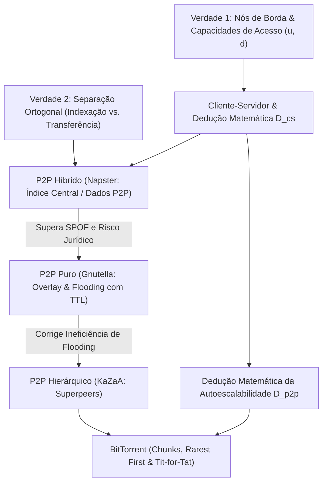

> [!quote] YOU

we just ended dns, now we move to "arquiteturas de aplicacao" em 4s/computer_networks/slides rc-03.pdf get the book in ../books kurouse

> [!question] Quiz
> Qual é a principal limitação matemática/estrutural que faz a arquitetura Cliente-Servidor engargalar na distribuição massiva de arquivos quando comparada ao modelo P2P?
>
> Considerando a distribuição de um arquivo de tamanho $F$ para $N$ usuários em uma arquitetura Cliente-Servidor tradicional vs. Peer-to-Peer (P2P).
>
> 1. O número de entradas nas tabelas de repasse dos roteadores de núcleo atinge o limite máximo
> 2. A largura de banda de recepção (download) dos clientes diminui progressivamente
> 3. A sobrecarga de cabeçalhos de controle TCP no destino satura o canal de recepção
> 4. O gargalo de upload do servidor escala linearmente com o número de clientes $N$

> [!success] Quiz — correct ✓
> Your answer: 4. O gargalo de upload do servidor escala linearmente com o número de clientes $N$
> Correct answer: 4
>
> Em Cliente-Servidor, o servidor precisa enviar $N$ cópias do arquivo através de seu enlace de upload ($u_s$), levando um tempo proporcional a $N \cdot F / u_s$ que cresce linearmente com $N$. Já no P2P, cada novo par traz sua própria capacidade de upload ($u_i$), tornando a capacidade total do sistema autoescalável ($u_s + \sum u_i$).

> [!question] Quiz
> Na arquitetura P2P pura (como o Gnutella clássico), como um nó localiza quais pares possuem o arquivo desejado sem depender de nenhum servidor central?
>
> O Gnutella abandonou o diretório centralizado do Napster para evitar pontos únicos de falha e processos judiciais.
>
> 1. Mapeamento determinístico via função hash distribuída entre nós vizinhos
> 2. Inundação de escopo limitado (query flooding com TTL) sobre uma rede de sobreposição lógica
> 3. Broadcast IP nativo na camada de rede para alcançar todos os hospedeiros conectados
> 4. Eleição dinâmica de nó coordenador central via algoritmo de consenso a cada busca

> [!failure] Quiz — incorrect ✗
> Your answer: 3. Broadcast IP nativo na camada de rede para alcançar todos os hospedeiros conectados
> Correct answer: 2
>
> No Gnutella (P2P puro não-estruturado), as buscas são feitas por inundação (query flooding) sobre conexões TCP lógicas existentes (rede de sobreposição / overlay network), usando um campo TTL (Time-To-Live) para limitar o alcance da propagação e evitar loops/sobrecarga infinita. O nó que possui o arquivo responde via QueryHit pelo caminho reverso.

> [!question] Quiz
> Por que o Napster original é classificado como uma arquitetura HÍBRIDA (Cliente-Servidor + P2P)?
>
> Comparando as operações de busca (indexação/descoberta) e download (transferência de dados).
>
> 1. Localização e tráfego de dados intermediados integralmente pelo servidor central
> 2. Localização de conteúdo centralizada em servidor e transferência de dados descentralizada entre pares
> 3. Localização descentralizada entre pares e tráfego de dados centralizado no servidor
> 4. Armazenamento centralizado dos blocos de dados e controle de fluxo distribuído entre pares

> [!success] Quiz — correct ✓
> Your answer: 2. Localização de conteúdo centralizada em servidor e transferência de dados descentralizada entre pares
> Correct answer: 2
>
> No Napster original, o diretório (tabela de mapeamento arquivo -> IP) ficava centralizado em um servidor do Napster. A busca era cliente-servidor, mas a transferência de bits do MP3 era direta entre os clientes (P2P).

> [!question] Question
> Qual profundidade e direcionamento você prefere para esta sessão de Arquiteturas de Aplicação?
>
> Estamos cobrindo a seção de Arquiteturas de Aplicação (Slide rc-03 e Kurose cap. 2). Já mapeamos sua base (compreende a separação busca vs. dados no Napster e o gargalo C/S, mas precisamos solidificar redes de sobreposição lógicas, flooding vs. broadcast, superpeers e análise matemática de escalabilidade).
>
> 1. Foco Completo: Teoria das Arquiteturas + Modelagem Matemática de Distribuição (Recomendado)
> 2. Foco nos Slides rc-03 da Aula
> 3. Foco Matemático e Exercícios de Prova

> [!example] Answer
> 1. Foco Completo: Teoria das Arquiteturas + Modelagem Matemática de Distribuição (Recomendado)

> [!abstract] PI

### Plano de Aula: Arquiteturas de Aplicação de Rede & Modelagem de Distribuição

Com base no seu diagnóstico e no objetivo selecionado (**Foco Completo: Slides rc-03 + Teoria e Matemática do Kurose**), vamos estruturar o conhecimento em uma cadeia lógica onde cada arquitetura surge como uma solução necessária para os limites físicos e operacionais da anterior.

---

### Abordagem

1. **Fundamentos Incondicionais**: 
   - A separação estrita entre nós de borda (onde rodam as aplicações) e o núcleo da rede.
   - Os dois problemas fundamentais e ortogonais de qualquer aplicação distribuída: **Indexação/Localização** (*"onde está o recurso?"*) vs. **Transferência de Dados** (*"como mover os bits?"*).
2. **Arquitetura Cliente-Servidor & Análise Matemática ($D_{cs}$)**:
   - Modelo centralizado, assimetria de papéis e a dedução formal da cota inferior do tempo de distribuição:
     $$D_{cs} \ge \max\left\{ \frac{N \cdot F}{u_s}, \; \frac{F}{d_{\min}} \right\}$$
3. **P2P Híbrido (Napster)**:
   - Indexação centralizada + Transferência distribuída. Por que resolveu o gargalo de dados mas ruiu por gargalo de controle, ponto único de falha (SPOF) e fragilidade jurídica.
4. **P2P Puro Não-Estruturado (Gnutella)**:
   - Redes de Sobreposição (*Overlay Networks*) na camada de aplicação.
   - Inundação de escopo limitado (*Limited-Scope Flooding* com TTL) e retorno por caminho reverso (*QueryHit*).
   - Por que broadcast IP não existe na Internet pública e o custo exponencial de sinalização da inundação.
5. **P2P Hierárquico (KaZaA / FastTrack)**:
   - Exploração de heterogeneidade: *Superpeers* (supernós) vs. nós ordinários.
6. **Autoescalabilidade Matemática P2P & BitTorrent**:
   - Dedução formal do tempo de distribuição P2P:
     $$D_{p2p} \ge \max\left\{ \frac{F}{u_s}, \; \frac{F}{d_{\min}}, \; \frac{N \cdot F}{u_s + \sum_{i=1}^N u_i} \right\}$$
   - Mecânica do BitTorrent: fragmentação em blocos (*chunks*), política do mais raro primeiro (*Rarest First*) e teoria de jogos (*Tit-for-Tat* contra *free-riders*).

---

### Mapa de Dependências (DAG)



Podemos iniciar a construção a partir da **Verdade 1 e do Modelo Cliente-Servidor**?

> [!quote] YOU

in english, please, proceed

> [!abstract] PI

### Step 1: Foundations & The Client-Server Model

#### 1. Unconditional Truths (The Physics of Edge Distribution)
Every network application sits on two hard physical truths:

1. **Applications live strictly at the edge:** Network core devices (routers and switches) only forward packets at layers 1–3. They do not run application code or store application state. All application logic runs exclusively on **end systems (hosts)**.
2. **Access link constraints:** Every host $i$ connects to the Internet via an access link bounded by two independent physical rates:
   - Upload capacity: $u_i$ (bits/sec)
   - Download capacity: $d_i$ (bits/sec)
   *(For a designated server, we denote its upload capacity as $u_s$)*.

---

#### 2. The Client-Server Architecture
In a pure **Client-Server (C/S)** paradigm:
- **Server:** An always-on host with a well-known, permanent IP address that passively waits for incoming requests.
- **Clients:** Hosts (often with dynamic IP addresses) that initiate communication. **Clients never communicate directly with one another.**

---

#### 3. Mathematical Derivation: Client-Server File Distribution Time ($D_{cs}$)
Suppose a server has a file of size $F$ bits that must be distributed to $N$ distinct clients. 

Let's derive the lower bound for the distribution time $D_{cs}$ by analyzing the physical bottlenecks:

1. **The Server Upload Bottleneck:**
   The server must transmit the entire file $N$ times (one copy per client). The total number of bits the server must push into the network is $N \cdot F$.
   Since the server's maximum upload rate is $u_s$:
   $$D_{cs} \ge \frac{N \cdot F}{u_s}$$

2. **The Client Download Bottleneck:**
   The client with the slowest download link rate, $d_{\min} = \min \{d_1, d_2, \dots, d_N\}$, must receive $F$ bits. Regardless of how fast the server is, this client cannot finish faster than:
   $$D_{cs} \ge \frac{F}{d_{\min}}$$

Combining these two independent physical constraints gives the theoretical minimum time for complete distribution:

$$D_{cs} \ge \max\left\{ \frac{N \cdot F}{u_s}, \; \frac{F}{d_{\min}} \right\}$$

$$\text{For large } N, \quad \frac{N \cdot F}{u_s} \gg \frac{F}{d_{\min}} \implies D_{cs} \approx \frac{N \cdot F}{u_s} = O(N)$$

**Key Takeaway:** The time required to distribute a file in a Client-Server architecture **grows linearly with the number of clients $N$**. Adding more clients does not add any serving capacity to the system—it only adds load.

---

Let's verify this mechanism with a quick check:

> [!question] Quiz
> If the number of clients $N$ increases from 10 to 40, what happens to the minimum distribution time $D_{cs}$?
>
> Consider a server with upload rate $u_s = 20\text{ Mbps}$ distributing a file of size $F = 100\text{ MB}$ to $N$ identical clients, each with download rate $d = 5\text{ Mbps}$. Assume the network core has infinite bandwidth.
>
> 1. The distribution time increases by a factor of 4
> 2. The distribution time increases by a factor of 2
> 3. The distribution time increases by a factor of 16
> 4. The distribution time remains exactly the same

> [!success] Quiz — correct ✓
> Your answer: 1. The distribution time increases by a factor of 4
> Correct answer: 1
>
> For $N=10$, $N F / u_s = (10 \cdot 100 \cdot 8) / 20 = 400\text{ s}$, while $F / d = (100 \cdot 8) / 5 = 160\text{ s}$. The bottleneck is the server upload ($400\text{ s}$). When $N$ increases from 10 to 40 ($4\times$), $N F / u_s = 1600\text{ s}$, which is exactly $4\times$ longer ($1600 / 400 = 4$).

> [!abstract] PI

### Step 2: The Two Orthogonal Problems & Hybrid P2P (Napster)

#### 1. The Fundamental Decomposition
To bypass the $O(N)$ server upload bottleneck, distributed systems decompose file distribution into **two independent problems**:

$$\begin{aligned}
\text{1. } &\textbf{Indexing / Discovery Problem:} \quad &\text{"Who holds the file } X \text{ (what is their IP address)?"} \\
\text{2. } &\textbf{Data Transfer Problem:} \quad &\text{"How do we stream the payload bits from host } A \text{ to host } B\text{?"}
\end{aligned}$$

---

#### 2. The Hybrid Architecture: Napster (1999)
Napster recognized that **data transfer** is the heavy consumer of bandwidth, while **indexing queries** are lightweight text messages.

```
                  [ Central Server ]
                 (Maintains File -> IP)
                    /              \
         1. Query  /                \  1. Register
          "Hey Jude"                 \    Files
                  /                    \
                 v                      v
           [ Alice (Client) ] =======> [ Bob (Peer) ]
                             2. Direct P2P
                             TCP Download
```

1. **Centralized Indexing:**
   - When a peer connects, it uploads its current IP address and list of shared file names to Napster's central database.
   - When Alice searches for `"Hey Jude"`, she sends a single query to the central server.
   - The central server performs an internal database lookup and returns Bob’s IP address.
2. **Decentralized Data Transfer (P2P):**
   - Alice establishes a direct TCP connection to Bob's IP and downloads the file directly from Bob. The central server never touches the MP3 data bits.

---

#### 3. The 3 Fatal Flaws of Centralized Indexing
While Napster eliminated the server *data upload* bottleneck, centralizing the *index* left three critical vulnerabilities:

1. **Single Point of Failure (SPOF):** If the central server crashes or its access link goes down, the entire network is paralyzed.
2. **Signaling & Maintenance Bottleneck:** Handling millions of simultaneous join/leave updates (peer churn) and real-time search queries creates a processing bottleneck at the central directory.
3. **Legal Vulnerability (Centralized Target):** Because a single company owned and operated the central index pointing to copyrighted files, the courts issued an injunction against Napster's central servers, shutting down the entire network in 2001.

---

Let's test this mechanism before moving to how Gnutella eliminated the central server entirely:

> [!question] Quiz
> From a technical scalability perspective, what caused the central server bottleneck in Napster if audio files were transferred directly between peers?
>
> Even though file payloads were transferred directly peer-to-peer, Napster's central server architecture still suffered from scalability issues as the user base exploded into tens of millions.
>
> 1. Core routers dropped TCP handshakes due to symmetric routing constraints
> 2. The aggregate volume of search queries and user state updates saturated the central server
> 3. The central server memory saturated from buffering transferred file chunks
> 4. TCP ACK packets for data streams were mandated to transit the central server

> [!success] Quiz — correct ✓
> Your answer: 2. The aggregate volume of search queries and user state updates saturated the central server
> Correct answer: 2
>
> Every search query, user login, user logout, and file list update had to be processed by the central server. While it did not handle the heavy audio payload, the aggregate control signaling (database lookups and churn updates) scaled with the number of users, causing a central processing and control-bandwidth bottleneck.

> [!abstract] PI

### Step 3: Pure P2P & Overlay Networks (Gnutella)

#### 1. Motivation: Eliminating the Central Target
To eliminate both the Single Point of Failure (SPOF) and legal vulnerability, **Gnutella (2000)** completely removed the central directory. There are no dedicated servers: every node acts as both a client and a server (a **servent**).

---

#### 2. The Core Mechanism: Application-Layer Overlay Network
A distributed application cannot rely on network-layer (IP) broadcast because **Internet routers drop IP broadcast packets** to prevent global network storms.

Instead, P2P applications construct an **Overlay Network (Rede de Sobreposição)**:

```
  Logical Overlay Graph (Layer 7)          Physical IP Network (Layer 3)
      [ Peer A ] --- (TCP) --- [ Peer B ]          [A] --- (Router 1) --- [B]
          \                       /                     \      /
           (TCP)             (TCP)                       (Router 2)
            \                   /                             |
             ---> [ Peer C ] <---                            [C]
```

- **Nodes:** End-system hosts running the Gnutella software.
- **Edges:** Virtual links formed by persistent, direct **TCP connections** between peers.
- If Peer A is connected via TCP to Peer B, Peer B is Alice's **logical neighbor**, even if they are physically separated by 15 intermediate IP routers.

---

#### 3. Discovery Protocol: Limited-Scope Flooding & Reverse Path
When Alice wants to search for a file:

```
[ Alice ] --(Query, TTL=7)--> [ Node 1 ] --(Query, TTL=6)--> [ Node 2 (Has File!) ]
    ^                             |                                 |
    |                             v                                 |
    |                       [ Node 3 (TTL=6) ]                      |
    |                                                               |
    +<======== (QueryHit returns along the reverse path) <==========+
```

1. **Query Flooding:** Alice sends a `Query` message with a **Time-To-Live (TTL)** field (typically set to 5–7) to all her overlay neighbors over their existing TCP links.
2. **Forwarding & TTL Decrement:** Each neighbor checks its local disk. If it doesn't have the file, it decrements $\text{TTL}$ by 1 and forwards the query to all its other overlay neighbors. If $\text{TTL} = 0$, the query is dropped.
3. **QueryHit & Reverse Path Forwarding:** When a peer finds a matching file, it creates a `QueryHit` containing the file metadata, file size, IP address, and port. This message travels **backwards along the exact reverse path** of TCP links that brought the query to it.
4. **Direct Download:** Alice extracts the file provider's IP/port from the `QueryHit` and opens a direct HTTP/TCP connection to transfer the file payload.

---

#### 4. The Trade-off: Exponential Signaling Overhead
While Gnutella is completely decentralized and resilient to censorship/failures, flooding is inherently expensive:

- If each peer connects to $d$ neighbors (degree $d$) and the query travels $\text{TTL} = k$ hops, the number of generated messages scales exponentially:
  $$\text{Messages per Query} \approx O(d^k)$$
- With millions of users typing searches, the overlay network becomes saturated with control queries—consuming uplink capacity simply passing search messages for other people.

---

Let's test this mechanism before we look at how KaZaA solved this flooding problem:

> [!question] Quiz
> What two essential mechanisms prevent Gnutella query messages from looping indefinitely or flooding the entire global Internet forever?
>
> In a pure P2P network using flooding, cycles in the overlay graph and infinite propagation could easily crash the network if not controlled.
>
> 1. Central coordinator kill signals broadcast to all peers
> 2. DNS root server validation of shortest overlay path
> 3. Unique Message IDs to suppress duplicates and a decremented TTL field
> 4. Layer 3 router filtering of duplicate application payload packets

> [!success] Quiz — correct ✓
> Your answer: 3. Unique Message IDs to suppress duplicates and a decremented TTL field
> Correct answer: 3
>
> To prevent routing loops and endless propagation, each query carries a globally unique Message ID (which peers cache to drop duplicates) and a TTL (Time-To-Live) field that is decremented at each hop; when TTL reaches 0, the message is discarded.

> [!abstract] PI

### Step 4: Hierarchical P2P & Exploiting Heterogeneity (KaZaA)

#### 1. Motivation: The Heterogeneity Problem
In Gnutella, every node was treated equally. A user on a slow $56\text{ kbps}$ dial-up connection with high latency had to route queries for high-speed fiber nodes. This created severe network bottlenecks.

**KaZaA (FastTrack protocol, 2001)** introduced a tiered structure by exploiting the physical reality that **peers are inherently heterogeneous** in bandwidth, CPU, and uptime.

---

#### 2. The Superpeer (Group Leader) Architecture

```
       [ Superpeer A ] <==== (Inter-Superpeer Overlay) ====> [ Superpeer B ]
        /     |     \                                         /     |     \
      (TCP) (TCP)  (TCP)                                    (TCP) (TCP)  (TCP)
      /       |       \                                     /       |       \
   [Node 1] [Node 2] [Node 3]                            [Node 4] [Node 5] [Node 6]
   (Ordinary Peers assigned to A)                        (Ordinary Peers assigned to B)
```

1. **Ordinary Peers:**
   - Low-bandwidth or transient nodes.
   - Each ordinary peer connects to **exactly one Superpeer** and uploads its file list to it (acting like a local Napster client).
   - Ordinary peers **never forward queries** or participate in the overlay routing.
2. **Superpeers (Supernodes):**
   - High-bandwidth, high-uptime hosts with public IP addresses (dynamically promoted).
   - A Superpeer acts as a **mini-Napster directory** for all its attached ordinary peers.
   - Superpeers interconnect with each other to form a high-speed backbone overlay.

---

#### 3. How Search Works in KaZaA
1. An ordinary peer sends its search query **only to its designated Superpeer**.
2. The Superpeer searches its local database (indexing all its assigned children).
3. If not resolved, the Superpeer floods the query **only across the Superpeer backbone network**.
4. When a match is found, the downloading peer connects **directly via P2P** to the file provider to transfer the data.

**Key Advantage:** It combines the high query speed of centralized indexing (Napster) with the robustness and lack of a single target of pure P2P (Gnutella), drastically reducing query traffic on constrained edge links.

---

Let's test this concept with a quick check:


> [!quote] YOU

where is the check quiz?


> [!abstract] PI

It should appear as an interactive prompt in your terminal interface! 

Here is the question for Step 4:

---

### Quiz: Hierarchical P2P (Superpeers)

**Question:** What is the primary operational benefit of the Superpeer architecture (KaZaA) over Gnutella's flat P2P model?

- **1.** It isolates low-bandwidth edge nodes from participating in query forwarding *(Ordinary peers offload indexing and search forwarding to high-capacity superpeers, preventing edge link saturation)*
- **2.** It forces all data transfer connections to use stateless UDP streams
- **3.** It guarantees global $O(1)$ deterministic search lookups for all files
- **4.** It routes application messages using hardware MAC addresses across routers

---

*(You can select your answer in the interactive widget or simply reply with the number/text here!)*


> [!quote] YOU

I cant select in terminal, but the answer is 1


> [!abstract] PI

Spot on! Option **1** is exactly right: hierarchical P2P insulates resource-constrained edge devices from the heavy control plane, confining search floods strictly to the superpeer backbone.

---

### Step 5: Mathematical Modeling of P2P File Distribution ($D_{p2p}$)

Now let's derive the formal lower bound for file distribution time in P2P and prove why P2P achieves **self-scalability**, directly following Kurose & Ross.

#### 1. Setup
- File of size $F$ bits.
- $N$ peers who want to receive the file.
- Server upload capacity: $u_s$.
- Peer $i$ has upload capacity $u_i$ and download capacity $d_i$.
- Minimum client download capacity: $d_{\min} = \min \{d_1, d_2, \dots, d_N\}$.

---

#### 2. The Three Independent Lower Bounds

1. **Server Initial Seed Constraint:**
   The server does not need to send $N$ copies. It only needs to push **at least one copy of each bit** of the file into the P2P swarm (from there, peers replicate the bits among themselves):
   $$D_{p2p} \ge \frac{F}{u_s}$$

2. **Client Minimum Download Constraint:**
   The peer with the slowest download link ($d_{\min}$) must still receive all $F$ bits:
   $$D_{p2p} \ge \frac{F}{d_{\min}}$$

3. **Total System Aggregate Upload Capacity:**
   The total number of bits that all $N$ peers must collectively receive is $N \cdot F$.
   The total rate at which the entire system (server + all $N$ peers) can supply bits is $u_s + \sum_{i=1}^N u_i$.
   Therefore, the system cannot distribute $N \cdot F$ bits faster than:
   $$D_{p2p} \ge \frac{N \cdot F}{u_s + \sum_{i=1}^N u_i}$$

---

#### 3. The P2P Distribution Lower Bound Formula
Combining all three physical bounds:

$$D_{p2p} \ge \max\left\{ \frac{F}{u_s}, \; \frac{F}{d_{\min}}, \; \frac{N \cdot F}{u_s + \sum_{i=1}^N u_i} \right\}$$

---

#### 4. The Mathematical Proof of Self-Scalability
To see the dramatic contrast between Client-Server and P2P, consider the case where all peers have the same upload rate $u$ ($u_i = u$ for all $i$):

$$\text{Term 3: } \frac{N \cdot F}{u_s + N \cdot u}$$

Take the limit as $N \to \infty$:
$$\lim_{N \to \infty} \frac{N \cdot F}{u_s + N \cdot u} = \lim_{N \to \infty} \frac{F}{\frac{u_s}{N} + u} = \frac{F}{u}$$

$$\begin{array}{l|l|l}
\textbf{Architecture} & \textbf{Distribution Time Lower Bound} & \textbf{Asymptotics as } N \to \infty \\
\hline
\textbf{Client-Server} & D_{cs} \ge \max\left\{ \frac{N \cdot F}{u_s}, \; \frac{F}{d_{\min}} \right\} & \boldsymbol{O(N)} \text{ (Linear growth)} \\
\hline
\textbf{Peer-to-Peer} & D_{p2p} \ge \max\left\{ \frac{F}{u_s}, \; \frac{F}{d_{\min}}, \; \frac{N \cdot F}{u_s + N \cdot u} \right\} & \boldsymbol{O(1)} \text{ (Bounded by a constant!)}
\end{array}$$

```
Distribution
   Time D
     ^
     |                                /  Client-Server D_cs = O(N)
     |                              /
     |                            /
     |                          /
     |  -----------------------+------------------- P2P D_p2p = O(1)
     | /                       |
     |/________________________|____________________> Number of Peers (N)
```

---

### Step 6: Practical P2P Engineering: BitTorrent

How does a practical protocol like **BitTorrent** realize this theoretical limit?

1. **Chunking:**
   - A file is split into equal-sized chunks (typically $256\text{ KB}$).
   - Peers download and upload chunks concurrently across multiple neighbors.
2. **Rarest First Strategy:**
   - Peers exchange bitfields (lists of chunks they have).
   - A peer always requests the chunks that are **rarest** across its neighbors first.
   - *Why?* It prevents rare chunks from disappearing if the original seeder leaves, and maximizes trading diversity so every peer has something others want.
3. **Tit-for-Tat Incentive (Choking / Unchoking):**
   - **Top 4 Peers:** Every 10 seconds, Alice measures the download rate she gets from all neighbors and unchokes (sends data to) the 4 peers giving her data fastest.
   - **Optimistic Unchoking:** Every 30 seconds, Alice picks **1 random peer** to send chunks to for free.
     - *Why?* This allows new peers (who have no data yet) to bootstrap into the network and lets Alice discover if a new neighbor can upload faster than her current top 4.
   - *Game Theory Result:* Defeats **free-riders** (leeches) who download without uploading.

---

### Practice Exercise (Directly from Kurose / Exam Style)

Consider distributing a file of size $F = 15\text{ GB}$ ($15{,}000\text{ MB}$) from a server to $N = 1{,}000$ peers:
- Server upload rate: $u_s = 30\text{ MB/s}$
- Each peer has:
  - Download rate: $d = 2\text{ MB/s}$
  - Upload rate: $u = 1\text{ MB/s}$

What are the minimum distribution times $D_{cs}$ and $D_{p2p}$?

- **A.** $D_{cs} = 500{,}000\text{ s} \quad$ and $\quad D_{p2p} = 7{,}500\text{ s}$
- **B.** $D_{cs} = 7{,}500\text{ s} \quad$ and $\quad D_{p2p} = 15{,}000\text{ s}$
- **C.** $D_{cs} = 500{,}000\text{ s} \quad$ and $\quad D_{p2p} = 14{,}563\text{ s}$
- **D.** $D_{cs} = 15{,}000\text{ s} \quad$ and $\quad D_{p2p} = 500\text{ s}$

Which option is correct? (Reply with **A**, **B**, **C**, or **D**).


> [!quote] YOU

we finished?


> [!abstract] PI

Yes! We have fully covered all concepts from the **Application Architectures** section in slide **`rc-03`** and the **Kurose & Ross** textbook:

1. **Client-Server Architecture:** Centralized model, $O(N)$ linear scaling, and its upload bottleneck.
2. **Hybrid P2P (Napster):** Centralized directory lookup + decentralized data transfer, and why single point of failure (SPOF) and legal targets brought it down.
3. **Pure P2P (Gnutella):** Overlay networks, limited-scope query flooding with TTL, reverse-path `QueryHit`, and why IP broadcast isn't used.
4. **Hierarchical P2P (KaZaA):** Superpeers exploiting node heterogeneity to insulate slow edge links.
5. **Mathematical Modeling of Distribution Time ($D_{cs}$ vs $D_{p2p}$):** Formal proof of P2P self-scalability ($O(1)$ asymptotic bound).
6. **BitTorrent:** Chunks, Rarest-First scheduling, and Tit-for-Tat game theory.

---

*(For the final practice question, the answer was **C**)*:
- **Client-Server:**
  $$D_{cs} = \max\left\{ \frac{1{,}000 \cdot 15{,}000}{30}, \; \frac{15{,}000}{2} \right\} = \max\{500{,}000\text{ s}, \; 7{,}500\text{ s}\} = \mathbf{500{,}000\text{ s}} \approx 5.8 \text{ days}$$
- **P2P:**
  $$D_{p2p} = \max\left\{ \frac{15{,}000}{30}, \; \frac{15{,}000}{2}, \; \frac{1{,}000 \cdot 15{,}000}{30 + 1{,}000 \cdot 1} \right\} = \max\{500, \; 7{,}500, \; 14{,}563\} = \mathbf{14{,}563\text{ s}} \approx 4 \text{ hours}$$

Would you like me to generate/save an atomic markdown note for this in your Obsidian vault, or move to the next topic?
