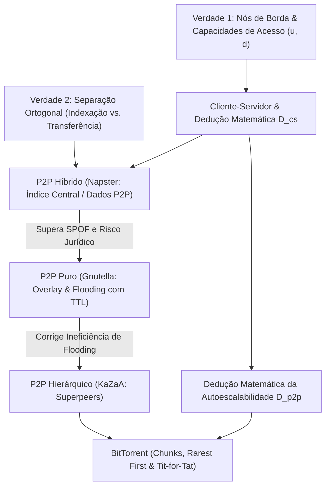

> [!quote] YOU

we just ended dns, now we move to "arquiteturas de aplicacao" em 4s/computer_networks/slides rc-03.pdf get the book in ../books kurouse

> [!question] Quiz
> Qual é a principal limitação matemática/estrutural que faz a arquitetura Cliente-Servidor engargalar na distribuição massiva de arquivos quando comparada ao modelo P2P?
>
> Considerando a distribuição de um arquivo de tamanho $F$ para $N$ usuários em uma arquitetura Cliente-Servidor tradicional vs. Peer-to-Peer (P2P).
>
> 1. O número de entradas nas tabelas de repasse dos roteadores de núcleo atinge o limite máximo
> 2. A largura de banda de recepção (download) dos clientes diminui progressivamente
> 3. A sobrecarga de cabeçalhos de controle TCP no destino satura o canal de recepção
> 4. O gargalo de upload do servidor escala linearmente com o número de clientes $N$

> [!success] Quiz — correct ✓
> Your answer: 4. O gargalo de upload do servidor escala linearmente com o número de clientes $N$
> Correct answer: 4
>
> Em Cliente-Servidor, o servidor precisa enviar $N$ cópias do arquivo através de seu enlace de upload ($u_s$), levando um tempo proporcional a $N \cdot F / u_s$ que cresce linearmente com $N$. Já no P2P, cada novo par traz sua própria capacidade de upload ($u_i$), tornando a capacidade total do sistema autoescalável ($u_s + \sum u_i$).

> [!question] Quiz
> Na arquitetura P2P pura (como o Gnutella clássico), como um nó localiza quais pares possuem o arquivo desejado sem depender de nenhum servidor central?
>
> O Gnutella abandonou o diretório centralizado do Napster para evitar pontos únicos de falha e processos judiciais.
>
> 1. Mapeamento determinístico via função hash distribuída entre nós vizinhos
> 2. Inundação de escopo limitado (query flooding com TTL) sobre uma rede de sobreposição lógica
> 3. Broadcast IP nativo na camada de rede para alcançar todos os hospedeiros conectados
> 4. Eleição dinâmica de nó coordenador central via algoritmo de consenso a cada busca

> [!failure] Quiz — incorrect ✗
> Your answer: 3. Broadcast IP nativo na camada de rede para alcançar todos os hospedeiros conectados
> Correct answer: 2
>
> No Gnutella (P2P puro não-estruturado), as buscas são feitas por inundação (query flooding) sobre conexões TCP lógicas existentes (rede de sobreposição / overlay network), usando um campo TTL (Time-To-Live) para limitar o alcance da propagação e evitar loops/sobrecarga infinita. O nó que possui o arquivo responde via QueryHit pelo caminho reverso.

> [!question] Quiz
> Por que o Napster original é classificado como uma arquitetura HÍBRIDA (Cliente-Servidor + P2P)?
>
> Comparando as operações de busca (indexação/descoberta) e download (transferência de dados).
>
> 1. Localização e tráfego de dados intermediados integralmente pelo servidor central
> 2. Localização de conteúdo centralizada em servidor e transferência de dados descentralizada entre pares
> 3. Localização descentralizada entre pares e tráfego de dados centralizado no servidor
> 4. Armazenamento centralizado dos blocos de dados e controle de fluxo distribuído entre pares

> [!success] Quiz — correct ✓
> Your answer: 2. Localização de conteúdo centralizada em servidor e transferência de dados descentralizada entre pares
> Correct answer: 2
>
> No Napster original, o diretório (tabela de mapeamento arquivo -> IP) ficava centralizado em um servidor do Napster. A busca era cliente-servidor, mas a transferência de bits do MP3 era direta entre os clientes (P2P).

> [!question] Question
> Qual profundidade e direcionamento você prefere para esta sessão de Arquiteturas de Aplicação?
>
> Estamos cobrindo a seção de Arquiteturas de Aplicação (Slide rc-03 e Kurose cap. 2). Já mapeamos sua base (compreende a separação busca vs. dados no Napster e o gargalo C/S, mas precisamos solidificar redes de sobreposição lógicas, flooding vs. broadcast, superpeers e análise matemática de escalabilidade).
>
> 1. Foco Completo: Teoria das Arquiteturas + Modelagem Matemática de Distribuição (Recomendado)
> 2. Foco nos Slides rc-03 da Aula
> 3. Foco Matemático e Exercícios de Prova

> [!example] Answer
> 1. Foco Completo: Teoria das Arquiteturas + Modelagem Matemática de Distribuição (Recomendado)

> [!abstract] PI

### Plano de Aula: Arquiteturas de Aplicação de Rede & Modelagem de Distribuição

Com base no seu diagnóstico e no objetivo selecionado (**Foco Completo: Slides rc-03 + Teoria e Matemática do Kurose**), vamos estruturar o conhecimento em uma cadeia lógica onde cada arquitetura surge como uma solução necessária para os limites físicos e operacionais da anterior.

---

### Abordagem

1. **Fundamentos Incondicionais**: 
   - A separação estrita entre nós de borda (onde rodam as aplicações) e o núcleo da rede.
   - Os dois problemas fundamentais e ortogonais de qualquer aplicação distribuída: **Indexação/Localização** (*"onde está o recurso?"*) vs. **Transferência de Dados** (*"como mover os bits?"*).
2. **Arquitetura Cliente-Servidor & Análise Matemática ($D_{cs}$)**:
   - Modelo centralizado, assimetria de papéis e a dedução formal da cota inferior do tempo de distribuição:
     $$D_{cs} \ge \max\left\{ \frac{N \cdot F}{u_s}, \; \frac{F}{d_{\min}} \right\}$$
3. **P2P Híbrido (Napster)**:
   - Indexação centralizada + Transferência distribuída. Por que resolveu o gargalo de dados mas ruiu por gargalo de controle, ponto único de falha (SPOF) e fragilidade jurídica.
4. **P2P Puro Não-Estruturado (Gnutella)**:
   - Redes de Sobreposição (*Overlay Networks*) na camada de aplicação.
   - Inundação de escopo limitado (*Limited-Scope Flooding* com TTL) e retorno por caminho reverso (*QueryHit*).
   - Por que broadcast IP não existe na Internet pública e o custo exponencial de sinalização da inundação.
5. **P2P Hierárquico (KaZaA / FastTrack)**:
   - Exploração de heterogeneidade: *Superpeers* (supernós) vs. nós ordinários.
6. **Autoescalabilidade Matemática P2P & BitTorrent**:
   - Dedução formal do tempo de distribuição P2P:
     $$D_{p2p} \ge \max\left\{ \frac{F}{u_s}, \; \frac{F}{d_{\min}}, \; \frac{N \cdot F}{u_s + \sum_{i=1}^N u_i} \right\}$$
   - Mecânica do BitTorrent: fragmentação em blocos (*chunks*), política do mais raro primeiro (*Rarest First*) e teoria de jogos (*Tit-for-Tat* contra *free-riders*).

---

### Mapa de Dependências (DAG)

Podemos iniciar a construção a partir da **Verdade 1 e do Modelo Cliente-Servidor**?

> [!quote] YOU

in english, please, proceed

> [!abstract] PI

### Step 1: Foundations & The Client-Server Model

#### 1. Unconditional Truths (The Physics of Edge Distribution)
Every network application sits on two hard physical truths:

1. **Applications live strictly at the edge:** Network core devices (routers and switches) only forward packets at layers 1–3. They do not run application code or store application state. All application logic runs exclusively on **end systems (hosts)**.
2. **Access link constraints:** Every host $i$ connects to the Internet via an access link bounded by two independent physical rates:
   - Upload capacity: $u_i$ (bits/sec)
   - Download capacity: $d_i$ (bits/sec)
   *(For a designated server, we denote its upload capacity as $u_s$)*.

---

#### 2. The Client-Server Architecture
In a pure **Client-Server (C/S)** paradigm:
- **Server:** An always-on host with a well-known, permanent IP address that passively waits for incoming requests.
- **Clients:** Hosts (often with dynamic IP addresses) that initiate communication. **Clients never communicate directly with one another.**

---

#### 3. Mathematical Derivation: Client-Server File Distribution Time ($D_{cs}$)
Suppose a server has a file of size $F$ bits that must be distributed to $N$ distinct clients. 

Let's derive the lower bound for the distribution time $D_{cs}$ by analyzing the physical bottlenecks:

1. **The Server Upload Bottleneck:**
   The server must transmit the entire file $N$ times (one copy per client). The total number of bits the server must push into the network is $N \cdot F$.
   Since the server's maximum upload rate is $u_s$:
   $$D_{cs} \ge \frac{N \cdot F}{u_s}$$

2. **The Client Download Bottleneck:**
   The client with the slowest download link rate, $d_{\min} = \min \{d_1, d_2, \dots, d_N\}$, must receive $F$ bits. Regardless of how fast the server is, this client cannot finish faster than:
   $$D_{cs} \ge \frac{F}{d_{\min}}$$

Combining these two independent physical constraints gives the theoretical minimum time for complete distribution:

$$D_{cs} \ge \max\left\{ \frac{N \cdot F}{u_s}, \; \frac{F}{d_{\min}} \right\}$$

$$\text{For large } N, \quad \frac{N \cdot F}{u_s} \gg \frac{F}{d_{\min}} \implies D_{cs} \approx \frac{N \cdot F}{u_s} = O(N)$$

**Key Takeaway:** The time required to distribute a file in a Client-Server architecture **grows linearly with the number of clients $N$**. Adding more clients does not add any serving capacity to the system—it only adds load.

---

Let's verify this mechanism with a quick check:

> [!question] Quiz
> If the number of clients $N$ increases from 10 to 40, what happens to the minimum distribution time $D_{cs}$?
>
> Consider a server with upload rate $u_s = 20\text{ Mbps}$ distributing a file of size $F = 100\text{ MB}$ to $N$ identical clients, each with download rate $d = 5\text{ Mbps}$. Assume the network core has infinite bandwidth.
>
> 1. The distribution time increases by a factor of 4
> 2. The distribution time increases by a factor of 2
> 3. The distribution time increases by a factor of 16
> 4. The distribution time remains exactly the same
