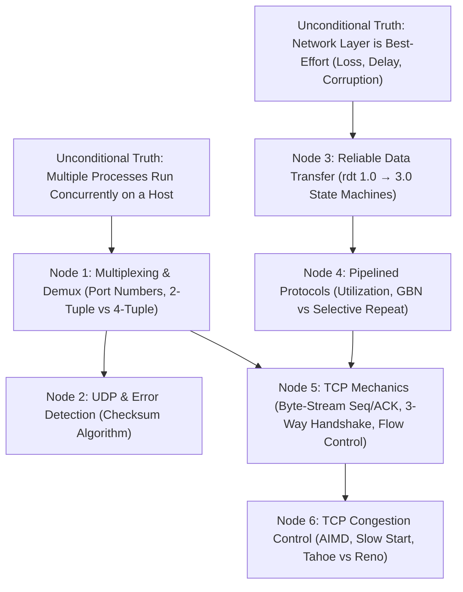

> [!quote] YOU

now can we start in transport layer? uses the 4s/computer_network/slides/rc-04-CamadaTransporte.pdf and the kurouse book in ../books

> [!question] Quiz
> What fundamental distinction defines the boundary between the Transport Layer and the Network Layer?
>
> Starting Phase 1 (Probe) to map your baseline before we plan and dive into the Transport Layer (Kurose Chapter 3 / Slide 04).
>
> 1. Transport layer provides packet routing across autonomous systems; network layer provides socket management inside hosts.
> 2. Transport layer provides logical communication between processes; network layer provides physical bit transmission across links.
> 3. Transport layer provides logical communication between processes; network layer provides logical communication between hosts.
> 4. Transport layer provides logical communication between hosts; network layer provides logical communication between routers.

> [!success] Quiz — correct ✓
> Your answer: 3. Transport layer provides logical communication between processes; network layer provides logical communication between hosts.
> Correct answer: 3
>
> The transport layer provides logical communication between application processes running on different hosts, whereas the network layer provides logical communication between the hosts themselves.

> [!question] Quiz
> Which fields does a host use to demultiplex an incoming TCP segment to the correct socket?
>
> Probing demultiplexing mechanisms in the transport layer.
>
> 1. By using the 2-tuple: Destination Port and the connection's Sequence Number.
> 2. By using the 4-tuple: Source IP, Source Port, Destination IP, and Destination Port.
> 3. By using the 3-tuple: Source IP, Destination IP, and Destination Port.
> 4. By using the 2-tuple: Destination IP and Destination Port only.

> [!question] Quiz — I don't know
> Your answer: I don't know
> Correct answer: 2
>
> A TCP socket is uniquely identified by a 4-tuple: (Source IP address, Source port number, Destination IP address, Destination port number). When a TCP segment arrives, the OS uses all four fields to demultiplex the segment to the correct socket. (In contrast, UDP demultiplexing uses only the destination IP and destination port).

> [!question] Quiz
> What is the fundamental difference between Flow Control and Congestion Control?
>
> Probing the concepts of Flow Control vs Congestion Control.
>
> 1. Flow control adjusts the transmission window based on network loss; congestion control manages sender-to-receiver packet reordering.
> 2. Flow control prevents packet loss in intermediate routers; congestion control manages application buffer sizes at the sender.
> 3. Flow control prevents overflowing the receiver buffer; congestion control prevents overwhelming the network links and routers.
> 4. Flow control manages TCP connection handshakes; congestion control enforces reliable delivery via acknowledgments.

> [!success] Quiz — correct ✓
> Your answer: 3. Flow control prevents overflowing the receiver buffer; congestion control prevents overwhelming the network links and routers.
> Correct answer: 3
>
> Flow control is an end-to-end mechanism that prevents the sender from overflowing the specific receiver's buffer. Congestion control prevents network routers and links from being overwhelmed by traffic from all sending hosts combined.

> [!question] Quiz
> How do Go-Back-N and Selective Repeat differ when handling out-of-order packets at the receiver?
>
> Probing pipelined reliable data transfer mechanisms (GBN vs SR).
>
> 1. Go-Back-N buffers out-of-order packets; Selective Repeat requests retransmission of only the entire window.
> 2. Go-Back-N retransmits only corrupted packets; Selective Repeat retransmits all packets starting from the lost one.
> 3. Go-Back-N discards out-of-order packets; Selective Repeat buffers out-of-order packets and acknowledges each independently.
> 4. Go-Back-N uses negative acknowledgments (NAKs); Selective Repeat relies exclusively on sender timeout expirations.

> [!question] Quiz — I don't know
> Your answer: I don't know
> Correct answer: 3
>
> In Go-Back-N, the receiver discards all out-of-order packets and only sends cumulative ACKs for correctly received in-order packets. In Selective Repeat, the receiver individually acknowledges and buffers out-of-order packets until missing packets arrive to fill the gap.

> [!question] Question
> How would you like to structure our journey through the Transport Layer?
>
> We mapped your edges: strong high-level grasp of host vs. process and flow vs. congestion, with clear frontiers at socket demuxing, RDT evolution, and TCP internals.
>
> 1. Complete Systematic Walk-through (Recommended)
> 2. Focus on RDT, TCP Mechanisms & Congestion Control
> 3. Problem-Set & Exercise Driven

> [!example] Answer
> 1. Complete Systematic Walk-through (Recommended)

> [!abstract] PI

### Transport Layer Roadmap & Dependency Plan

We are going to build the Transport Layer (Kurose Chapter 3 / Slide 04) from first principles. Nothing will appear out of nowhere: every mechanism (ports, sequence numbers, checksums, sliding windows, congestion windows) will be motivated by a concrete failure mode or physical constraint of computer networks.

---

### The Approach

1. **Multiplexing & Demultiplexing**: Starting from the reality that a machine runs dozens of network processes over a single physical network interface. We will discover why port numbers exist and why UDP needs only a 2-tuple while TCP strictly requires a 4-tuple.
2. **UDP & Checksum**: The minimal transport protocol. We will analyze why applications choose "unreliable" transport and how the Internet 1's-complement checksum detects bit corruption.
3. **Principles of Reliable Data Transfer (RDT)**: We will build a reliable protocol from scratch over an unreliable network layer ($rdt 1.0 \to 2.0 \to 2.1 \to 2.2 \to 3.0$), discovering step-by-step why we need ACKs, sequence numbers, timers, and retransmissions.
4. **Pipelining (Go-Back-N vs. Selective Repeat)**: Why stop-and-wait destroys link utilization, and how sliding windows solve it through cumulative ACKs (GBN) vs. selective buffering (SR).
5. **TCP Internals**: Moving from abstract RDT to real-world TCP: byte-stream sequence numbering, 3-way handshake, connection teardown, RTT estimation, and Flow Control ($rwnd$).
6. **TCP Congestion Control**: How end systems detect and react to network bottleneck collapse using Additive-Increase Multiplicative-Decrease (AIMD), Slow Start, Fast Retransmit, and Fast Recovery (TCP Tahoe vs. Reno).

---

### The Dependency Map



---

Ready to begin with **Node 1: Multiplexing and Demultiplexing**? Give the go-ahead and we'll dive right in.

---
> [!tip] 💬 English Polish
> - **Original:** *"now can we start in transport layer? uses the 4s/computer_network/slides/rc-04-CamadaTransporte.pdf and the kurouse book in ../books"*
> - **More Natural:** *"Can we start with the transport layer now? Let's use the slides in `...` and the Kurose book in `...`."*
> - **Quick Tips:**
>   - Use **"start with [topic]"** or **"move on to [topic]"** rather than *"start in [topic]"*.
>   - In imperative suggestions, use **"Let's use..."** or the participle **"using..."** instead of *"uses..."*.
>   - Author's name is **Kurose** (James Kurose).


> [!quote] YOU

right, proceed


> [!abstract] PI

### Node 1: Multiplexing and Demultiplexing

#### 1. Motivation: The Host-to-Process Gap
The **Network Layer** (IP protocol) provides *host-to-host* communication. When an IP datagram arrives at your machine, the network layer has successfully delivered it to the correct computer using the destination **IP address**.

However, a modern operating system runs hundreds of network-aware processes simultaneously:
- A browser with tabs open to YouTube and GitHub.
- An active SSH session in your terminal.
- A background Spotify stream and a local database server.

When an IP datagram arrives carrying a chunk of bytes, the operating system faces a critical question: **Which specific process does this chunk belong to?**

---

#### 2. The Core Mechanism: Sockets and Port Numbers

Every process communicating over the network interacts through an abstraction called a **Socket** (the software door between the application layer and the transport layer).

To deliver data to the correct door, the transport layer assigns every socket an identifier called a **Port Number**:
- Port numbers are **16-bit integers**, ranging from $0$ to $65535$ ($2^{16} - 1$).
  - **Well-known ports** ($0$ to $1023$): Reserved for standard protocols (e.g., HTTP: $80$, HTTPS: $443$, SSH: $22$, DNS: $53$).
  - **Ephemeral / Dynamic ports** ($1024$ to $65535$): Automatically assigned by the OS to client applications when they initiate communication.

```
+-------------------------------------------------------------+
| SENDER (Multiplexing)                                       |
|  [App A (port 52100)]    [App B (port 52101)]               |
|            \                  /                             |
|             \                /                              |
|       Gather data + add Port Headers (Transport Layer)      |
|                      |                                      |
|             Pass to Network Layer (IP)                      |
+-------------------------------------------------------------+
                              | (Network transmission)
                              v
+-------------------------------------------------------------+
| RECEIVER (Demultiplexing)                                   |
|             Receive from Network Layer (IP)                 |
|                      |                                      |
|       Inspect Port Headers & Route to Sockets               |
|             /                \                              |
|            /                  \                             |
|  [Socket (port 52100)]   [Socket (port 52101)]              |
+-------------------------------------------------------------+
```

- **Multiplexing (at sender)**: Gathering data chunks from multiple sockets, encapsulating them with transport headers (source/dest ports), and passing the segments down to IP.
- **Demultiplexing (at receiver)**: Unpacking incoming segments, reading the header fields, and directing each segment's payload to the exact corresponding socket.

---

#### 3. Connectionless (UDP) vs. Connection-Oriented (TCP) Demultiplexing

How the OS matches an incoming segment to a socket depends strictly on the transport protocol:

##### A. UDP Demultiplexing: 2-Tuple
A UDP socket is identified by only two pieces of information:
$$\text{UDP Demux Key} = (\text{Destination IP Address},\; \text{Destination Port Number})$$

- If Host $A$ and Host $B$ both send UDP datagrams to Host $C$ on destination port $53$ (DNS), **both datagrams are delivered to the exact same UDP socket** on Host $C$, regardless of where they originated.
- The receiving application can inspect the segment's *Source IP* and *Source Port* metadata if it needs to know who sent it.

##### B. TCP Demultiplexing: 4-Tuple
A TCP socket is bound to an active, point-to-point connection identified by a full 4-tuple:
$$\text{TCP Demux Key} = (\text{Source IP},\; \text{Source Port},\; \text{Destination IP},\; \text{Destination Port})$$

- A TCP server (e.g., a Web server on port $80$) maintains a **welcoming (listening) socket**.
- When a client initiates a connection, the OS accepts it and creates a **brand-new, dedicated socket** tied uniquely to that 4-tuple.
- Even if $1000$ different clients connect to the same web server IP on port $80$, the server OS manages $1000$ distinct TCP sockets. Each segment is routed directly to the specific socket holding the state (sequence numbers, buffers, window sizes) for that client.

---

Let's verify this mechanism before moving to UDP and RDT.


> [!question] Quiz
> Host C runs a web server on port 80. Host A sends 2 simultaneous HTTP requests (using ephemeral ports 50001 and 50002) over TCP to Host C:80. Host B also sends 2 simultaneous HTTP requests (using ephemeral ports 50001 and 50002) over TCP to Host C:80. How many distinct TCP sockets exist on Host C to handle these 4 active connections?
>
> Testing TCP connection-oriented demultiplexing behavior.
>
> 1. The segments are all delivered into a single shared socket listening on port 80.
> 2. The segments are demultiplexed into 3 sockets because Host B shares a single destination port.
> 3. The segments from Host A go to one socket, and the segments from Host B go to a second socket (2 sockets total).
> 4. The segments are demultiplexed into 4 distinct sockets on Host C.


> [!warning] Quiz — cancelled
> (user skipped)


> [!question] Question
> How would you like to proceed?
>
> You cancelled the quiz. Would you like to ask a question about multiplexing/demultiplexing, re-try the question, or move directly forward?
>
> 1. Proceed to Node 2 (UDP & Checksum) (Recommended)
> 2. Explain demultiplexing further / Ask a question
> 3. Re-take the quiz question


> [!example] Answer
> Other: but do you jumps some subjects like transport layer services etc


> [!abstract] PI

### Transport-Layer Services & Overview (Kurose §3.1 / Slide 04)

You are completely right to call this out. Let's make sure Section 3.1 (**Transport-Layer Services and Guarantees**) is fully explored and grounded before we get into protocol specifics.

---

### 1. The Core Purpose: Extending Host-to-Host to Process-to-Process

The fundamental job of the transport layer is to provide **logical communication** between application processes running on different hosts:
- **Logical communication** means that from the application’s perspective, the two processes communicate as if they were directly connected by a dedicated wire, regardless of the physical distance, routers, or link types in between.
- Transport-layer protocols run **exclusively on the end systems (hosts)**, never on intermediate network routers. Routers in the network core only inspect and forward packets up to the **Network Layer (IP)**.

```
+-------------------+                                   +-------------------+
| Application Layer |                                   | Application Layer |
+-------------------+                                   +-------------------+
|  Transport Layer  | <=========== Logical ===========> |  Transport Layer  |
+-------------------+         Communication             +-------------------+
|   Network Layer   |                                   |   Network Layer   |
+-------------------+           +-----------+           +-------------------+
|  Link & Physical  | <-------> |  Routers  | <-------> |  Link & Physical  |
+-------------------+           | (L1 - L3) |           +-------------------+
     Host A                     +-----------+                Host B
```

---

### 2. The Classic Household Analogy (Kurose)

Kurose introduces a famous analogy to clearly separate the **Transport Layer** from the **Network Layer**:

Imagine two large families living in two different houses:
- **East Coast House**: 12 kids (Ann, Bob, Chris...)
- **West Coast House**: 12 cousins (Alice, Bill, Clara...)

Every week, the kids write letters to their cousins:
1. **The Application Messages**: The letters inside the envelopes.
2. **The Processes**: The individual kids writing/reading the letters.
3. **The Hosts**: The two houses.
4. **The Transport Layer Protocol (e.g., Ann & Bill)**: 
   - In the East Coast house, **Ann** collects letters from all 12 kids and takes them to the physical mailbox at the front yard.
   - When mail arrives at the front yard, **Ann** picks up the batch and hands each letter to the specific sibling it is addressed to.
   - (Bill does the exact same job in the West Coast house).
5. **The Network Layer Protocol**: The **Postal Service (mail carrier & trucks)**, which only knows how to move mail from *House A's mailbox* to *House B's mailbox*.

> **The Key Takeaway**:
> - The Postal Service (Network Layer) only delivers between **houses (hosts)**.
> - Ann and Bill (Transport Layer) deliver between **individual cousins (processes)**.
> - Even if the postal service does not guarantee letter order or might lose a letter, Ann and Bill could theoretically add numbering or re-send letters to provide a reliable service to the kids.

---

### 3. What the Transport Layer Can and Cannot Guarantee

The services a transport protocol can provide are constrained by the underlying network layer:

#### What the Transport Layer CAN do (even if IP fails to):
- **Process-level Addressing**: Using port numbers to direct data to specific sockets (Multiplexing / Demultiplexing).
- **Integrity Checking**: Detecting bit errors caused by electromagnetic interference on links (via Checksums).
- **Reliable Data Transfer**: Guaranteeing that data arrives with zero bit errors, zero loss, and in exact order (via Sequence Numbers, ACKs, Retransmissions in TCP).
- **Flow Control**: Preventing a fast sender from overwhelming a slow receiver's memory buffer.
- **Congestion Control**: Throttling traffic to prevent network-wide collapse of intermediate routers.

#### What the Internet Transport Layer CANNOT guarantee:
Because the underlying IP network is a packet-switched, best-effort network, neither TCP nor UDP can guarantee:
1. **Delay / Latency Guarantees**: Neither protocol can guarantee that a segment will arrive within $\le 50\text{ ms}$.
2. **Bandwidth / Throughput Guarantees**: Neither protocol can reserve a dedicated data rate (e.g., $10\text{ Mbps}$ guaranteed).

---

### 4. The Two Internet Transport Service Models: TCP vs. UDP

| Feature | **UDP** (User Datagram Protocol, RFC 768) | **TCP** (Transmission Control Protocol, RFC 793) |
| :--- | :--- | :--- |
| **Connection Model** | **Connectionless** (no handshake, no state) | **Connection-oriented** (3-way handshake, stateful) |
| **Reliability** | **Unreliable** (best-effort; drops, reordering, duplicates possible) | **Reliable** (in-order byte stream, guaranteed delivery) |
| **Flow & Congestion Control** | **None** (sends as fast as the app generates) | **Yes** (manages receiver buffer and network congestion) |
| **Header Overhead** | **8 bytes** (very lightweight) | **20 bytes** minimum (up to 60 bytes with options) |
| **Typical Use Cases** | DNS, VoIP, Video Streaming, Real-time gaming, DHCP | Web (HTTP/HTTPS), File Transfer (FTP), Email (SMTP), SSH |

---

Now that the conceptual foundations of Section 3.1 are solidly in place, would you like to:
1. Revisit **Multiplexing/Demultiplexing** (Section 3.2), or
2. Move straight to **UDP & Checksum calculation** (Section 3.3)?

---
> [!tip] 💡 English Polish
> - **Original:** *"but do you jumps some subjects like transport layer services etc"*
> - **More Natural:** *"Did you skip some topics, like transport layer services?"* or *"Are you jumping over some subjects, such as transport layer services?"*
> - **Quick Tips:**
>   - With auxiliary verbs (**do / did / does**), the main verb always stays in its **base form**: *"Did you jump...?"* or *"Do you jump...?"* (never *"do you jumps"*).
>   - For past actions or omissions, prefer the past tense: *"Did you skip...?"*.


> [!quote] YOU

mutiplexing/demuiplexing


> [!abstract] PI

### Section 3.2: Multiplexing and Demultiplexing in Depth

Now let's examine exactly how the operating system and transport layer execute **Multiplexing** and **Demultiplexing** at the packet and socket levels.

---

### 1. The Core Data Flow: Sender vs. Receiver

```
SENDER HOST (Multiplexing)                      RECEIVER HOST (Demultiplexing)
+-------------------------+                     +-------------------------+
| Process P1 | Process P2 |                     | Process P3 | Process P4 |
| (Socket 1) | (Socket 2) |                     | (Socket 3) | (Socket 4) |
+------------+------------+                     +------------+------------+
        \         /                                    ^         ^
         \       /                                      \       /
      +-------------+                                +-------------+
      |  Transport  |  Creates Transport Segments    |  Transport  |  Reads Headers &
      |    Layer    |  (Adds Source & Dest Ports)    |    Layer    |  Routes to Sockets
      +-------------+                                +-------------+
             |                                              ^
             v                                              |
      +-------------+                                +-------------+
      |Network (IP) |  Encapsulates in IP Datagram   |Network (IP) |  Extracts Transport
      |    Layer    |  (Adds Source & Dest IPs)      |    Layer    |  Segment
      +-------------+                                +-------------+
             |                                              ^
             +================ (Network) ===================+
```

Every transport-layer segment (both UDP and TCP) includes at least two fields dedicated to this job:
1. **Source Port Number** ($16$ bits)
2. **Destination Port Number** ($16$ bits)

---

### 2. Connectionless Demultiplexing (UDP)

In UDP, a socket is identified solely by a **2-tuple**:
$$\text{UDP Socket Key} = (\text{Destination IP Address},\; \text{Destination Port Number})$$

#### Step-by-Step Scenario:
1. A server process creates a UDP socket and binds it to port $6428$:
   ```python
   server_socket = socket(AF_INET, SOCK_DGRAM)
   server_socket.bind(('', 6428))
   ```
2. **Host A** (IP: `198.51.100.1`) sends a UDP packet from ephemeral port `9157` to Destination IP `203.0.113.5`, Port `6428`.
3. **Host B** (IP: `198.51.100.2`) sends a UDP packet from ephemeral port `9157` to Destination IP `203.0.113.5`, Port `6428`.

```
Host A (198.51.100.1)                      Server (203.0.113.5)
[Src: 9157, Dst: 6428] ------------------> | 
                                           | ===> [Single UDP Socket on Port 6428]
Host B (198.51.100.2)                      |
[Src: 9157, Dst: 6428] ------------------> |
```

#### The Result:
- Both packets arrive at the server.
- The server OS checks the **Destination Port ($6428$)**.
- Both packets are placed into the **exact same socket buffer**.
- Why does the UDP header even include a *Source Port* then? 
  - So the server application can read the `(Source IP, Source Port)` from the incoming message envelope and use it as the destination address when sending a **reply**.

---

### 3. Connection-Oriented Demultiplexing (TCP)

In TCP, a socket is identified by a **4-tuple**:
$$\text{TCP Socket Key} = (\text{Source IP Address},\; \text{Source Port Number},\; \text{Destination IP Address},\; \text{Destination Port Number})$$

#### Why does TCP need all 4 fields, while UDP only needed 2?
Unlike UDP (which just tosses independent datagrams into a box), TCP provides an **in-order, reliable byte stream with flow control and congestion control**. 
This requires the OS to maintain a dedicated **state block (TCB - Transmission Control Block)** for every active connection:
- Sequence numbers sent and acknowledged.
- Send and receive buffer queues.
- Current Congestion Window ($cwnd$) and Receive Window ($rwnd$).
- Estimated Round-Trip Time ($RTT$) and retransmission timers.

If segments from two different clients ended up in the same socket, their byte streams, sequence numbers, and ACKs would collide and corrupt the connection state.

---

### 4. The TCP Server Lifecycle: Welcoming Socket vs. Connected Sockets

1. **Listening / Welcoming Socket**:
   The web server listens on port $80$:
   ```python
   listen_socket = socket(AF_INET, SOCK_STREAM)
   listen_socket.bind(('', 80))
   listen_socket.listen()
   ```
2. **The 3-Way Handshake**:
   When a client sends a TCP SYN packet (connection request) to port $80$, the server OS creates a **new, dedicated socket** specifically bound to that client's 4-tuple:
   ```python
   connection_socket, client_address = listen_socket.accept()
   ```
3. **Concurrent Connections**:
   - The welcoming socket continues listening on port $80$ for *new* incoming connection requests.
   - All subsequent data segments for existing connections are demultiplexed directly to their respective dedicated connection sockets.

```
Client A (198.51.100.1)                     Web Server (203.0.113.5)
Port: 50000 -----------------------------> [Socket: (198.51.100.1, 50000, 203.0.113.5, 80)]
Port: 50001 -----------------------------> [Socket: (198.51.100.1, 50001, 203.0.113.5, 80)]

Client B (198.51.100.2)
Port: 50000 -----------------------------> [Socket: (198.51.100.2, 50000, 203.0.113.5, 80)]
                                           [Welcoming Socket: (*, *, 203.0.113.5, 80)]
```

---

Let's test this mechanism with a concrete diagnostic question.


> [!question] Quiz
> Host A (IP: 10.0.0.1) and Host B (IP: 10.0.0.2) both establish active TCP connections to Server S (IP: 10.0.0.99) on destination port 80. By coincidence, both Host A and Host B choose the same ephemeral source port 55000. When Server S receives data segments from both hosts, what does its transport layer do?
>
> Testing TCP demultiplexing rules.
>
> 1. The two segments are demultiplexed to two separate, dedicated TCP sockets.
> 2. The second segment is dropped because port 55000 is already in use by Host A.
> 3. The two segments are delivered into the same TCP connection socket because the destination port and source port match.
> 4. The two segments are delivered to the welcoming listening socket on port 80.


> [!success] Quiz — correct ✓
> Your answer: 1. The two segments are demultiplexed to two separate, dedicated TCP sockets.
> Correct answer: 1
>
> Because TCP demultiplexing uses the full 4-tuple (Source IP, Source Port, Dest IP, Dest Port), the difference in Source IP (10.0.0.1 vs 10.0.0.2) means the OS kernel demultiplexes these segments to two completely separate TCP connection sockets.


> [!abstract] PI

### Node 2: Connectionless Transport — UDP (Kurose §3.3)

---

#### 1. Motivation: Why Choose an "Unreliable" Protocol?

If UDP provides no guarantee of delivery, ordering, or congestion control, why not use TCP for everything?

There are four primary reasons developers choose UDP:
1. **Finer Application-Level Control Over What Data Is Sent and When**: 
   - TCP uses congestion control; if intermediate links get congested, TCP throttles the sender and waits.
   - Real-time applications (VoIP, video calls, competitive online gaming) prefer dropping old packets rather than waiting for retransmissions or throttling. Stale real-time data is useless data.
2. **No Connection Establishment Delay**:
   - TCP requires a **3-way handshake** before sending any actual application data, adding a minimum of $1 \text{ RTT}$ (Round-Trip Time) of latency.
   - UDP sends data immediately in the very first packet (essential for fast DNS lookups).
3. **No Connection State**:
   - TCP must allocate memory for send/receive buffers, sequence/ACK numbers, and congestion parameters.
   - A server running UDP can typically support vastly more active clients because it maintains zero state per client.
4. **Small Header Overhead**:
   - A TCP header has a minimum of $20\text{ bytes}$ of overhead per segment.
   - A UDP header has only **$8\text{ bytes}$**.

---

#### 2. The UDP Segment Structure

A UDP segment header consists of only **four 16-bit fields** ($8$ bytes total):

```
 0                   15 16                  31
+----------------------+----------------------+
|  Source Port (16b)   | Destination Port(16b)|
+----------------------+----------------------+
|     Length (16b)     |    Checksum (16b)    |
+----------------------+----------------------+
|                                             |
|          Application Payload Data           |
|                                             |
+---------------------------------------------+
```

- **Length**: Total length of the UDP segment (header $+$ data) in bytes.
- **Checksum**: Used by the receiving host to determine whether bits within the segment were altered (flipped) during transmission.

---

#### 3. The Internet Checksum Algorithm

The goal of the checksum is to detect bit errors caused by electrical noise, fading wireless signals, or faulty router hardware.

##### How the Sender Computes the Checksum:
1. Treat all bytes in the segment (header $+$ payload) as a sequence of **16-bit integers**.
2. Add all 16-bit integers together using **1's complement addition**:
   - Whenever the addition produces a **carry bit** past the 16th bit (overflow), **wrap the carry bit around** and add it to the least significant bit (LSB).
3. Compute the **1's complement (bitwise inversion)** of the final sum ($0 \to 1, 1 \to 0$).
4. Insert this inverted value into the UDP Checksum field.

---

##### Concrete Calculation Example:

Suppose we want to compute the checksum for two 16-bit words:
- Word 1: `1110 0110 0100 1100`
- Word 2: `1101 0101 0101 0101`

**Step 1: Standard binary addition**
$$\begin{array}{r@{\quad}l}
  & 1110\;0110\;0100\;1100 \\
+ & 1101\;0101\;0101\;0101 \\
\hline
\mathbf{1} & 1011\;1011\;1010\;0001 \quad (\text{Carry bit: } 1)
\end{array}$$

**Step 2: Wrap around the carry bit**
$$\begin{array}{r@{\quad}l}
  & 1011\;1011\;1010\;0001 \\
+ & 0000\;0000\;0000\;0001 \\
\hline
  & 1011\;1011\;1010\;0010 \quad (\text{Sum})
\end{array}$$

**Step 3: Bitwise Inversion (1's complement)**
$$\text{Checksum} = \mathbf{0100\;0100\;0101\;1101}$$

---

##### How the Receiver Verifies Integrity:
The receiver adds **all 16-bit words together PLUS the received Checksum**:
$$\text{Word}_1 + \text{Word}_2 + \dots + \text{Checksum}$$
- If no bit errors occurred, the result will be **all 1s**: `1111 1111 1111 1111` ($0\text{xFFFF}$).
- If even a single bit in the sum is `0`, an error is detected.

---

Let's test this verification step with a quick diagnostic question.


> [!question] Quiz
> A receiver calculates the 1's complement sum of all 16-bit words of an incoming UDP segment, including the received checksum field. The result of the sum is: 1111 1110 1111 1111. What action does the receiver take?
>
> Testing checksum verification mechanics at the receiver.
>
> 1. The receiver requests an immediate retransmission from the sender.
> 2. The receiver concludes the segment is valid and delivers it to the socket.
> 3. The receiver uses the checksum to automatically correct the single inverted bit.
> 4. The receiver detects a bit error and discards or flags the segment.
