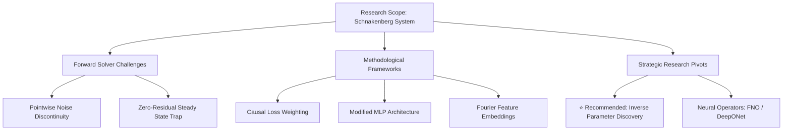

---
tags:
  - research/pinns
  - reaction-diffusion
  - schnakenberg
  - scientific-ml
  - study-notes
date: 2025-08-26
---
w
# Physics-Informed Neural Networks (PINNs) on Stiff Reaction-Diffusion Systems

## 1. Executive Summary & Research Context
Applying standard continuous Physics-Informed Neural Networks (PINNs) to the **Schnakenberg reaction-diffusion system** for forward Turing pattern simulation encounters severe optimization barriers. 

This research synthesis breaks down the mathematical root causes of failure, evaluates the causal training framework from Wang et al. (2022), and defines viable, high-impact research directions.

---

## 2. Core Failure Mechanisms on Turing Patterns

Simulating spontaneous pattern generation from random perturbations in continuous time-space violates standard neural network assumptions.

*(Deep dive note: [[research/concepts/Turing Bifurcation and PINN Failure Modes|Turing Bifurcation & Failure Modes]])*

![[research/concepts/Turing Bifurcation and PINN Failure Modes#Turing PINN Failure Takeaway]]

---

## 3. Causal PINNs Architecture & Theory

To address temporal breakdown where networks find trivial shortcuts at late times, Wang et al. (2022) proposed causal residual weighting.

*(Deep dive note: [[research/concepts/Causal PINNs and Temporal Weighting|Causal PINNs & Temporal Weighting]])*

![[research/concepts/Causal PINNs and Temporal Weighting#Causality Takeaway]]

### Key PyTorch Implementation Requirements
1. **Coordinate Normalization**: Remap $(t, x) \in [0, T] \times [0, L] \to [-1, 1]$ before passing to MLP.
2. **Stop Gradient**: Cumulative weights $w_i = \exp(-\epsilon \sum_{k<i} \mathcal{L}_k)$ must be called with `.detach()`.
3. **Modified MLP**: Dual encoder branches $(U, V)$ preserve gradient flow across stiff reaction layers.

---

## 4. Strategic Research Evaluation: Forward vs. Inverse

| Decision Dimension | Path A: Forward Pattern Solver | Path B: Inverse Parameter Discovery (Recommended) |
| :--- | :--- | :--- |
| **Objective** | Predict $u(t, x), v(t, x)$ from $t=0$ without data | Recover $D_a, D_b, a, b$ from snapshot pattern data |
| **Feasibility** | ⚠️ Low / Requires extreme specialized tuning | ✅ **High / Robust convergence** |
| **Classical Comparison** | Classical ODE/PDE solvers (Julia Tsit5) run 1000x faster | Classical inverse methods struggle; PINNs excel |
| **Scientific Value** | Methodology demonstration on stiff dynamics | **Real-world systems biology / pattern discovery tool** |

*(Deep dive note: [[research/concepts/PINN Inverse Problems vs Forward Solvers|Inverse vs Forward PINNs]])*

![[research/concepts/PINN Inverse Problems vs Forward Solvers#Inverse Problem Takeaway]]

---

## 5. Recommended Project Blueprints

### Blueprint 1: High-Impact Inverse Discovery (Recommended)
- **Title Concept**: *"Data-Driven Identification and Hidden Species Reconstruction in Morphogenetic Turing Systems using PINNs"*
- **Pipeline**:
  1. Generate synthetic pattern ground-truth in Julia (`DifferentialEquations.jl`).
  2. Subsample sparse temporal snapshots and add Gaussian noise ($\sigma = 1\% - 10\%$).
  3. Train PINN to simultaneously discover $(D_a, D_b, a, b)$ and reconstruct unmeasured chemical field $v(t, x)$.

### Blueprint 2: Neural Operator Alternative (Modern SciML)
- Train a **Fourier Neural Operator (FNO)** mapping $u_0(x) \to u(t, x)$ across an ensemble of initial conditions, bypassing point-by-point continuous PINN optimization stalls.
