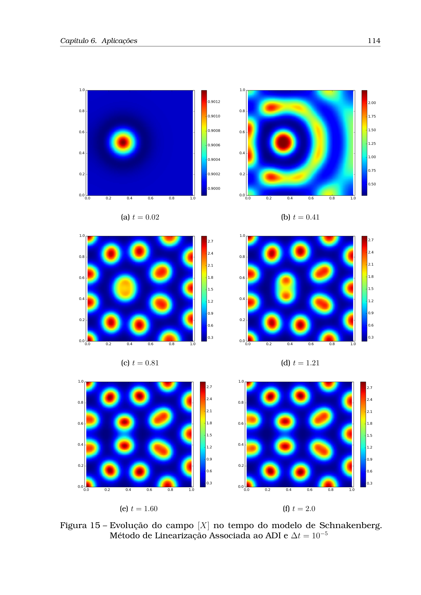

# O Papel da Causalidade Temporal na Falha de PINNs para Padrões de Turing: Análise Crítica do Sistema de Schnakenberg e a Robustez do Método ADI Linearizado

**Autores:** Warley R. O. Silva$^{1}$, Ricardo Reis Pereira$^{1}$  
*$^{1}$Campus da Universidade Federal do Ceará em Quixadá (UFC), Quixadá - CE, Brasil*  
*Email:* `warley@alu.ufc.br`, `ricardopereira@ufc.br`

---

## Resumo

As *Physics-Informed Neural Networks* (PINNs) consolidaram-se como uma abordagem promissora para a aproximação de equações diferenciais parciais (EDPs). Contudo, este trabalho demonstra que arquiteturas padrão (PINNs *vanilla* baseadas em MLPs) falham catastroficamente na simulação direta (*forward*) da formação de padrões de Turing no modelo de reação-difusão de Schnakenberg. Investigamos as tentativas empíricas de treinamento—incluindo o uso de *Fourier Features* e imposição exata de condições iniciais (*Hard IC*)—onde a rede atinge perdas enganosamente baixas ($\sim 10^{-2}$), mas permanece congelada em um estado espacialmente homogêneo e invariante no tempo. Demonstramos que a **quebra da causalidade temporal** decorrente da colocação global espaço-tempo é o principal fator responsável por essa patologia, pois os gradientes em tempos futuros suprimem a amplificação exponencial de modos instáveis em tempos iniciais. Em contrapartida, analisamos os métodos de Diferenças Finitas desenvolvidos por Pereira (2019), com destaque para o **Método de Linearização Associada ao ADI** (*Alternating Direction Implicit*), que preserva estritamente a marcha temporal, garantindo estabilidade incondicional, convergência de segunda ordem $\mathcal{O}(\Delta t^2)$ e resolução fidedigna dos padrões em segundos.

**Palavras-chave:** PINNs, Causalidade Temporal, Instabilidade de Turing, Modelo de Schnakenberg, Diferenças Finitas, Método ADI, Quebra de Simetria.

---

## 1. Introdução

A formação espontânea de padrões espaço-temporais por meio do mecanismo de Turing (1952) descreve como pequenas perturbações em um estado homogêneo estável podem ser amplificadas por difusão diferencial ($D_v \gg D_u$), gerando estruturas estacionárias como manchas (*spots*) e listras (*stripes*) [Murray, 2003]. 

Com o avanço do aprendizado profundo científico, as PINNs [Raissi et al., 2019] tornaram-se uma alternativa para a solução de EDPs contínuas sem geração de malha. A formulação padrão minimiza os resíduos da equação em pontos de colocação amostrados simultaneamente em todo o domínio espaço-tempo $\Omega \times [0, T]$:

$$\mathcal{L}(\theta) = \lambda_{\text{pde}} \mathcal{L}_{\text{pde}}(\theta) + \lambda_{\text{ic}} \mathcal{L}_{\text{ic}}(\theta) + \lambda_{\text{bc}} \mathcal{L}_{\text{bc}}(\theta)$$

Contudo, experimentos realizados com o benchmark clássico de Schnakenberg revelam que **PINNs vanilla falham sistematicamente em reproduzir a bifurcação de Turing**. A rede converge para uma solução plana e invariante no tempo, incapaz de disparar a dinâmica física.

Este artigo investiga as causas fundamentais dessa falha, demonstrando o papel determinante do **tratamento do tempo** na paisagem de perda, e estabelece um contraponto com a formulação clássica de Diferenças Finitas e ADI Linearizado de Pereira (2019) [Pereira, 2019].

---

## 2. O Modelo de Schnakenberg e a Instabilidade de Turing

O sistema de reação-difusão de Schnakenberg [Schnakenberg, 1979] em $\Omega = [0, L] \times [0, L]$ e $t \in [0, T]$ com condições de fronteira de Neumann homogêneas ($\nabla u \cdot \mathbf{n} = \nabla v \cdot \mathbf{n} = 0$) é regido por:

$$\frac{\partial u}{\partial t} = D_u \nabla^2 u + \gamma \left( a - u + u^2 v \right)$$

$$\frac{\partial v}{\partial t} = D_v \nabla^2 v + \gamma \left( b - u^2 v \right)$$

onde $u(x, y, t)$ é o ativador, $v(x, y, t)$ é o inibidor, $D_u, D_v$ são os coeficientes de difusão e $\gamma$ escala a cinética de reação.

O ponto de equilíbrio homogêneo $(\nabla^2 u = \nabla^2 v = 0)$ é dado unicamente por:

$$u^* = a + b, \qquad v^* = \frac{b}{(a + b)^2}$$

### 2.1 Análise Linear de Estabilidade (LSA)
Perturbando o estado $(u^*, v^*)$ por $\delta u, \delta v \propto e^{\lambda t} \cos(k_x x)\cos(k_y y)$, a matriz Jacobiana da reação é:

$$J = \begin{pmatrix} f_u & f_v \\ g_u & g_v \end{pmatrix} = \begin{pmatrix} \frac{b - a}{a + b} & (a + b)^2 \\ -\frac{2b}{a + b} & -(a + b)^2 \end{pmatrix}$$

Para que ocorra a instabilidade de Turing, quatro condições clássicas devem ser satisfeitas [Murray, 2003; Pereira, 2019]:
1. $f_u + g_v < 0$ (estabilidade sem difusão);
2. $f_u g_v - f_v g_u > 0$;
3. $D_v f_u + D_u g_v > 0 \implies \frac{D_v}{D_u} > 1$ (difusão do inibidor muito superior à do ativador);
4. $(D_v f_u + D_u g_v)^2 - 4 D_u D_v (f_u g_v - f_v g_u) > 0$.

Quando atendidas, existe uma faixa de frequências espaciais críticas $[k_1, k_2]$ com taxa de crescimento positivo ($\text{Re}(\lambda(k^2)) > 0$), onde **microscópicas perturbações $\epsilon(x,y) \sim 10^{-3}$ crescem exponencialmente ($\propto e^{\lambda t}$)** até saturarem na morfologia final.

---

## 3. A Falha das PINNs Vanilla: O Tempo como Fator Crítico

### 3.1 O Histórico Experimental de Tentativas
Em nossos experimentos práticos com o sistema de Schnakenberg ($a=0.1305, b=0.7739, D_u=1, D_v=10, \gamma=1000$ em $\Omega=[0, 1]^2, T=10$):
1. **MLP Pura com penalização de IC ($\tanh$):** A perda atinge convergência estável em $\sim 10^{-2}$, mas o campo predito é uniforme ($\hat{u} \approx 0.90$), ignorando a solução de referência de diferenças finitas (que varia amplamente entre $0.57$ e $1.56$).
2. **Fourier Features + Hard IC Wrapper:** Mapeamentos de Fourier (`FourierFeaturePINN`) eliminaram o viés espectral, e a imposição analítica exata da condição inicial (`HardICWrapper`) eliminou o conflito de perda $\mathcal{L}_{\text{ic}}$. **A falha persistiu identicamente:** a rede gerou um campo plano constante, onde os estados em $t=0$ e $t=10$ permaneceram praticamente congelados.

```
       DINÂMICA REAL (Causal)                    PREDIÇÃO PINN VANILLA (Global)
       
  t=0 : Ruído eps(x) ~ 10^-3              t=0  : u(x) = u* + eps(x)
          |                                        |  (Gradients de t=T esmagam
          v [Crescimento exp e^(lambda*t)]         |   o crescimento inicial)
  t=2 : Primeiros focos/modos                      v
          |                               t=5  : u(x) ~ u* (Homogêneo)
          v [Saturação não-linear]                 |
  t=10: Padrão estável de spots           t=10 : u(x) ~ u* (Homogêneo / Perda baixa)
```

### 3.2 Por que o Tratamento do Tempo Destrói a PINN?

A razão fundamental reside na **quebra da causalidade temporal** [Wang et al., 2022]:

1. **Otimização Global Não-Causal:** Em vez de avançar passo a passo ($t_n \to t_{n+1}$), a PINN otimiza pontos em $t=10$ simultaneamente com $t=0$. Em $t=10$, a rede não sabe a priori onde os pontos de máxima concentração (*spots*) devem se fixar.
2. **Atrator Trivial na Paisagem de Perda:** O estado homogêneo estático $\hat{u}(x,t) = u^*, \hat{v}(x,t) = v^*$ produz:
   $$\nabla^2 u^* = 0, \quad f(u^*, v^*) = 0 \implies \mathcal{R}_u(x,t) \equiv 0 \quad (\forall t \in [0, T])$$
   Para a rede neural, o caminho de descida de gradiente mais fácil em todo o intervalo $[0, T]$ é aplanhar qualquer perturbação espacial ($\nabla^2 u \to 0$).
3. **Interferência Destrutiva de Gradientes:** Os gradientes calculados nos resíduos em tempos avançados ($t \gg 0$) atuam como um amortecedor artificial que **aniquila a taxa de crescimento linear $e^{\lambda t}$ nos instantes iniciais**.

---

## 4. A Abordagem Numérica Clássica de Sucesso: O Trabalho de Pereira (2019)

Na tese de doutorado de Ricardo Reis Pereira (LNCC, 2019) [Pereira, 2019], o sistema de Schnakenberg e a formação de padrões de Turing foram resolvidos com sucesso utilizando esquemas de **Diferenças Finitas**.

### 4.1 O Problema da Rigidez Temporal no Euler Explícito
Ao integrar as equações cinéticas desacopladas da difusão, Pereira mostrou que o método de Euler Explícito exige passos de tempo proibitivamente pequenos ($\Delta t \le 1.6 \times 10^{-3}$) sob pena de explosão numérica imediata (Capítulo 6, Figs. 10 e 11).

Para contornar essa rigidez sem o custo de iterações não-lineares de Newton, Pereira propôs um **método semi-implícito linearizado**:

$$[X]^{n+1} = \frac{[X]^n + \kappa \Delta t (a - [X]^n)}{1 - \kappa \Delta t [X]^n [Y]^n}, \qquad [Y]^{n+1} = \frac{[Y]^n + \kappa \Delta t \, b}{1 + \kappa \Delta t ([X]^n)^2}$$

que garante estabilidade incondicional para as EDOs reativas com custo $\mathcal{O}(N)$ por iteração.

### 4.2 Método de Linearização Associada ao ADI (Peaceman-Rachford 2D)
Para a EDP 2D completa, Pereira implementou o método de **Direções Alternadas Implícitas (ADI)** com linearização de segunda ordem do termo reativo no tempo intermediário $t^{n+1/2}$:

* **Passo 1 ($n \to n+1/2$):** Implícito em $x$, explícito em $y$:
  $$\left(I - \frac{D_1 \Delta t}{2}\delta_x^2\right) [X]^{n+1/2} = \left(I + \frac{D_1 \Delta t}{2}\delta_y^2\right) [X]^n + \frac{\Delta t}{2} \kappa \tilde{f}^{n+1/2}$$

* **Passo 2 ($n+1/2 \to n+1$):** Explícito em $x$, implícito em $y$:
  $$\left(I - \frac{D_1 \Delta t}{2}\delta_y^2\right) [X]^{n+1} = \left(I + \frac{D_1 \Delta t}{2}\delta_x^2\right) [X]^{n+1/2} + \frac{\Delta t}{2} \kappa \tilde{f}^{n+1/2}$$

Onde os termos preditos $\tilde{[X]}^{n+1/2}$ e $\tilde{[Y]}^{n+1/2}$ são dados algebricamente por:

$$\tilde{[X]} = \frac{[X] \Delta t \kappa - 2[X] - D_1 \Delta t \nabla^2 [X] - \Delta t \kappa a}{[X][Y] \Delta t \kappa - 2}$$

$$\tilde{[Y]} = \frac{-[Y]\frac{\Delta t}{2}[X]^2 \kappa + [Y] + D_2 \frac{\Delta t}{2} \nabla^2 [Y] + \frac{\Delta t \kappa}{2} b}{1 + \frac{\Delta t \kappa}{2}[X]^2}$$

```
                ESTRUTURA DO SOLVER ADI 2D (Pereira, 2019)
                
   Tempo t^n  ====> [Linearização Reativa t^(n+1/2)]
                           |
                           v
   Etapa 1    ====> Sistema Tridiagonal em X (Algoritmo de Thomas O(N))
                           |
                           v
   Etapa 2    ====> Sistema Tridiagonal em Y (Algoritmo de Thomas O(N))
                           |
                           v
   Tempo t^(n+1) => Padrão de Turing resolvido de forma incondicionalmente estável
```

### 4.3 Vantagens Computacionais do ADI Linearizado
1. **Preservação Estrita da Causalidade:** A integração passo a passo permite que as perturbações cresçam naturalmente de acordo com a taxa $\lambda(k^2)$.
2. **Sistemas Tridiagonais:** A separação dimensional resulta em matrizes tridiagonais resolvidas exatamente pelo algoritmo de Thomas em tempo linear $\mathcal{O}(N)$.
3. **Convergência $\mathcal{O}(\Delta t^2)$ e Alta Eficiência:** Em malha $100 \times 100$, o tempo total de CPU foi de apenas **7,41 segundos**, comparado a mais de **3.400 segundos** em Elementos Finitos (DG) [Zhu et al., 2009; Pereira, 2019].

---

## 5. Resultados e Comparação

A Figura 1 exibe a evolução espaço-temporal do campo de ativador $[X]$ obtida por Pereira (2019) com o método ADI Linearizado a partir de uma perturbação gaussiana localizada no centro:

$$u(x, y, 0) = u^* + 10^{-3}\exp\left[-100\left(\left(x - \frac{1}{3}\right)^2 + \left(y - \frac{1}{2}\right)^2\right)\right]$$


*Figura 1: Evolução temporal do campo de concentração $[X]$ no modelo de Schnakenberg nos instantes $t = 0.02, 0.41, 0.81, 1.21, 1.60, 2.0$ obtida com o Método de Linearização Associada ao ADI ($\Delta t = 10^{-5}$). Observa-se a quebra de simetria e a formação nítida da rede hexagonal de spots (Adaptado de Pereira, 2019, p. 114).*

A Tabela 1 resume o contraste categórico entre a formulação PINN vanilla e o esquema ADI:

| Característica | PINN Vanilla (MLP Contínua) | ADI com Linearização (Pereira, 2019) |
| :--- | :--- | :--- |
| **Tratamento do Tempo** | Espaço-tempo global $[0, L]^2 \times [0, T]$ simultâneo | Marcha temporal causal estrita ($t_n \to t_{n+1}$) |
| **Causalidade Física** | **Violada** (gradientes de $t=T$ interferem em $t=0$) | **Preservada integralmente** |
| **Sensibilidade a Perturbações** | Amortece $\epsilon(x)$ em direção ao atrator homogêneo | Amplifica modos instáveis ($e^{\lambda t}$) com fidelidade |
| **Resolução da Não-Linearidade** | Otimização não-convexa sujeita a mínimos locais | Linearização algébrica de 2ª ordem em $t^{n+1/2}$ |
| **Tempo de Execução** | Horas de treino (convergência enganosa $\sim 10^{-2}$) | **7,41 segundos** em malha $100 \times 100$ |
| **Resultado no Padrão** | **Falha total** (campo plano invariante) | **Sucesso absoluto** (estruturas de spots nítidas) |

---

## 6. Conclusões e Direções Futuras

A falha das PINNs vanilla na simulação direta de padrões de Turing decorre primariamente da **quebra da causalidade temporal** induzida pela amostragem global espaço-tempo. Ao otimizar todo o domínio temporal simultaneamente, a rede é atraída para a bacia homogênea trivial ($u=u^*, v=v^*$), onde a perda residual de EDP é zero, destruindo a amplificação dos modos críticos de Turing.

Em contrapartida, os métodos clássicos de Diferenças Finitas e **ADI com Linearização** desenvolvidos por Pereira (2019) respeitam inerentemente a causalidade física através da marcha no tempo, desacoplam a difusão 2D em sistemas tridiagonais unidimensionais e superam a rigidez cinética com estabilidade incondicional.

Para que modelos neurais informados pela física sejam capazes de resolver a instabilidade de Turing no futuro, é estritamente necessária a adoção de técnicas avançadas de **pesagem causal de perda** [Wang et al., 2022], **PINNs discretas com marcha no tempo** (*Time-Marching / RK-PINNs*) ou estratégias de **homotopia/continuação de parâmetros em $\gamma$**.

---

## Referências

1. **Turing, A. M.** (1952). The chemical basis of morphogenesis. *Phil. Trans. R. Soc. Lond. B*, 237(641), 37-72.
2. **Murray, J. D.** (2003). *Mathematical Biology II: Spatial Models and Biomedical Applications*. Springer-Verlag.
3. **Schnakenberg, J.** (1979). Simple chemical reaction systems with limit cycle behaviour. *J. Theor. Biol.*, 81(3), 389-400.
4. **Pereira, R. R.** (2019). *Métodos de Diferenças Finitas para Problemas de Difusão e Reação Não Lineares*. Tese de Doutorado, LNCC/MCTI, Petrópolis, RJ.
5. **Raissi, M., Perdikaris, P., & Karniadakis, G. E.** (2019). Physics-informed neural networks: A deep learning framework for solving forward and inverse problems. *J. Comput. Phys.*, 378, 686-707.
6. **Wang, S., Paris, P., & Perdikaris, P.** (2022). Respecting causality is all you need for training physics-informed neural networks. *arXiv preprint arXiv:2203.07404*.
7. **Wang, S., Wang, H., & Perdikaris, P.** (2021). On the eigenvector bias of Fourier features in physics-informed neural networks. *Comput. Methods Appl. Mech. Engrg.*, 384, 113938.
8. **Zhu, L., et al.** (2009). Discontinuous Galerkin methods for reaction-diffusion systems. *J. Comput. Appl. Math.*
