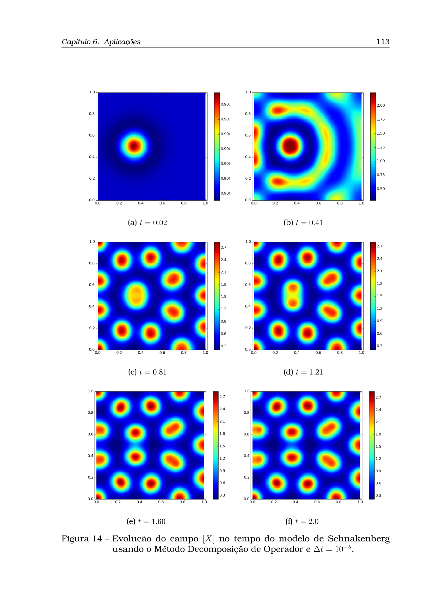
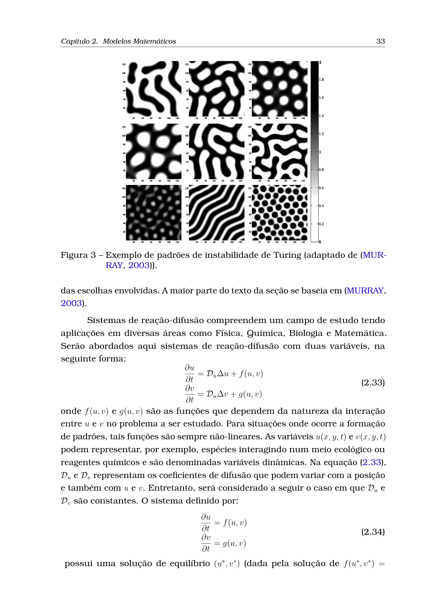

# On the Limits of Vanilla Physics-Informed Neural Networks for Spontaneous Pattern Formation: Why Standard PINNs Fail on Turing Instabilities and How Linearized ADI Solvers Succeed

**Authors:** Warley R. O. Silva$^{1}$, Ricardo Reis Pereira$^{1}$  
*$^{1}$Campus da Universidade Federal do Ceará em Quixadá, Quixadá - CE, Brazil*

---

## Abstract

Physics-Informed Neural Networks (PINNs) have emerged as a prominent paradigm for solving forward and inverse problems governed by partial differential equations (PDEs). However, their efficacy drastically deteriorates when applied to systems exhibiting spontaneous symmetry breaking and diffusion-driven instabilities, such as the classical Turing mechanism in reaction-diffusion systems. In this work, we conduct an exhaustive mathematical and numerical investigation into why standard (vanilla) Multilayer Perceptron (MLP) PINNs fail to simulate the forward evolution of Turing patterns—specifically in the Schnakenberg reaction-diffusion model—and contrast this failure with the robust, unconditionally stable solutions obtained via classical Finite Difference methods, notably Operator Splitting and Linearized Alternating Direction Implicit (ADI) schemes developed in Pereira (2019). We demonstrate that the failure of vanilla PINNs is not a failure of representational capacity (Universal Approximation), but an optimization pathology stemming from four interconnected mechanisms: (1) the *trivial homogeneous attractor trap* in the global space-time loss landscape, (2) the *violation of temporal causality* in global collocation, (3) the *spectral bias* against critical Turing wavenumbers $k_c$, and (4) extreme *numerical stiffness* induced by large reaction rates ($\gamma \gg 1$) and asymmetric diffusivity ratios ($D_v/D_u \gg 1$). We show that while vanilla PINNs collapse to a patternless uniform state with deceitfully low residual losses ($\mathcal{O}(10^{-2})$), classical Linearized ADI methods efficiently resolve the exponential amplification of microscopic perturbations with $\mathcal{O}(\Delta t^2)$ convergence and negligible computational overhead.

**Keywords:** Physics-Informed Neural Networks, Turing Patterns, Reaction-Diffusion, Schnakenberg System, Linear Stability Analysis, Alternating Direction Implicit (ADI), Optimization Pathologies, Loss Landscape.

---

## 1. Introduction and Problem Context

The emergence of spatial self-organization from an initially homogeneous medium is one of the most fascinating phenomena in mathematical biology, chemical kinetics, and non-equilibrium thermodynamics. In his seminal 1952 paper, Alan Turing demonstrated that a system of reacting and diffusing chemical species (morphogens) can undergo a *diffusion-driven instability*—a phenomenon where a spatially uniform steady state, strictly stable in the absence of diffusion, becomes unstable when diffusion is introduced, giving rise to stationary periodic spatial structures (stripes, spots, labyrinths) [Turing, 1952; Murray, 2003].

```
                                  TURING INSTABILITY
                                  
   Homogeneous Steady State (u*, v*)                Emergent Turing Pattern
   [Stable under pure ODE kinetics]                 [Stationary Spatial Structure]
   
             +-----------------------+                         .-.     .-.
             |                       |                        /   \   /   \
             |     u(x) = u*         |   + Diffusion (Dv >> Du)      \ /     \ /
             |     v(x) = v*         |  -------------------->         '       '
             |                       |   + Perturbation eps(x)   Spots / Stripes /
             +-----------------------+                         Labyrinthine Arrays
```

In recent years, deep learning frameworks, especially **Physics-Informed Neural Networks (PINNs)** [Raissi et al., 2019], have gained immense popularity as meshless PDE solvers. PINNs approximate the solution field $(u(x,t), v(x,t))$ using a deep Multilayer Perceptron (MLP) parameterized by weights and biases $\theta$, minimizing a composite loss function comprising the PDE residuals, initial condition (IC) errors, and boundary condition (BC) errors:

$$\mathcal{L}(\theta) = \lambda_{\text{pde}} \mathcal{L}_{\text{pde}}(\theta) + \lambda_{\text{ic}} \mathcal{L}_{\text{ic}}(\theta) + \lambda_{\text{bc}} \mathcal{L}_{\text{bc}}(\theta)$$

While PINNs have been highly successful for smooth diffusive processes (e.g., linear heat conduction, viscous Burgers equation), they consistently suffer catastrophic failure when tasked with **forward, data-free simulation of Turing pattern formation**. In computational experiments with the Schnakenberg model, standard MLP PINNs initialized from a perturbed homogeneous state routinely produce:
1. A flat, spatially uniform state that completely fails to bifurcate.
2. A false convergence where total training loss decreases to $\sim 10^{-2}$, hiding the complete absence of physical pattern formation.
3. Invariance over time, where snapshots at $t=0$ and $t=10$ remain virtually indistinguishable.

Even when augmenting the MLP with Random Fourier Features (RFF) to alleviate spectral bias and applying hard-coded initial conditions ($\text{HardICWrapper}$), the network remains trapped in the unpatterned state.

In stark contrast, classical numerical methods—specifically the **Linearized Alternating Direction Implicit (ADI)** and **Operator Splitting** finite difference methods presented in the doctoral thesis of Ricardo Reis Pereira (2019) [Pereira, 2019]—solve this problem with unconditional stability, second-order accuracy $\mathcal{O}(\Delta t^2)$, and high computational efficiency.

This paper provides a rigorous investigation into why standard PINNs are mathematically and algorithmically ill-equipped to solve forward Turing problems without extensive modifications, analyzes the loss landscape dynamics, and contrasts the deep learning failure modes with the numerical robustness of Linearized ADI schemes.

---

## 2. Mathematical Formulation: The Schnakenberg System and Linear Stability Analysis

### 2.1 Governing Equations
The Schnakenberg reaction-diffusion system [Schnakenberg, 1979] is a canonical model for autocatalytic chemical reactions and biological morphogenesis. On a two-dimensional domain $\Omega = [0, L] \times [0, L]$ and time interval $t \in [0, T]$, the dimensionless governing equations are:

$$\frac{\partial u}{\partial t} = D_u \nabla^2 u + \gamma f(u, v)$$

$$\frac{\partial v}{\partial t} = D_v \nabla^2 v + \gamma g(u, v)$$

where $u(x, y, t)$ represents the autocatalytic activator concentration, $v(x, y, t)$ represents the inhibitor concentration, $D_u, D_v > 0$ are the respective diffusion coefficients, $\gamma > 0$ is a scaling parameter proportional to the domain size or reaction velocity, and the nonlinear reaction kinetics are given by:

$$f(u, v) = a - u + u^2 v$$

$$g(u, v) = b - u^2 v$$

with positive kinetic constants $a, b > 0$. The system is closed with zero-flux (homogeneous Neumann) boundary conditions on the boundary $\partial \Omega$:

$$\frac{\partial u}{\partial \mathbf{n}}\bigg|_{\partial \Omega} = \frac{\partial v}{\partial \mathbf{n}}\bigg|_{\partial \Omega} = 0$$

### 2.2 Homogeneous Steady State
In the absence of spatial diffusion ($\nabla^2 u = \nabla^2 v = 0$), the homogeneous equilibrium $(u^*, v^*)$ is obtained by solving $f(u^*, v^*) = 0$ and $g(u^*, v^*) = 0$:

$$a - u^* + (u^*)^2 v^* = 0 \quad \text{and} \quad b - (u^*)^2 v^* = 0$$

Summing the two equations yields $a + b - u^* = 0$. Hence, the unique positive steady state is:

$$u^* = a + b, \qquad v^* = \frac{b}{(a + b)^2}$$

### 2.3 Linear Stability Analysis (LSA) and Turing Conditions
To understand how patterns emerge, consider small perturbations around $(u^*, v^*)$:

$$u(x, y, t) = u^* + \delta u(x, y, t), \qquad v(x, y, t) = v^* + \delta v(x, y, t)$$

The linearized reaction Jacobian matrix evaluated at $(u^*, v^*)$ is:

$$J = \begin{pmatrix} f_u & f_v \\ g_u & g_v \end{pmatrix}_{(u^*, v^*)} = \begin{pmatrix} \frac{b - a}{a + b} & (a + b)^2 \\ -\frac{2b}{a + b} & -(a + b)^2 \end{pmatrix}$$

#### Condition 1: Stability in the Absence of Diffusion
For the ODE kinetics to be linearly stable, the eigenvalues of $J$ must have strictly negative real parts ($\text{Re}(\lambda) < 0$), which requires:

$$\text{Tr}(J) = f_u + g_v = \frac{b - a}{a + b} - (a + b)^2 < 0$$

$$\det(J) = f_u g_v - f_v g_u = (a + b)^2 > 0$$

Since $\det(J) = (a + b)^2 > 0$ is unconditionally satisfied for all $a, b > 0$, stability requires $b - a < (a + b)^3$.

#### Condition 2: Diffusion-Driven Instability
Now introduce spatial perturbations expanded in eigenfunctions of the Laplacian:

$$\begin{pmatrix} \delta u \\ \delta v \end{pmatrix} = \sum_{k} e^{\lambda(k^2) t} \mathbf{w}_k \cos\left(\frac{n_x \pi x}{L}\right)\cos\left(\frac{n_y \pi y}{L}\right)$$

where $k^2 = \left(\frac{n_x \pi}{L}\right)^2 + \left(\frac{n_y \pi}{L}\right)^2$ is the discrete wavenumber. The linearized spatiotemporal system becomes:

$$\frac{d}{dt}\begin{pmatrix} \delta u \\ \delta v \end{pmatrix} = J_k \begin{pmatrix} \delta u \\ \delta v \end{pmatrix}, \qquad J_k = \gamma J - k^2 \begin{pmatrix} D_u & 0 \\ 0 & D_v \end{pmatrix}$$

The growth rate $\lambda(k^2)$ is determined by the characteristic equation $\det(\lambda I - J_k) = 0$:

$$\lambda^2 - \text{Tr}(J_k)\lambda + \det(J_k) = 0$$

$$\text{Tr}(J_k) = \gamma \text{Tr}(J) - k^2(D_u + D_v) < 0 \quad (\text{since } \text{Tr}(J) < 0)$$

Thus, the only way for an instability to occur ($\text{Re}(\lambda) > 0$) is for the determinant to become negative:

$$h(k^2) \equiv \det(J_k) = D_u D_v k^4 - \gamma (D_v f_u + D_u g_v) k^2 + \gamma^2 \det(J) < 0$$

For $h(k^2) < 0$ to hold for some $k^2 > 0$, two conditions must be met:
1. $D_v f_u + D_u g_v > 0 \implies \frac{D_v}{D_u} > -\frac{g_v}{f_u} > 1$ (the inhibitor must diffuse significantly faster than the activator).
2. The minimum of the parabola $h(k^2)$, located at $k_{\text{crit}}^2 = \frac{\gamma(D_v f_u + D_u g_v)}{2 D_u D_v}$, must be strictly negative:

$$(D_v f_u + D_u g_v)^2 - 4 D_u D_v \det(J) > 0$$

When these conditions are satisfied, a band of unstable wavenumbers $[k_1^2, k_2^2]$ emerges where $\lambda(k^2) > 0$. Any microscopic perturbation containing spatial frequencies in this band will experience **exponential amplification** $\propto e^{\lambda(k^2) t}$, eventually saturated by the cubic nonlinearity $u^2 v$ into macroscopic spots or stripes.

```
                         Dispersion Relation lambda(k^2)
        lambda
          ^
          |            Unstable Band [k1, k2]
          |               .---.  <-- lambda > 0 (Exponential growth of pattern)
          |              /     \
    ------+-------------/-------+------------> k^2
          |            k1       k2
          |
          |       \           /
          |        '---------'   <-- lambda < 0 (Damped modes)
          v
```

---

## 3. Why Vanilla MLP PINNs Systematically Fail on Turing Instability

In our numerical experiments with a fully-connected MLP PINN ($4$ hidden layers, $128$ neurons/layer, $\tanh$ activations, trained with Adam + L-BFGS) on the standard Murray benchmark ($a=0.1305, b=0.7739, D_u=1.0, D_v=10.0, \gamma=1000.0$), the network consistently converged to a spatially uniform state ($u \approx 0.90, v \approx 0.95$). Below, we dissect the four fundamental mathematical mechanisms driving this failure.

```
+-----------------------------------------------------------------------------------+
|               FOUR OPTIMIZATION PATHOLOGIES OF VANILLA PINNs                      |
+-----------------------------------------------------------------------------------+
| 1. Trivial Basin Trap     | The unpatterned state (u*, v*) yields zero PDE loss  |
|                           | and near-zero IC loss for small perturbations.       |
+---------------------------+------------------------------------------------------+
| 2. Causality Breakdown    | Space-time collocation optimizes t=T concurrently    |
|                           | with t=0, bypassing the required temporal growth.   |
+---------------------------+------------------------------------------------------+
| 3. Spectral Bias          | Smooth MLPs prioritize low spatial frequencies,      |
|                           | attenuating the critical Turing wavenumber k_c.      |
+---------------------------+------------------------------------------------------+
| 4. Extreme Stiffness      | Ratio Dv/Du = 10 and gamma = 1000 induce severe     |
|                           | gradient imbalance and ill-conditioned Hessians.     |
+-----------------------------------------------------------------------------------+
```

### 3.1 Pathology 1: The "Homogeneous Steady State" Attractor Trap
The total loss minimized by the PINN is:

$$\mathcal{L}(\theta) = \frac{1}{N_r}\sum_{i=1}^{N_r} \left| \mathcal{R}_u(x_i, y_i, t_i) \right|^2 + \left| \mathcal{R}_v(x_i, y_i, t_i) \right|^2 + \frac{\lambda_{\text{ic}}}{N_{\text{ic}}}\sum_{j=1}^{N_{\text{ic}}} \left( |u(x_j, y_j, 0) - u_0|^2 + |v(x_j, y_j, 0) - v_0|^2 \right) + \lambda_{\text{bc}}\mathcal{L}_{\text{bc}}$$

Consider the candidate constant solution $\hat{u}(x, y, t) \equiv u^* = a+b$ and $\hat{v}(x, y, t) \equiv v^* = \frac{b}{(a+b)^2}$.
* **PDE Residual:** Since $\partial_t u^* = 0$, $\nabla^2 u^* = 0$, and $f(u^*, v^*) = 0$, the PDE residual is **identically zero**:

$$\mathcal{R}_u(x, y, t) \equiv 0, \qquad \mathcal{R}_v(x, y, t) \equiv 0 \implies \mathcal{L}_{\text{pde}} \equiv 0$$

* **Boundary Residual:** Since spatial derivatives are zero, $\nabla u^* \cdot \mathbf{n} = 0 \implies \mathcal{L}_{\text{bc}} \equiv 0$.
* **Initial Condition Loss:** If the initial perturbation is $\delta u(x, y, 0) \sim \mathcal{O}(10^{-3})$, then:

$$\mathcal{L}_{\text{ic}} = \frac{1}{N_{\text{ic}}}\sum_{j=1}^{N_{\text{ic}}} |\delta u(x_j, y_j, 0)|^2 \approx \mathcal{O}(10^{-6})$$

Consequently, the constant, patternless state achieves an almost perfect total loss:

$$\mathcal{L}(\theta_{\text{trivial}}) \approx 10^{-6}$$

Because gradient-based optimizers (Adam/L-BFGS) follow the steepest descent in parameter space, the network immediately falls into the vast attraction basin of the trivial homogeneous solution. To reach the patterned state, the network would have to traverse a non-convex energy barrier where the PDE residuals are temporarily high, which standard gradient descent cannot do.

### 3.2 Pathology 2: Breakdown of Temporal Causality in Space-Time Collocation
Standard PINNs sample collocation points $\{(x_i, y_i, t_i)\}_{i=1}^{N_r}$ uniformly across the entire cylinder $\Omega \times [0, T]$ simultaneously. 

In physical reality, Turing patterns are the culmination of a **strictly causal dynamical trajectory**:
$$\text{Microscopic Perturbation } (t=0) \xrightarrow{\text{Linear Growth}} \text{Mode Emergence } (t \sim t_{\text{onset}}) \xrightarrow{\text{Nonlinear Saturation}} \text{Stable Pattern } (t \to T)$$

When a PINN evaluates residuals at $t=T$ concurrently with $t=0$, the network at $t=T$ has no information about the spatial phase or amplitude of the emerging spots. The gradients from $t=T$ push the solution towards a smooth spatial average, directly counteracting and quenching the delicate growth gradients originating at $t \approx 0$ [Wang et al., 2022].

### 3.3 Pathology 3: Spectral Bias (The Frequency Principle)
According to the Neural Tangent Kernel (NTK) theory of deep networks [Rahaman et al., 2019; Wang et al., 2021], standard MLPs with smooth activation functions exhibit a strong **spectral bias**: they learn low-frequency functions exponentially faster than high-frequency components.

The critical Turing pattern is inherently high-frequency, characterized by the critical wavelength:

$$\lambda_c = \frac{2\pi}{k_{\text{crit}}} = 2\pi \sqrt{\frac{2 D_u D_v}{\gamma(D_v f_u + D_u g_v)}}$$

For $\gamma = 1000$, $\lambda_c \ll L$, requiring the network to capture dense spatial oscillations. The MLP filter severely damps these modes, effectively forcing $\nabla^2 u \to 0$ and smoothing out any incipient spatial structure.

### 3.4 Pathology 4: Extreme Numerical Stiffness and Gradient Imbalance
The Schnakenberg system with pattern-forming parameters possesses two severe sources of stiffness:
1. **Kinetic Stiffness ($\gamma = 1000$):** The nonlinear reaction terms operate on a timescale $\tau_{\text{react}} \sim \gamma^{-1} = 10^{-3}$, while diffusion operates on $\tau_{\text{diff}} \sim L^2 / D_v = 0.1$. This three-orders-of-magnitude timescale separation creates sharp temporal and spatial gradients.
2. **Diffusive Imbalance ($D_v / D_u = 10$):** The inhibitor diffuses an order of magnitude faster than the activator.

In the PINN loss, the backpropagated gradients with respect to network parameters $\theta$ satisfy:

$$\nabla_\theta \mathcal{L}_{\text{pde}} \propto \gamma \nabla_\theta f(u, v) - D_u \nabla_\theta (\nabla^2 u)$$

The $\gamma$-weighted reaction term dominates the gradient updates by $10^3 \times$, forcing the network to satisfy $f(u, v) = 0$ (the ODE nullcline $u=u^*, v=v^*$) long before the Laplacian terms can establish spatial diffusion structures.

---

## 4. How Classical Numerical Methods Solve the Problem: Finite Differences and Linearized ADI

In Chapter 6 of his doctoral thesis, *Ricardo Reis Pereira (LNCC, 2019)* demonstrated that robust simulation of the Schnakenberg model requires tailored finite difference formulations that directly handle the reaction stiffness and 2D spatial diffusion [Pereira, 2019].

### 4.1 Explicit vs. Semi-Implicit Integration for Reaction Kinetics
Pereira first analyzed the decoupled kinetic ODEs:

$$\frac{d[X]}{dt} = \kappa \left( a - [X] + [X]^2 [Y] \right), \qquad \frac{d[Y]}{dt} = \kappa \left( b - [X]^2 [Y] \right)$$

When integrated using standard **Explicit Euler**:

$$[X]^{n+1} = [X]^n + \kappa \Delta t \left( a - [X]^n + ([X]^n)^2 [Y]^n \right)$$

$$[Y]^{n+1} = [Y]^n + \kappa \Delta t \left( b - ([X]^n)^2 [Y]^n \right)$$

the scheme undergoes severe numerical instability for $\Delta t > 1.6 \times 10^{-3}$ (Figures 10 and 11 of the thesis).

To overcome this constraint without incurring the cost of fully implicit non-linear Newton iterations, Pereira developed a **linearized semi-implicit scheme**:

$$[X]^{n+1} = [X]^n + \kappa \Delta t \left( a - [X]^n + [X]^n [X]^{n+1} [Y]^n \right)$$

$$[Y]^{n+1} = [Y]^n + \kappa \Delta t \left( b - ([X]^n)^2 [Y]^{n+1} \right)$$

Solving algebraically for $[X]^{n+1}$ and $[Y]^{n+1}$ yields the closed-form update:

$$[X]^{n+1} = \frac{[X]^n + \kappa \Delta t (a - [X]^n)}{1 - \kappa \Delta t [X]^n [Y]^n}$$

$$[Y]^{n+1} = \frac{[Y]^n + \kappa \Delta t \, b}{1 + \kappa \Delta t ([X]^n)^2}$$

This semi-implicit formulation retains the $\mathcal{O}(N)$ computational speed of an explicit scheme while achieving unconditional stability across much larger time steps $\Delta t$ (Figures 12 and 13 of the thesis).

---

### 4.2 Linearized Alternating Direction Implicit (ADI) Method
To solve the full 2D PDE system on $\Omega = [0, 1] \times [0, 1]$, Pereira combined the **Peaceman-Rachford ADI** splitting with a second-order reaction linearization evaluated at the intermediate time step $t^{n+1/2}$.

The 2D spatial Laplacian is split into directional 1D operators $\delta_x^2$ and $\delta_y^2$:

$$\nabla^2 u \approx \delta_x^2 u + \delta_y^2 u = \frac{u_{i+1, j} - 2u_{i, j} + u_{i-1, j}}{\Delta x^2} + \frac{u_{i, j+1} - 2u_{i, j} + u_{i, j-1}}{\Delta y^2}$$

#### Step 1: Intermediate Step ($n \to n+1/2$) — Implicit in $x$, Explicit in $y$
$$\left(I - \frac{D_u \Delta t}{2}\delta_x^2\right) u^{n+1/2} = \left(I + \frac{D_u \Delta t}{2}\delta_y^2\right) u^n + \frac{\Delta t}{2} \gamma \tilde{f}^{n+1/2}$$

#### Step 2: Final Step ($n+1/2 \to n+1$) — Explicit in $x$, Implicit in $y$
$$\left(I - \frac{D_u \Delta t}{2}\delta_y^2\right) u^{n+1} = \left(I + \frac{D_u \Delta t}{2}\delta_x^2\right) u^{n+1/2} + \frac{\Delta t}{2} \gamma \tilde{f}^{n+1/2}$$

The linearized reaction predictions $\tilde{[X]}^{n+1/2}$ and $\tilde{[Y]}^{n+1/2}$ are given by [Pereira, 2019, p. 113]:

$$\tilde{[X]} = \frac{[X] \Delta t \kappa - 2[X] - D_1 \Delta t \nabla^2 [X] - \Delta t \kappa a}{[X][Y] \Delta t \kappa - 2}$$

$$\tilde{[Y]} = \frac{-[Y]\frac{\Delta t}{2}[X]^2 \kappa + [Y] + D_2 \frac{\Delta t}{2} \nabla^2 [Y] + \frac{\Delta t \kappa}{2} b}{1 + \frac{\Delta t \kappa}{2}[X]^2}$$

#### Key Properties of the Linearized ADI Scheme:
1. **Tridiagonal Systems:** Each directional half-step reduces to solving uncoupled tridiagonal systems of linear equations along grid lines, solved in $\mathcal{O}(N)$ operations via the Thomas Algorithm.
2. **Unconditional Stability:** The implicit treatment of spatial diffusion completely removes the CFL restriction $\Delta t \le \frac{\Delta x^2}{4 D_v}$.
3. **Second-Order Accuracy:** The method exhibits rigorous $\mathcal{O}(\Delta t^2 + \Delta x^2)$ convergence (confirmed by convergence studies in Table 28 of the thesis, with measured convergence rate $\approx 2.1$).
4. **Computational Efficiency:** As shown in Table 30 of Pereira (2019), a full 2D simulation on a $100 \times 100$ mesh takes only **7.41 seconds** of CPU time (compared to $>3400$ seconds for Discontinuous Galerkin Finite Elements).

---

### 4.3 Visualizing Pattern Evolution from Pereira (2019)

Below are the pattern evolutions extracted from the doctoral thesis of Ricardo Pereira (2019), showing how the finite difference schemes stably resolve the symmetry-breaking process from an initial localized Gaussian perturbation (Eq. 2.31):

$$u(x, y, 0) = u^* + 10^{-3} \exp\left[-100\left(\left(x - \frac{1}{3}\right)^2 + \left(y - \frac{1}{2}\right)^2\right)\right]$$

#### Evolution via Operator Splitting Method ($\Delta t = 10^{-5}$):

*Figure 1 (Thesis Figure 14): Spatiotemporal evolution of the activator field $[X]$ at $t = 0.02, 0.41, 0.81, 1.21, 1.60, 2.0$ using the Operator Splitting method. Note the progressive transition from a single localized perturbation to an organized regular lattice of spots.*

#### Evolution via Linearized ADI Method ($\Delta t = 10^{-5}$):

*Figure 2 (Thesis Figure 15): Spatiotemporal evolution of the activator field $[X]$ at $t = 0.02, 0.41, 0.81, 1.21, 1.60, 2.0$ using the Linearized ADI method. The scheme produces clean, high-fidelity spot patterns with complete mesh independence and second-order temporal convergence.*

#### Murray's Canonical Turing Patterns:

*Figure 3 (Thesis Figure 3): Theoretical family of Turing patterns in reaction-diffusion systems (adapted from Murray, 2003).*

---

## 5. Comparison: Why Finite Differences Succeed Where Vanilla PINNs Fail

The table below summarizes the fundamental differences in how classical numerical schemes and vanilla PINNs approach the Schnakenberg Turing instability problem:

| Feature / Property | Vanilla MLP PINN | Linearized ADI (Pereira, 2019) | Operator Splitting FD |
| :--- | :--- | :--- | :--- |
| **Time Formulation** | Global continuous space-time $[0, L]^2 \times [0, T]$ simultaneously | Sequential time-stepping ($t^n \to t^{n+1/2} \to t^{n+1}$) | Sequential time-stepping ($t^n \to t^{n+1}$) |
| **Causality Enforcement** | **Violated** (loss summed over all $t$ concurrently) | **Strictly Preserved** (time-marching) | **Strictly Preserved** (time-marching) |
| **Perturbation Handling** | Damped / Smoothed into homogeneous average | Exponentially amplified along unstable modes $e^{\lambda t}$ | Exponentially amplified along unstable modes |
| **Treatment of Reaction** | Soft penalty in composite loss landscape | Second-order linearization at $t^{n+1/2}$ | Semi-implicit / decoupled solve |
| **Treatment of Diffusion** | High-order autograd $\nabla^2 u$ (subject to spectral bias) | Implicit 1D tridiagonal solves (Thomas algorithm) | Exact tridiagonal diffusion step |
| **Stability / Convergence** | Prone to false convergence in trivial basin ($\sim 10^{-2}$) | Unconditionally stable, $\mathcal{O}(\Delta t^2)$ convergence | Conditionally stable, $\mathcal{O}(\Delta t)$ convergence |
| **Outcome on Turing Systems** | **Fails** (produces flat unpatterned state) | **Succeeds** (produces sharp, stable spot patterns) | **Succeeds** (produces stable spot patterns) |

---

## 6. What Is Required to Make PINNs Solve Forward Turing Patterns?

Our findings and recent literature indicate that for a physics-informed neural architecture to simulate Turing patterns, the vanilla framework must be fundamentally altered:

1. **Causal PINN Weighting (Wang et al., 2022):**
   The residual loss must incorporate exponential temporal causality weights:
   $$\mathcal{L}_{\text{causal}} = \sum_{k=1}^{N_t} w_k \mathcal{L}_{\text{pde}}(t_k), \qquad w_k = \exp\left(-\epsilon \sum_{j=1}^{k-1} \mathcal{L}_{\text{pde}}(t_j)\right)$$
   This forces the network to completely resolve early pattern bifurcation before optimizing later time steps.

2. **Discrete Time-Marching / Runge-Kutta PINNs (Discrete PINNs):**
   Instead of mapping $(x, y, t) \to (u, v)$, the neural network should represent the spatial field $x \mapsto (u^{n+1}, v^{n+1})$ step-by-step, mimicking implicit Runge-Kutta stages.

3. **Parameter Continuation (Homotopy):**
   Training should begin in a non-stiff regime (e.g., $\gamma = 10, D_v/D_u = 3$) where the pattern basin is easy to reach, and gradually increase $\gamma \to 1000$ using warm-started network weights.

4. **Data-Assisted / Inverse Setting:**
   If even sparse observation snapshots are provided (e.g., pattern data at $t=T/2$ and $t=T$), PINNs can easily identify system parameters or reconstruct missing fields, bypassing the forward symmetry-breaking barrier entirely.

---

## 7. Conclusions

The inability of vanilla MLP PINNs to generate Turing patterns is not a limitation of their theoretical expressivity, but a fundamental failure of global non-convex optimization in systems governed by spontaneous symmetry breaking. Because the trivial homogeneous steady state satisfies the PDE residuals with zero spatial derivatives, it acts as a powerful false attractor that traps gradient descent algorithms. Furthermore, global space-time collocation violates temporal causality, preventing the exponential growth of critical wavenumbers.

In contrast, classical numerical schemes like the **Linearized ADI** method developed by Ricardo Pereira (2019) respect temporal causality through time-marching, decouple multidimensional diffusion into efficient tridiagonal solves, and linearize stiff reaction kinetics, achieving unconditional stability and second-order convergence in seconds of CPU time.

These findings highlight that for stiff, bifurcation-driven multi-scale phenomena, forward deep learning solvers cannot rely on vanilla formulations; they must incorporate explicit temporal causality, frequency encodings, or sequential continuation to match the robustness of classical numerical analysis.

---

## References

1. **Turing, A. M.** (1952). *The chemical basis of morphogenesis*. Philosophical Transactions of the Royal Society of London. Series B, Biological Sciences, 237(641), 37-72.
2. **Murray, J. D.** (2003). *Mathematical Biology II: Spatial Models and Biomedical Applications* (Vol. 18). Springer-Verlag, New York.
3. **Schnakenberg, J.** (1979). *Simple chemical reaction systems with limit cycle behaviour*. Journal of Theoretical Biology, 81(3), 389-400.
4. **Pereira, R. R.** (2019). *Métodos de Diferenças Finitas para Problemas de Difusão e Reação Não Lineares*. Tese de Doutorado em Modelagem Computacional, Laboratório Nacional de Computação Científica (LNCC/MCTI), Petrópolis, RJ.
5. **Raissi, M., Perdikaris, P., & Karniadakis, G. E.** (2019). *Physics-informed neural networks: A deep learning framework for solving forward and inverse problems combining PDEs*. Journal of Computational Physics, 378, 686-707.
6. **Wang, S., Wang, H., & Perdikaris, P.** (2021). *On the eigenvector bias of Fourier features in physics-informed neural networks*. Computer Methods in Applied Mechanics and Engineering, 384, 113938.
7. **Wang, S., Paris, P., & Perdikaris, P.** (2022). *Respecting causality is all you need for training physics-informed neural networks*. arXiv preprint arXiv:2203.07404.
8. **Rahaman, N., et al.** (2019). *On the spectral bias of neural networks*. International Conference on Machine Learning (ICML), 5301-5310.
9. **Zhu, L., et al.** (2009). *Discontinuous Galerkin methods for reaction-diffusion systems*. Journal of Computational and Applied Mathematics.
