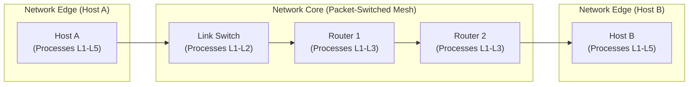

---
tags:
  - networks/fundamentals
  - networks/architecture
  - networks/kurose-ch1
  - study-notes
date: 2025-05-10
updated: 2025-05-10
---

# Introduction to Computer Networks & The Internet

## 1. Executive Summary & Master Roadmap
A computer network is an interconnected collection of autonomous computing devices exchanging data. The Internet is a "network of networks" structured into two distinct regions:
* **Network Edge (*Borda*)**: Hosts (end systems) executing distributed applications (Web, P2P, email, streaming).
* **Network Core (*Núcleo*)**: Interconnected mesh of packet switches (routers and switches) forwarding data via **packet switching** (store-and-forward datagrams).

---

## 2. Topic Breakdown (Atomic Sub-Notes)

### I. Network Edge & Application Architectures
* [[Concept - Network Edge and Application Architectures|Network Edge and Application Architectures]]: Hosts, End Systems, and the Client-Server vs. Peer-to-Peer (P2P) paradigms, and why applications run strictly at the edge.
![[Concept - Network Edge and Application Architectures#Summary Takeaway]]

### II. Network Core & Switching Paradigms
* [[Concept - Circuit Switching vs Packet Switching|Circuit Switching vs. Packet Switching]]: Why the Internet uses statistical multiplexing and store-and-forward routing instead of reserved circuits (FDM/TDM).
![[Concept - Circuit Switching vs Packet Switching#Core Comparison Matrix]]

### III. Performance, Delays & Losses
* [[Concept - Router Buffers Delays and Packet Loss|Router Buffers, Delays, and Packet Loss]]: Queuing delay, transmission delay ($L/R$), propagation delay ($d/s$), traffic intensity ($\frac{L \cdot a}{R}$), and router buffer overflow packet loss.
![[Concept - Router Buffers Delays and Packet Loss#Delay Summary]]

### IV. Global Internet Topology
* [[Concept - Internet Hierarchy and ISPs|Internet Hierarchy & ISP Structure]]: Tier-1 global backbones, Tier-2 regional providers, local access ISPs, PoPs, and IXPs/NAPs.
![[Concept - Internet Hierarchy and ISPs#Hierarchy Summary]]

### V. Physical Media & Topologies
* [[Concept - Physical Transmission Media and Topologies|Physical Transmission Media and Topologies]]: Guided vs. unguided media (Twisted-pair, Fiber, Radio), Star/Bus/Ring topologies, spectrum regulation, and repeaters/amplifiers.
![[Concept - Physical Transmission Media and Topologies#Comparative Analysis (Professor's Exam Question)]]

### VI. Protocol Layering & Encapsulation
* [[Architecture - Protocol Layers OSI vs TCP-IP|Protocol Layering: OSI vs. TCP/IP]]: 7-layer conceptual OSI model vs. 5-layer practical Internet TCP/IP stack.
![[Architecture - Protocol Layers OSI vs TCP-IP#Comparison Box]]
* [[Mechanism - Encapsulation and Decapsulation|Encapsulation & Decapsulation]]: PDU transformations ($M \to \text{Segment} \to \text{Datagram} \to \text{Frame} \to \text{Bits}$) and processing boundaries across hosts (L1–L5), switches (L1–L2), and routers (L1–L3).
![[Mechanism - Encapsulation and Decapsulation#Encapsulation Summary]]

---

## 3. Flashcards Hub
* Review the active recall deck: [[flashcards-01-intro-networks|Flashcards - Intro to Networks]]
