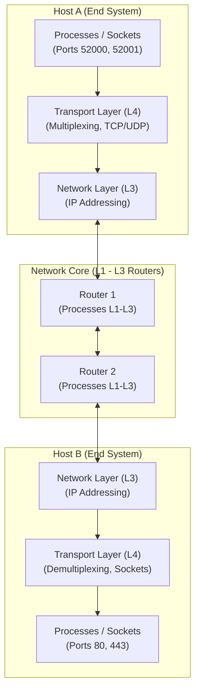

---
tags:
  - networks/transport-layer
  - study-notes
  - ufc/computer-networks
date: 2025-09-22
parent: "[[02-application-layer]]"
---

# Chapter 3: Transport Layer (Camada de Transporte)

## 1. Executive Summary & Master Mental Model
The **Transport Layer** (Layer 4) provides **logical communication** between application processes running on different hosts across the network. It bridges user-space application protocols (HTTP, DNS, SMTP) with the best-effort, packet-switched network core (IP).

> [!abstract] Fundamental Axiom of the Transport Layer
> While the **Network Layer (IP)** routes packets *host-to-host* across the network topology, the **Transport Layer** extends delivery *process-to-process* directly to application sockets, running exclusively on end systems at the network edge.

---

## 2. Core Topics & Atomic Deep Dives

### A. Transport Layer Services & Principles
Understanding the host-to-process boundary, service guarantees (what Layer 4 can vs. cannot guarantee), and the Kurose household analogy.
- **Key Concepts:** Logical communication, Host-to-Host vs Process-to-Process, Kurose Household Analogy, Service guarantees vs Best-Effort IP constraints.
- **Full Deep Dive:** [[Concept - Transport Layer Services and Principles]]
![[Concept - Transport Layer Services and Principles#Summary]]

---

### B. Multiplexing & Demultiplexing Mechanics
How the operating system kernel gathers application payloads into segments and directs incoming segments to the exact socket endpoints.
- **Key Concepts:** Port numbers ($0-65535$), Connectionless 2-Tuple Demux (`Dest IP`, `Dest Port`) vs Connection-Oriented 4-Tuple Demux (`Src IP`, `Src Port`, `Dest IP`, `Dest Port`), Welcoming (Listening) Socket vs Dedicated Connection Sockets.
- **Full Deep Dive:** [[Mechanism - Transport Layer Multiplexing and Demultiplexing]]
![[Mechanism - Transport Layer Multiplexing and Demultiplexing#Summary]]

---

### C. Connectionless Transport: UDP & Checksum Algorithm
The lightweight, zero-latency transport protocol and the Internet 1's-complement checksum calculation and verification mechanics.
- **Key Concepts:** Design trade-offs (0-RTT setup, stateless server, no congestion throttling, 8-byte header), RFC 768 segment structure, 1's-complement addition, wrap-around carry bit, and receiver integrity checking (`0xFFFF`).
- **Full Deep Dive:** [[Protocol - User Datagram Protocol (UDP) and Checksum]]
![[Protocol - User Datagram Protocol (UDP) and Checksum#Summary]]

---

### D. TCP Segment Structure & Connection Management
The full-duplex, reliable byte-stream transport protocol, its header anatomy, and its lifecycle handshakes.
- **Key Concepts:** 20-byte base header, Flags (`SYN`, `FIN`, `ACK`, `RST`, `PSH`, `URG`), Byte-stream sequence numbering vs Cumulative ACKs, Piggybacking in Telnet, 3-way handshake (`SYN` $\to$ `SYN-ACK` $\to$ `ACK`), and 4-way teardown (`FIN`/`ACK`).
- **Full Deep Dive:** [[Protocol - Transmission Control Protocol (TCP) Segment and Connection Management]]
![[Protocol - Transmission Control Protocol (TCP) Segment and Connection Management#Summary]]

---

### E. Pipelined Reliable Data Transfer (GBN, SR, and TCP Hybrid)
Overcoming stop-and-wait utilization bottlenecks using sliding windows and retransmission algorithms.
- **Key Concepts:** Link utilization math ($U = \frac{d_{\text{trans}}}{RTT + d_{\text{trans}}}$), Go-Back-N (cumulative ACKs, single timer, discards out-of-order packets), Selective Repeat (individual ACKs, per-packet timers, buffers out-of-order packets), TCP Hybrid model, and Fast Retransmit (3 duplicate ACKs).
- **Full Deep Dive:** [[Mechanism - Pipelined Reliable Data Transfer (GBN, SR, and TCP Hybrid)]]
![[Mechanism - Pipelined Reliable Data Transfer (GBN, SR, and TCP Hybrid)#Summary]]

---

### F. TCP Flow Control & Receiver Buffer Management
Speed-matching service preventing a fast sender from overflowing a slower receiver's memory buffer.
- **Key Concepts:** Flow Control vs Congestion Control distinction, `RcvBuffer`, `LastByteRead`, `LastByteRcvd`, Receive Window derivation ($rwnd = \text{RcvBuffer} - (\text{LastByteRcvd} - \text{LastByteRead})$), and Zero-Window Deadlock resolution via 1-byte probe segments.
- **Full Deep Dive:** [[Mechanism - TCP Flow Control and Buffer Management]]
![[Mechanism - TCP Flow Control and Buffer Management#Summary]]

---

### G. TCP Congestion Control & Bottleneck Fairness
End-to-end feedback mechanisms regulating network traffic injection to prevent intermediate router collapse.
- **Key Concepts:** Congestion costs (queuing delay, drops, wasted upstream capacity), End-to-End vs Network-Assisted, Congestion Window ($cwnd$), Slow Start ($2^k$ exponential growth), Congestion Avoidance (linear $+1\text{ MSS/RTT}$), Loss handling (Timeout vs 3 Dup ACKs), TCP Tahoe vs Reno (Fast Recovery), and AIMD bottleneck fairness convergence ($\frac{R}{K}$).
- **Full Deep Dive:** [[Mechanism - TCP Congestion Control and Fairness]]
![[Mechanism - TCP Congestion Control and Fairness#Summary]]

---

## 3. High-Yield Flashcard Review Deck
Active recall flashcards covering transport services, socket demultiplexing, UDP checksums, TCP headers, sliding windows, flow control, and congestion control:
🗂️ **[[flashcards-03-transport-layer]]**
