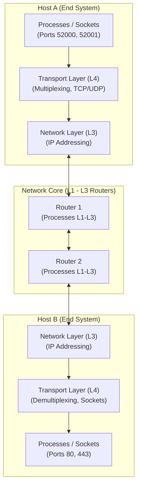

---
tags:
  - networks/transport-layer
  - study-notes
  - ufc/computer-networks
date: 2025-09-22
parent: "[[02-application-layer]]"
---

# Chapter 3: Transport Layer (Camada de Transporte)

## 1. Executive Summary & Master Mental Model
The **Transport Layer** (Layer 4) provides **logical communication** between application processes running on different hosts. It acts as the bridge between user-space application protocols (HTTP, DNS, SMTP) and the underlying packet-switched network core (IP).

> [!abstract] Fundamental Axiom of the Transport Layer
> While the **Network Layer** moves packets host-to-host across the physical and routing topology, the **Transport Layer** extends this delivery process-to-process directly to application sockets, running exclusively on end systems at the network edge.

---

## 2. Core Topics & Atomic Deep Dives

### A. Transport Layer Services & Principles
Understanding the host-to-process boundary, service guarantees (what Layer 4 can vs. cannot guarantee), and the Kurose household analogy.
- **Key Concepts:** Logical communication, Host-to-Host vs Process-to-Process, Kurose Household Analogy, Service guarantees vs Best-Effort constraints.
- **Full Deep Dive:** [[Concept - Transport Layer Services and Principles]]
![[Concept - Transport Layer Services and Principles#Summary]]

---

### B. Multiplexing & Demultiplexing Mechanics
How the operating system kernel gathers application payloads into segments and directs incoming segments to the exact socket endpoints.
- **Key Concepts:** Port numbers ($0-65535$), Connectionless 2-Tuple Demux (`Dest IP`, `Dest Port`) vs Connection-Oriented 4-Tuple Demux (`Src IP`, `Src Port`, `Dest IP`, `Dest Port`), Welcoming (Listening) Socket vs Dedicated Connection Sockets.
- **Full Deep Dive:** [[Mechanism - Transport Layer Multiplexing and Demultiplexing]]
![[Mechanism - Transport Layer Multiplexing and Demultiplexing#Summary]]

---

### C. Connectionless Transport: UDP & Checksum Algorithm
The lightweight, zero-latency transport protocol and the Internet 1's-complement checksum calculation and verification mechanics.
- **Key Concepts:** Design trade-offs (0-RTT setup, stateless server, no congestion throttling, 8-byte header), RFC 768 segment structure, 1's-complement addition, wrap-around carry bit, and receiver integrity checking (`0xFFFF`).
- **Full Deep Dive:** [[Protocol - User Datagram Protocol (UDP) and Checksum]]
![[Protocol - User Datagram Protocol (UDP) and Checksum#Summary]]

---

## 3. High-Yield Flashcard Review Deck
Active recall flashcards covering transport services, socket demultiplexing rules, port ranges, and binary checksum arithmetic:
🗂️ **[[flashcards-03-transport-layer]]**
